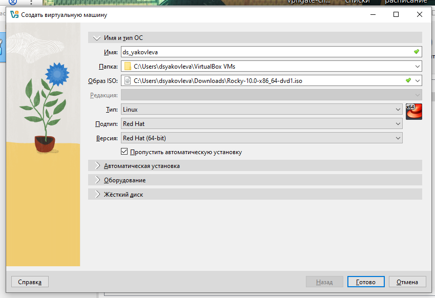
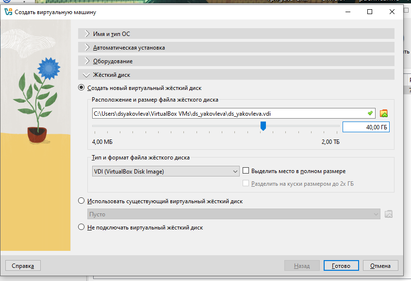
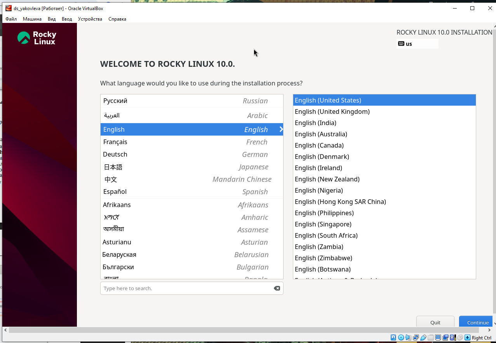
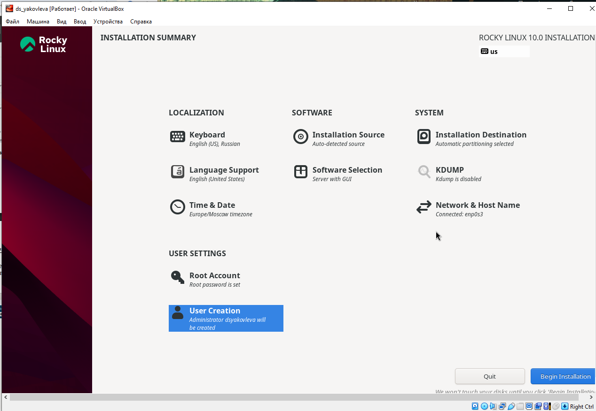
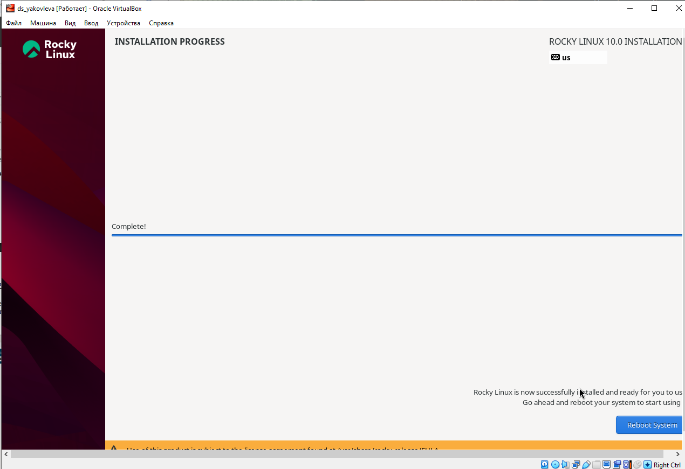
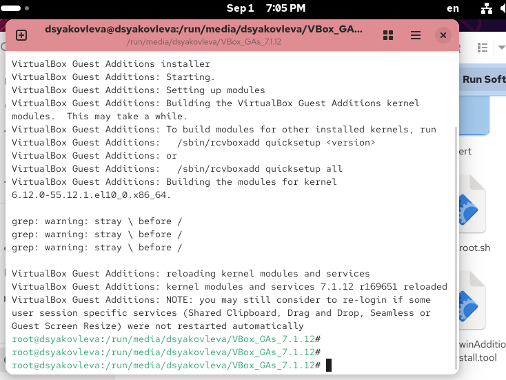

---
## Front matter
lang: ru-RU
title: Отчёт по лабораторной работе №1
subtitle: Установка ОС на виртуальную машину
author:
  - Яковлева Дарья Сергеевна
institute:
  - Российский университет дружбы народов, Москва, Россия
date: 1 сентября 2025

## i18n babel
babel-lang: russian
babel-otherlangs: english

## Formatting pdf
toc: false
slide_level: 2
aspectratio: 169
section-titles: true
theme: metropolis
header-includes:
 - \metroset{progressbar=frametitle,sectionpage=progressbar,numbering=fraction}
---

# Цели и задачи работы

## Цель работы

Приобретение практических навыков установки операционной системы на виртуальную машину, настройки минимально необходимых сервисов.

# Ход выполнения работы

## Создание виртуальной машины

{ #fig:001 width=70% }

## Параметры виртуальной машины

{ #fig:002 width=70% }

## Установка ОС

{ #fig:003 width=70% }

## Установка драйверов

{ #fig:004 width=70% }

## Изменение имени машины

{ #fig:005 width=70% }

## Системные характеристики

{ #fig:006 width=70% }

# Контрольные вопросы

## Основные команды Linux

- `man`, `help` — справка  
- `cd` — перемещение по каталогам  
- `ls`, `dir` — просмотр содержимого  
- `ls -l` — объём каталога  
- `touch`, `mkdir`, `rm`, `rmdir` — работа с файлами и папками  
- `chmod` — права доступа  
- `history` — история команд  

## Файловые системы

- FAT — простая и совместимая  
- NTFS — поддержка больших файлов, контроль доступа  
- Ext2/3/4 — стандарт Linux, журналирование  
- XFS — для больших файлов, масштабируемость  

# Итоги работы

## Вывод

Выполнена установка операционной системы на виртуальную машину и настройка сервисов.
