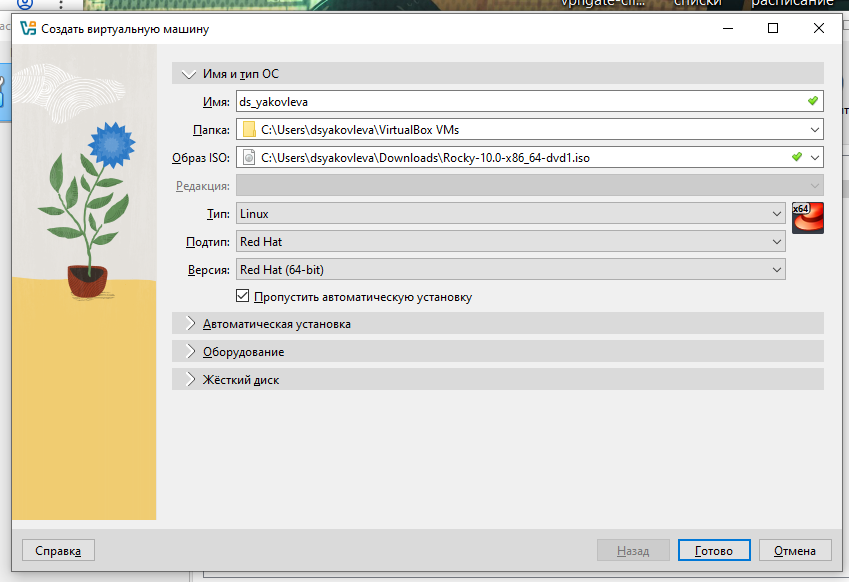
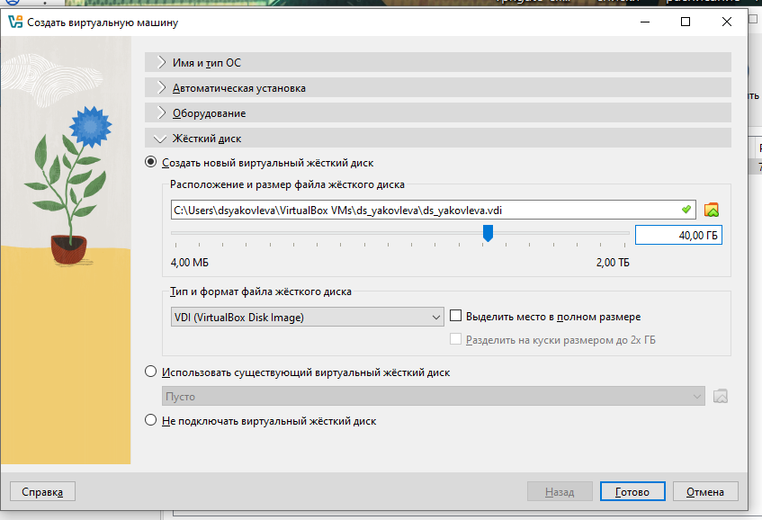
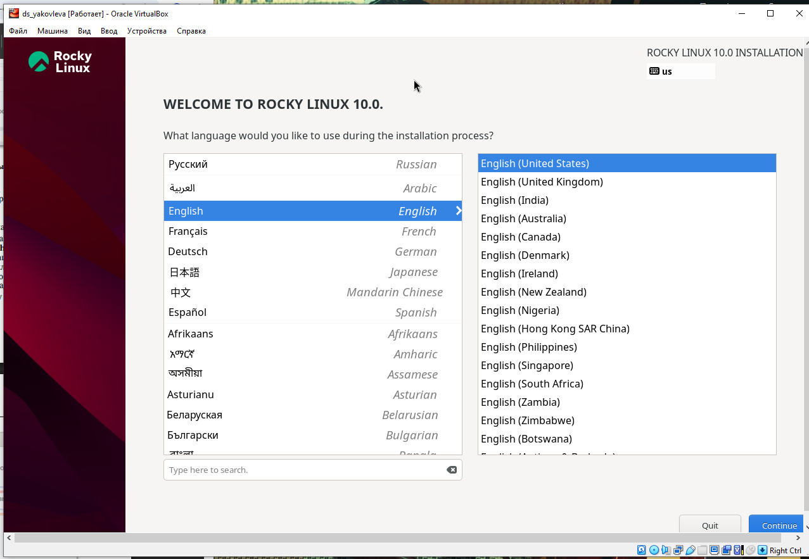
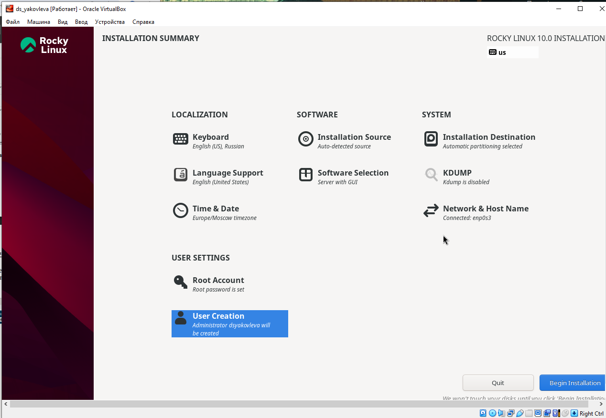
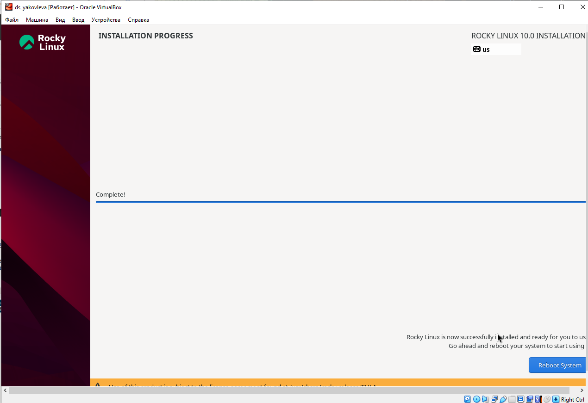
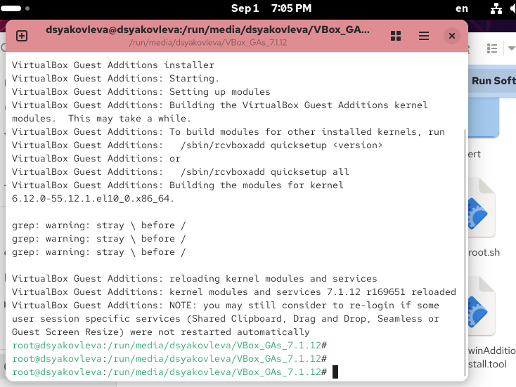

---
## Front matter
title: "Отчёт по лабораторной работе №1"
subtitle: "Установка ОС на виртуальную машину"
author: "Яковлева Дарья Сергеевна"

## Generic otions
lang: ru-RU
toc-title: "Содержание"

## Bibliography
bibliography: bib/cite.bib
csl: pandoc/csl/gost-r-7-0-5-2008-numeric.csl

## Pdf output format
toc: true
toc-depth: 2
lof: true
lot: true
fontsize: 12pt
linestretch: 1.5
papersize: a4
documentclass: scrreprt
## I18n polyglossia
polyglossia-lang:
  name: russian
  options:
    - spelling=modern
    - babelshorthands=true
polyglossia-otherlangs:
  name: english
## I18n babel
babel-lang: russian
babel-otherlangs: english
## Fonts
mainfont: IBM Plex Serif
romanfont: IBM Plex Serif
sansfont: IBM Plex Sans
monofont: IBM Plex Mono
mathfont: STIX Two Math
mainfontoptions: Ligatures=Common,Ligatures=TeX,Scale=0.94
romanfontoptions: Ligatures=Common,Ligatures=TeX,Scale=0.94
sansfontoptions: Ligatures=Common,Ligatures=TeX,Scale=MatchLowercase,Scale=0.94
monofontoptions: Scale=MatchLowercase,Scale=0.94,FakeStretch=0.9
mathfontoptions:
## Biblatex
biblatex: true
biblio-style: "gost-numeric"
biblatexoptions:
  - parentracker=true
  - backend=biber
  - hyperref=auto
  - language=auto
  - autolang=other*
  - citestyle=gost-numeric
## Pandoc-crossref LaTeX customization
figureTitle: "Рис."
tableTitle: "Таблица"
listingTitle: "Листинг"
lofTitle: "Список иллюстраций"
lotTitle: "Список таблиц"
lolTitle: "Листинги"
## Misc options
indent: true
header-includes:
  - \usepackage{indentfirst}
  - \usepackage{float}
  - \floatplacement{figure}{H}
---

# Цель работы

Целью данной работы является приобретение практических навыков установки операционной системы на виртуальную машину, настройки минимально необходимых для дальнейшей работы сервисов.

# Выполнение лабораторной работы

Создаю виртуальную машину и подключаю установочный диск (см. рис. [@fig:001]).

{ #fig:001 width=70% }

Настраиваю параметры виртуальной машины (см. рис. [@fig:002]).

{ #fig:002 width=70% }

Загружаю ОС с установочного диска и начинаю установку (см. рис. [@fig:003]).

{ #fig:003 width=70% }

После установки перезагружаю ОС и устанавливаю драйверы (см. рис. [@fig:004]).

{ #fig:004 width=70% }

Я забыл задать при установке имя машины, поэтому использовал дополнительные команды (см. рис. [@fig:005]).

{ #fig:005 width=70% }

# Поиск информации

Получаю системную информацию:  

1. Версия ядра Linux (Linux version).  
2. Частота процессора (Detected Mhz processor).  
3. Модель процессора (CPU0).  
4. Объем доступной оперативной памяти (Memory available).  
5. Тип обнаруженного гипервизора (Hypervisor detected).  
6. Тип файловой системы корневого раздела.  
7. Последовательность монтирования файловых систем (см. рис. [@fig:006]).  

{ #fig:006 width=70% }

# Контрольные вопросы

1. Укажите команды терминала и приведите примеры:  

* для получения справки по команде — `man`, `help`, `?`  
* для перемещения по файловой системе — `cd`  
* для просмотра содержимого каталога — `ls`, `dir`  
* для определения объёма каталога — `ls -l`  
* для создания / удаления каталогов / файлов — `touch file`, `mkdir dir`, `rm file`, `rm -d dir`  
* для задания определённых прав на файл / каталог — `chmod`  
* для просмотра истории команд — `history`  

2. Какую информацию содержит учётная запись пользователя?  

Учётная запись пользователя — это необходимая для системы информация о пользователе, хранящаяся в специальных файлах. Она используется Linux для аутентификации и назначения прав доступа.  

Файл `/etc/passwd` содержит:  
- имя пользователя (login);  
- зашифрованный пароль (обычно хэш MD5 или символ `!`);  
- UID — числовой идентификатор пользователя;  
- GID — идентификатор группы;  
- настоящее имя (для административных целей);  
- домашний каталог (Home Dir);  
- программная оболочка (Shell).  

3. Что такое файловая система? Приведите примеры.  

Файловая система — порядок, определяющий способ организации, хранения и именования данных на носителях.  

- **FAT** — поддерживается всеми ОС, проста и надёжна, но ограничена по размеру.  
- **NTFS** — поддержка больших файлов и дисков, длинные имена, контроль доступа, низкая фрагментация.  
- **Ext2/3/4** — стандартные файловые системы Linux, с журналированием (с ext3).  
- **XFS** — оптимизирована для больших файлов, поддерживает увеличение разделов "на лету".  

4. Как посмотреть, какие файловые системы подмонтированы в ОС?  

Командой `mount`.  

5. Как удалить зависший процесс?  

Сначала получить идентификатор командой `ps`, затем завершить процесс:  
```bash
kill PID
```

# Заключение

Выполнена установка операционной системы и настройка сервисов.
