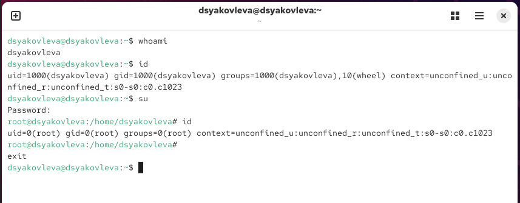
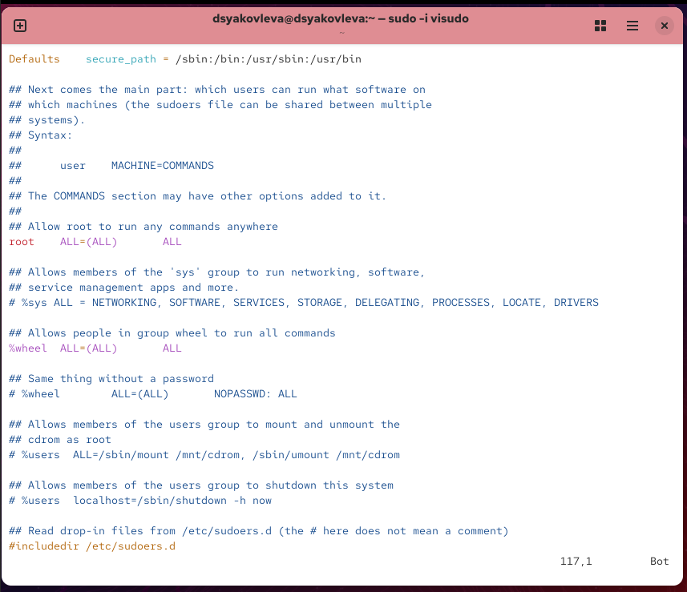
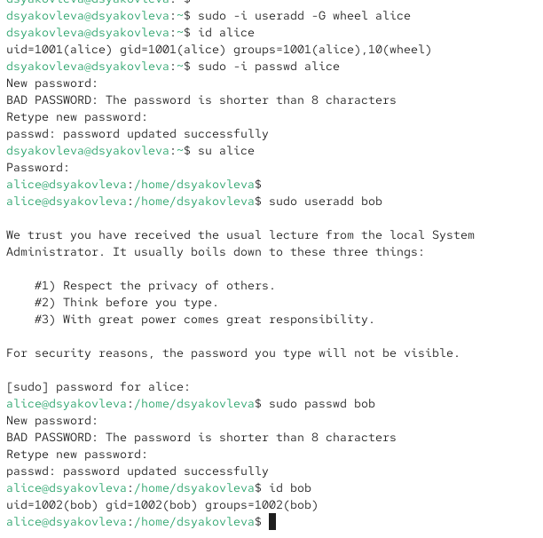
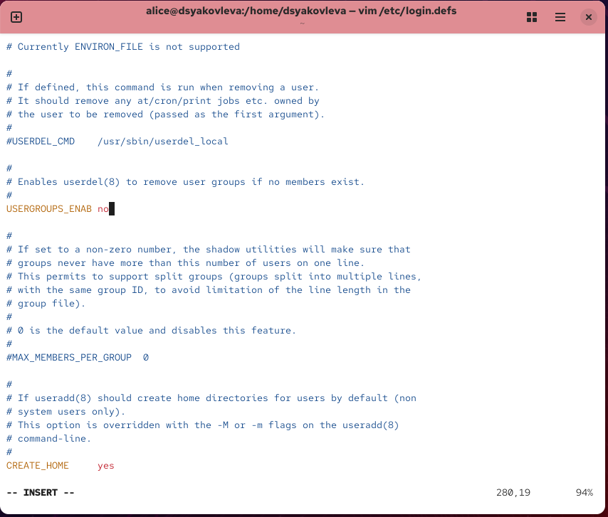
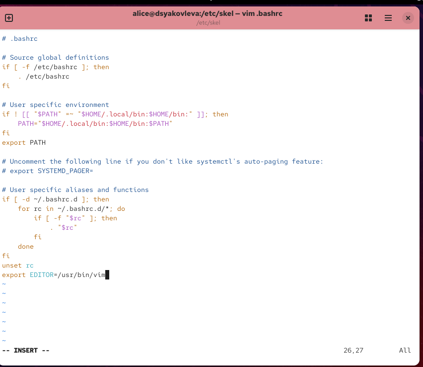
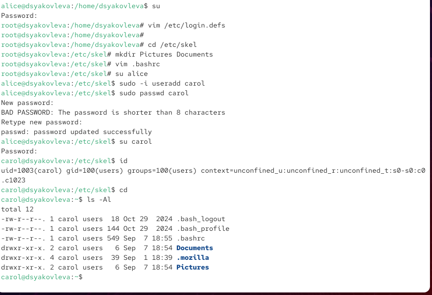
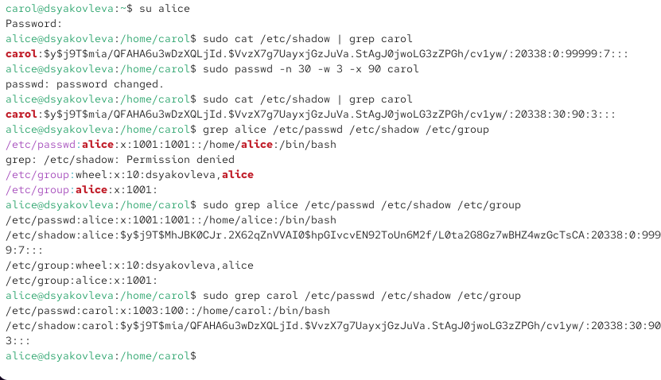
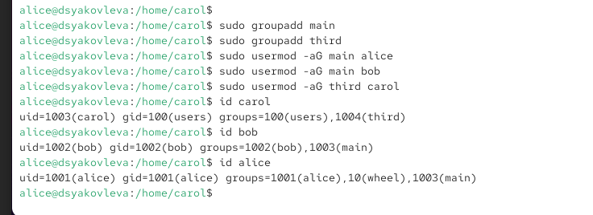

---
## Front matter
lang: ru-RU
title: Отчёт по лабораторной работе №2
subtitle: Управление пользователями и группами
author:
  - Яковлева Дарья Сергеевна
institute:
  - Российский университет дружбы народов, Москва, Россия
date: 8 сентября 2025

## i18n babel
babel-lang: russian
babel-otherlangs: english

## Formatting pdf
toc: false
slide_level: 2
aspectratio: 169
section-titles: true
theme: metropolis
header-includes:
 - \metroset{progressbar=frametitle,sectionpage=progressbar,numbering=fraction}
---

# Цель работы

## Цель

Получить практические навыки работы с учётными записями пользователей и группами в операционной системе Linux.

# Выполнение лабораторной работы

## Определение текущего пользователя

{ #fig:001 width=70% }

## Работа с sudo

{ #fig:002 width=70% }

## Создание пользователей

{ #fig:003 width=70% }

## Конфигурация параметров учётных записей

{ #fig:004 width=70% }

## Файл .bashrc

{ #fig:005 width=70% }

## Создание пользователя carol

{ #fig:006 width=70% }

## Настройка политики паролей

{ #fig:007 width=70% }

## Работа с группами

{ #fig:008 width=70% }

# Контрольные вопросы

## Команды для информации о пользователях

* `id`
* `whoami`
* `groups`

## Конфигурация sudo

* `su` — переключение на другого пользователя (пароль этого пользователя)
* `sudo` — выполнение команды от root (пароль текущего пользователя)

* Файл `/etc/sudoers`
* Редактирование через `visudo`
* Группа `wheel` имеет полный доступ

## Файлы параметров учётных записей

* `/etc/login.defs`
* `/etc/skel/`

## Файлы с информацией о группах

* `/etc/passwd` (основная группа)
* `/etc/group` (дополнительные группы)

# Итоги работы

## Вывод

Были приобретены навыки управления пользователями и группами в Linux: создание учётных записей, назначение паролей, настройка политик безопасности, а также работа с группами и sudo.
