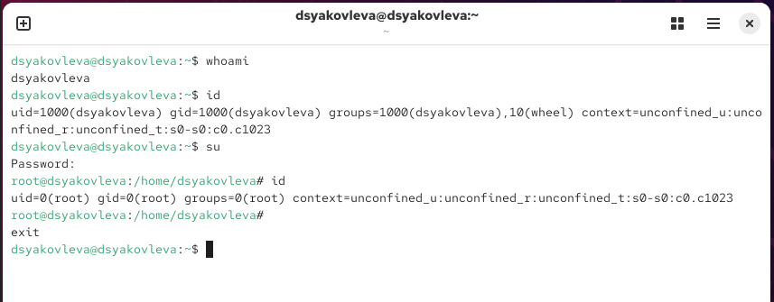
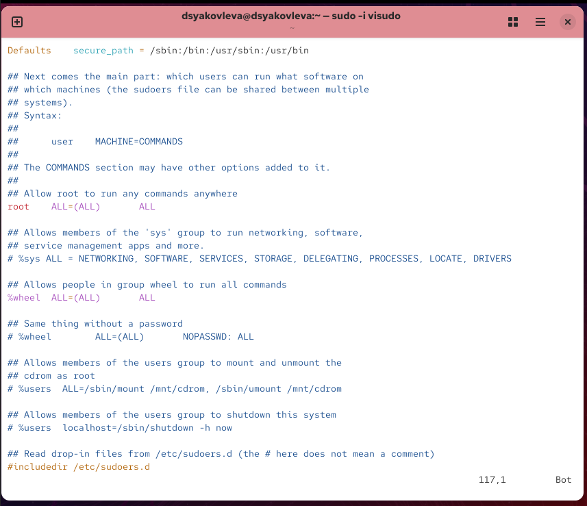
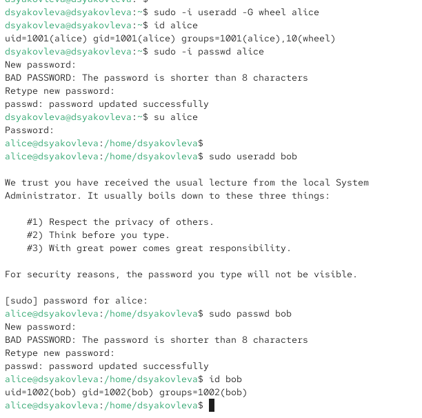
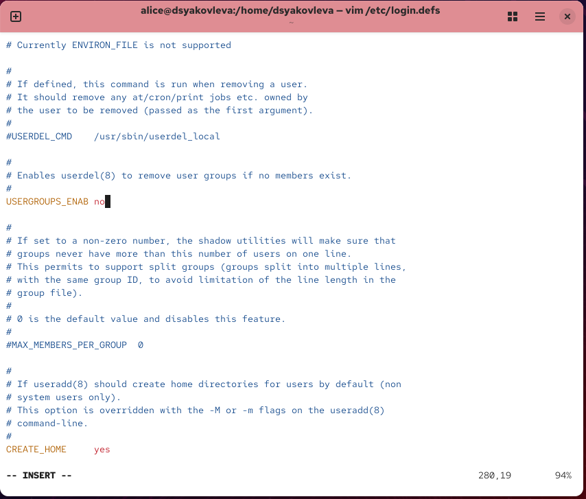
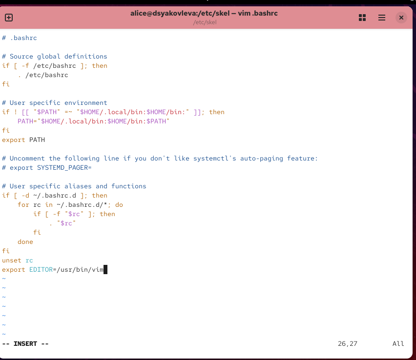
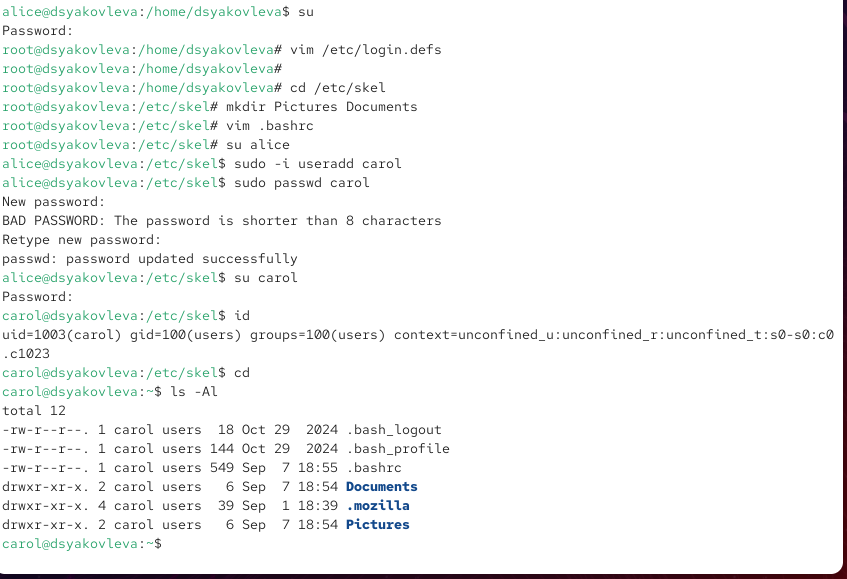
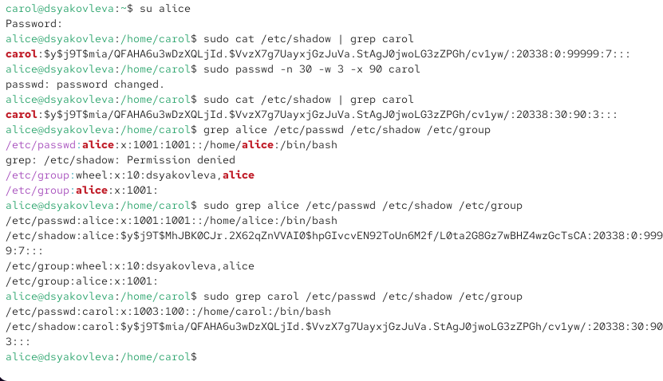
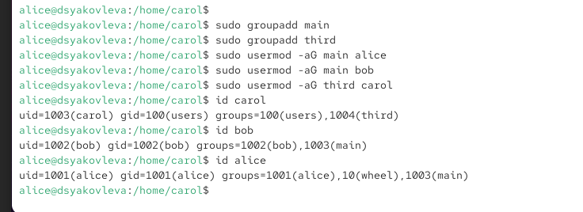

---
## Front matter
title: "Отчёт по лабораторной работе №2"
subtitle: "Управление пользователями и группами"
author: "Яковлева Дарья Сергеевна"

## Generic otions
lang: ru-RU
toc-title: "Содержание"

## Bibliography
bibliography: bib/cite.bib
csl: pandoc/csl/gost-r-7-0-5-2008-numeric.csl

## Pdf output format
toc: true # Table of contents
toc-depth: 2
lof: true # List of figures
lot: true # List of tables
fontsize: 12pt
linestretch: 1.5
papersize: a
documentclass: scrreprt
## I18n polyglossia
polyglossia-lang:
  name: russian
  options:
	- spelling=modern
	- babelshorthands=true
polyglossia-otherlangs:
  name: english
## I18n babel
babel-lang: russian
babel-otherlangs: english
## Fonts
mainfont: IBM Plex Serif
romanfont: IBM Plex Serif
sansfont: IBM Plex Sans
monofont: IBM Plex Mono
mathfont: STIX Two Math
mainfontoptions: Ligatures=Common,Ligatures=TeX,Scale=0.94
romanfontoptions: Ligatures=Common,Ligatures=TeX,Scale=0.94
sansfontoptions: Ligatures=Common,Ligatures=TeX,Scale=MatchLowercase,Scale=0.94
monofontoptions: Scale=MatchLowercase,Scale=0.94,FakeStretch=0.9
mathfontoptions:
## Biblatex
biblatex: true
biblio-style: "gost-numeric"
biblatexoptions:
  - parentracker=true
  - backend=biber
  - hyperref=auto
  - language=auto
  - autolang=other*
  - citestyle=gost-numeric
## Pandoc-crossref LaTeX customization
figureTitle: "Рис."
tableTitle: "Таблица"
listingTitle: "Листинг"
lofTitle: "Список иллюстраций"
lotTitle: "Список таблиц"
lolTitle: "Листинги"
## Misc options
indent: true
header-includes:
  - \usepackage{indentfirst}
  - \usepackage{float} # keep figures where there are in the text
  - \floatplacement{figure}{H} # keep figures where there are in the text
---

# Цель работы

Получить практические навыки работы с учётными записями пользователей и группами в операционной системе Linux.

# Выполнение лабораторной работы

## Переключение учётных записей пользователей

Определяю текущего пользователя (см. рис. \[@fig:001]):

Вывожу информацию о пользователе с помощью `id` (см. рис. \[@fig:001]).

Переключаюсь на root с помощью `su` и снова использую `id` (см. рис. \[@fig:001]).

{ #fig:001 width=70% }

Открываю файл `/etc/sudoers` через `visudo`, чтобы проверить настройки (см. рис. \[@fig:002]).

{ #fig:002 width=70% }

Вижу строку `%wheel ALL=(ALL) ALL`, которая означает, что пользователи группы *wheel* могут выполнять любые команды от имени root.

## Создание пользователей

Создаю пользователя **alice** и добавляю его в группу *wheel* (см. рис. \[@fig:003]).

Задаю пароль для alice (см. рис. \[@fig:003]).

Переключаюсь на alice и создаю пользователя **bob** (см. рис. \[@fig:003]).

Назначаю пароль bob (см. рис. \[@fig:003]).

Проверяю группы пользователя bob (см. рис. \[@fig:003]).

{ #fig:003 width=70% }

## Конфигурация параметров учётных записей

Открываю файл `/etc/login.defs` и проверяю параметры (см. рис. \[@fig:004]).

{ #fig:004 width=70% }

{ #fig:005 width=70% }

Перехожу в `/etc/skel`, создаю каталоги `Pictures` и `Documents` (см. рис. \[@fig:006]).

Создаю пользователя **carol** (см. рис. \[@fig:006]).

Проверяю её домашний каталог и группы (см. рис. \[@fig:006]).

Изучаю запись carol в `/etc/shadow` и настраиваю политику паролей (см. рис. \[@fig:007]).

{ #fig:006 width=70% }

{ #fig:007 width=70% }

## Работа с группами

Создаю группы `main` и `third` (см. рис. \[@fig:008]).

Добавляю пользователей в группы (см. рис. \[@fig:008]).

Проверяю, что carol входит в группу `third` (см. рис. \[@fig:008]).

Вывожу группы всех пользователей для контроля (см. рис. \[@fig:008]).

{ #fig:008 width=70% }

# Контрольные вопросы

1. **При помощи каких команд можно получить информацию о пользователе и группах?**
   Используются команды `id`, `whoami`, `groups`.

2. **Какой UID у пользователя root?**
   UID = 0. Проверить можно командой `id root`.

3. **Различие между su и sudo?**

* `su` переключает на другого пользователя с запросом его пароля.
* `sudo` выполняет команду с правами root, запрашивая пароль текущего пользователя.

4. **Файл конфигурации sudo?**
   `/etc/sudoers`.

5. **Как безопасно редактировать sudo?**
   Только с помощью `visudo`, так как он проверяет синтаксис.

6. **Какой группе нужно принадлежать для доступа ко всем командам sudo?**
   К группе `wheel`.

7. **Какие файлы используются для параметров создания учётных записей?**

* `/etc/login.defs` — общие параметры.
* `/etc/skel/` — файлы и каталоги по умолчанию.

8. **Где хранится информация о группах?**

* `/etc/passwd` — основная группа.
* `/etc/group` — дополнительные группы.
  Пример: у alice есть запись в обоих файлах.

9. **Какие команды изменяют информацию о пароле?**

* `passwd` — изменение пароля.
* `chage` — изменение срока действия.

10. **Как изменять информацию в /etc/group?**
    Рекомендуется использовать `usermod` или `groupmod`, а не прямое редактирование, чтобы избежать ошибок.

# Заключение

В ходе лабораторной работы были приобретены навыки управления пользователями и группами в Linux: создание учётных записей, назначение паролей, настройка политик безопасности, а также работа с группами и sudo.
