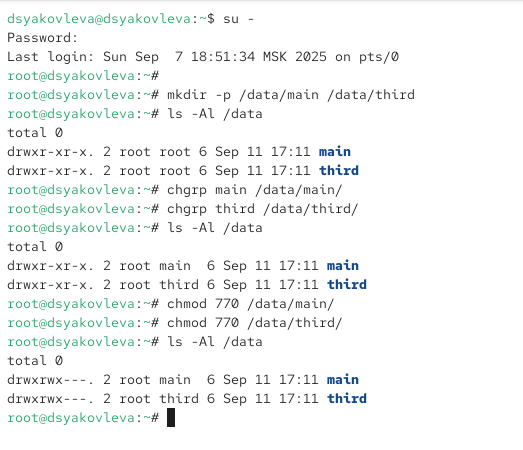
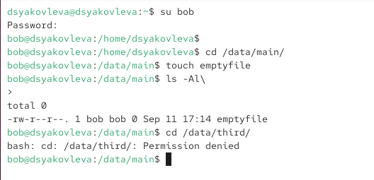
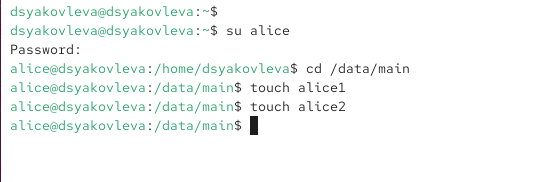
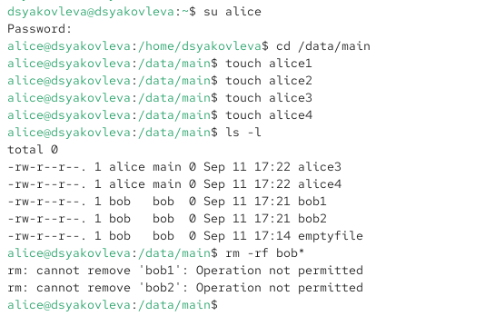
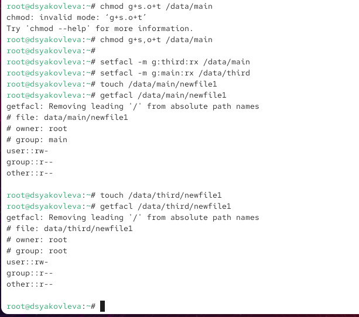
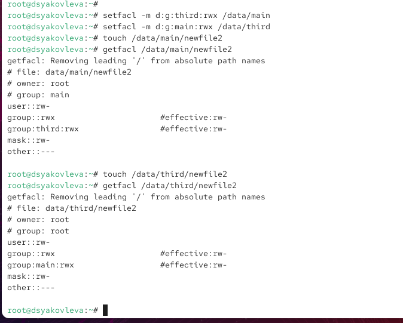
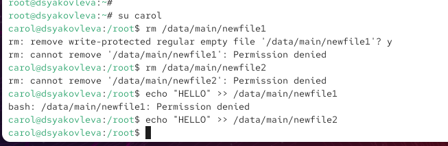

---
## Front matter
lang: ru-RU
title: Отчёт по лабораторной работе №2
subtitle: Настройка прав доступа
author:
  - Яковлева Дарья Сергеевна
institute:
  - Российский университет дружбы народов, Москва, Россия
date: 15 сентября 2025

## i18n babel
babel-lang: russian
babel-otherlangs: english

## Formatting pdf
toc: false
slide_level: 2
aspectratio: 169
section-titles: true
theme: metropolis
header-includes:
 - \metroset{progressbar=frametitle,sectionpage=progressbar,numbering=fraction}
---

# Цель работы

## Цель

Получить навыки настройки базовых и расширенных прав доступа пользователей и групп в Linux.

# Выполнение лабораторной работы

## Управление базовыми разрешениями  

{ #fig:001 width=70% }

## Управление базовыми разрешениями  

{ #fig:002 width=70% }

## Использование специальных разрешений  

SGID и Sticky-bit для организации совместного использования файлов.  

{ #fig:003 width=70% }

## Использование специальных разрешений  

{ #fig:004 width=70% }

## Управление расширенными разрешениями (ACL)  

ACL для более гибкого управления доступом.  

{ #fig:005 width=70% }

## Управление расширенными разрешениями (ACL)  

{ #fig:006 width=70% }

## Управление расширенными разрешениями (ACL)  

{ #fig:007 width=70% }

# Контрольные вопросы

## Основные команды работы с доступом  

* `chown`, `chmod`, `find`
* SGID, Sticky-bit
* `setfacl`, `getfacl`
* `umask`, `chattr`

## Примеры применения  

* Установка владельцев и групп для файлов  
* Поиск файлов по пользователю  
* Назначение базовых и специальных разрешений  
* Использование ACL и прав по умолчанию  

# Итоги работы

## Вывод  

Были изучены и применены базовые и расширенные механизмы управления правами доступа в Linux: стандартные разрешения, специальные биты и списки ACL.
