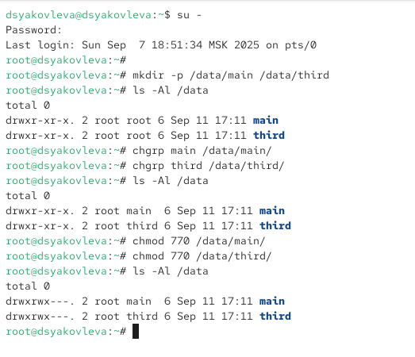
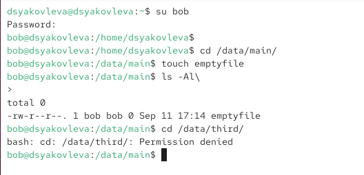
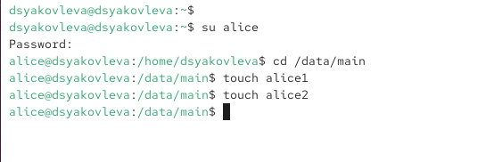
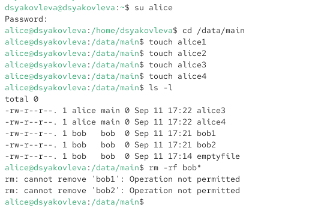
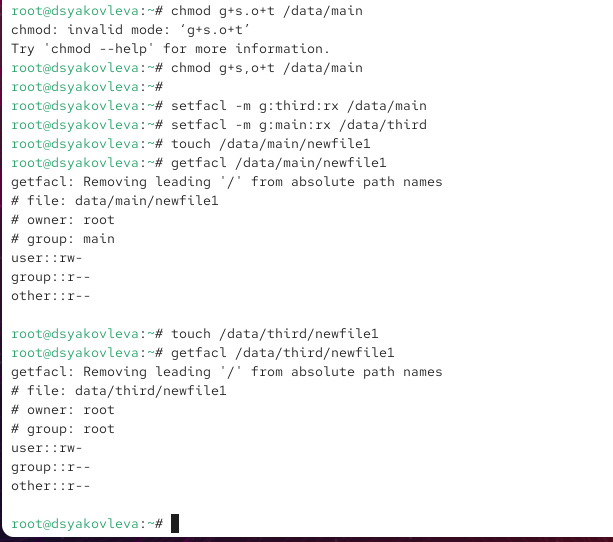
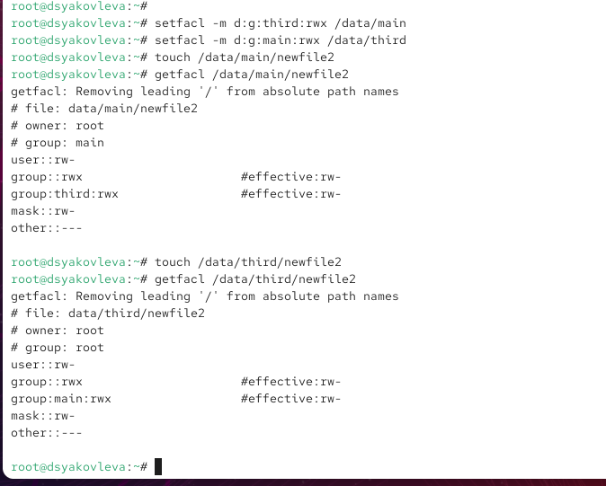
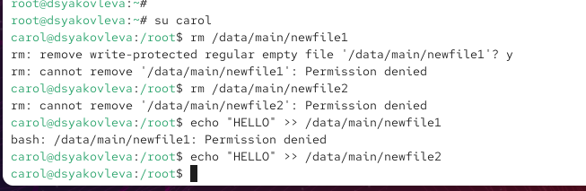

---
## Front matter
title: "Отчёт по лабораторной работе №3"
subtitle: "Настройка прав доступа"
author: "Яковлева Дарья Сергеевна"

## Generic otions
lang: ru-RU
toc-title: "Содержание"

## Bibliography
bibliography: bib/cite.bib
csl: pandoc/csl/gost-r-7-0-5-2008-numeric.csl

## Pdf output format
toc: true # Table of contents
toc-depth: 2
lof: true # List of figures
lot: true # List of tables
fontsize: 12pt
linestretch: 1.5
papersize: a
documentclass: scrreprt
## I18n polyglossia
polyglossia-lang:
  name: russian
  options:
	- spelling=modern
	- babelshorthands=true
polyglossia-otherlangs:
  name: english
## I18n babel
babel-lang: russian
babel-otherlangs: english
## Fonts
mainfont: IBM Plex Serif
romanfont: IBM Plex Serif
sansfont: IBM Plex Sans
monofont: IBM Plex Mono
mathfont: STIX Two Math
mainfontoptions: Ligatures=Common,Ligatures=TeX,Scale=0.94
romanfontoptions: Ligatures=Common,Ligatures=TeX,Scale=0.94
sansfontoptions: Ligatures=Common,Ligatures=TeX,Scale=MatchLowercase,Scale=0.94
monofontoptions: Scale=MatchLowercase,Scale=0.94,FakeStretch=0.9
mathfontoptions:
## Biblatex
biblatex: true
biblio-style: "gost-numeric"
biblatexoptions:
  - parentracker=true
  - backend=biber
  - hyperref=auto
  - language=auto
  - autolang=other*
  - citestyle=gost-numeric
## Pandoc-crossref LaTeX customization
figureTitle: "Рис."
tableTitle: "Таблица"
listingTitle: "Листинг"
lofTitle: "Список иллюстраций"
lotTitle: "Список таблиц"
lolTitle: "Листинги"
## Misc options
indent: true
header-includes:
  - \usepackage{indentfirst}
  - \usepackage{float} # keep figures where there are in the text
  - \floatplacement{figure}{H} # keep figures where there are in the text
---

# Цель работы

Получение навыков настройки базовых и специальных прав доступа для групп пользователей в операционной системе типа Linux.

# Выполнение лабораторной работы


## Управление базовыми разрешениями  

Перехожу в терминал под пользователем root с помощью `su -` (см. рис. \[@fig:001]).  

Создаю каталоги `/data/main` и `/data/third` с помощью команды `mkdir -p` и просматриваю их владельцев через `ls -Al /data` (см. рис. \[@fig:001]).  

Меняю группу для каталогов: у `/data/main` владельцем становится *main*, у `/data/third* – *third*. Проверяю изменения повторным вызовом `ls -Al /data` (см. рис. \[@fig:001]).  

После этого устанавливаю права доступа `770` для обоих каталогов, чтобы доступ имели только владельцы и их группы, а остальные пользователи были ограничены. Проверяю результат с помощью `ls -Al /data` (см. рис. \[@fig:001]).  

{ #fig:001 width=70% }  

Далее перехожу в терминал под пользователем *bob* (см. рис. \[@fig:002]).  

Пробую войти в каталог `/data/main` и создать файл `emptyfile`. Операция завершается успешно, так как у группы *main* есть необходимые права доступа (см. рис. \[@fig:002]).  

Затем пытаюсь перейти в каталог `/data/third`. При этом система выдаёт сообщение *Permission denied*, поскольку пользователь *bob* не входит в группу *third* и не имеет прав доступа к этому каталогу (см. рис. \[@fig:002]).  

{ #fig:002 width=70% }  

- Пользователь *bob* может работать с каталогом `/data/main`, так как его группа включена в разрешения.  
- Доступ к `/data/third` для него закрыт, так как права доступа ограничены только для владельца и группы *third*.  


## Использование специальных разрешений (SGID и Sticky-bit)  

Перехожу в терминал под пользователем *alice*, затем открываю каталог `/data/main` и создаю два файла `alice1` и `alice2` (см. рис. \[@fig:003]).  

{ #fig:003 width=70% }  

В другом терминале выполняю вход под пользователем *bob*, перехожу в каталог `/data/main` и просматриваю его содержимое. Вижу созданные ранее файлы `alice1` и `alice2`. После этого пробую удалить их командой `rm -f alice*`. Файлы удаляются, так как sticky-бит ещё не установлен, и у группы есть права на удаление (см. рис. \[@fig:004]).  

Затем под пользователем *bob* создаю свои файлы `bob1` и `bob2`.  

В терминале под root назначаю для каталога `/data/main` специальные разрешения: бит идентификатора группы (SGID) и sticky-бит. Для этого использую команду:  

```bash
chmod g+s,o+t /data/main
```

После применения SGID новые файлы, создаваемые в каталоге, наследуют группу-владельца каталога, а sticky-бит запрещает удалять чужие файлы пользователям, не являющимся их владельцами.

Далее снова вхожу под пользователем alice и создаю ещё два файла: `alice3` и `alice4`. 
Проверяю их владельцев с помощью `ls -l`. Видно, что файлы принадлежат пользователю *alice*, но группой для них установлена *main*, так как включён SGID (см. рис. [@fig:004]).

Пробую удалить файлы, принадлежащие пользователю *bob* (`bob1`, `bob2`). 
Система запрещает выполнение этой операции и выдаёт сообщение Operation not permitted, так как активен sticky-бит.

{ #fig:004 width=70% }  

- SGID обеспечивает наследование группового владельца каталога для всех создаваемых в нём файлов.
- Sticky-бит предотвращает удаление или изменение файлов пользователями, которым они не принадлежат, даже если у них есть права записи в каталог.

## Управление расширенными разрешениями с использованием списков ACL  

Перехожу в терминал под пользователем root.  
Задаю права доступа для групп: группе *third* в каталоге `/data/main` предоставляю права на чтение и выполнение, а группе *main* в каталоге `/data/third` — аналогичные права. Проверку выполняю с помощью `getfacl` (см. рис. \[@fig:005]).  

{ #fig:005 width=70% }  

Создаю новый файл `newfile1` в каталоге `/data/main` и анализирую его атрибуты. Владельцем файла является root, а группой — main. При этом расширенные ACL-настройки не применяются, так как они были назначены только на каталог и не наследуются для уже существующих файлов (см. рис. \[@fig:006]).  

Аналогично в каталоге `/data/third` создаётся файл `newfile1`. Его владельцем и группой остаётся root. Права доступа соответствуют стандартным настройкам, поскольку ACL по умолчанию ещё не были заданы (см. рис. \[@fig:006]).  

Далее устанавливаю расширенные разрешения по умолчанию для каталогов `/data/main` и `/data/third`. После этого создаю новые файлы `newfile2` в обоих каталогах. В результате они наследуют дополнительные права:  
- в `/data/main/newfile2` права доступа имеют группы *main* и *third*;  
- в `/data/third/newfile2` права назначены группам *root* и *main* (см. рис. \[@fig:006]).  

{ #fig:006 width=70% }  

Для проверки переключаюсь на пользователя *carol*, который состоит в группе *third*.  
При попытке удалить файлы `newfile1` и `newfile2` из каталога `/data/main` система выдаёт ошибку *Permission denied*, так как пользователь не является их владельцем.  

Далее пробую записать данные в эти файлы. Операции завершаются отказом, поскольку для группы *third* установлены только права на чтение и выполнение, без возможности записи (см. рис. \[@fig:007]).  

{ #fig:007 width=70% }  

- ACL позволяют гибко распределять права доступа для отдельных групп, расширяя стандартную систему разрешений Linux.  
- Права по умолчанию, заданные в каталоге, наследуются только новыми файлами и не распространяются на ранее созданные.  
- Пользователь *carol*, входящий в группу *third*, может просматривать содержимое, но не имеет возможности изменять или удалять чужие файлы, что подтверждает корректность применения ACL.  


# Контрольные вопросы

# Контрольные вопросы  

1. **Как следует использовать команду chown, чтобы установить владельца группы для файла? Приведите пример.**  
   Используется команда `chown`. Формат: `chown :group file`.  
   Пример: `chown :developers report.txt` — назначает владельцем группы файла *report.txt* группу *developers*.  

2. **С помощью какой команды можно найти все файлы, принадлежащие конкретному пользователю? Приведите пример.**  
   Используется команда `find`. Формат: `find / -user username`.  
   Пример: `find /home -user alice` — ищет все файлы, принадлежащие пользователю *alice* в каталоге `/home`.  

3. **Как применить разрешения на чтение, запись и выполнение для всех файлов в каталоге /data для пользователей и владельцев групп, не устанавливая никаких прав для других? Приведите пример.**  
   Используется команда `chmod`.  
   Пример: `chmod -R 770 /data` — владельцу и группе назначаются права чтения, записи и выполнения, для остальных пользователей права отсутствуют.  

4. **Какая команда позволяет добавить разрешение на выполнение для файла, который необходимо сделать исполняемым?**  
   Используется команда `chmod`.  
   Пример: `chmod +x script.sh` — делает файл *script.sh* исполняемым.  

5. **Какая команда позволяет убедиться, что групповые разрешения для всех новых файлов, создаваемых в каталоге, будут присвоены владельцу группы этого каталога? Приведите пример.**  
   Для этого используется SGID-бит.  
   Пример: `chmod g+s /shared` — новые файлы в каталоге *shared* будут наследовать группу каталога.  

6. **Необходимо, чтобы пользователи могли удалять только те файлы, владельцами которых они являются, или которые находятся в каталоге, владельцами которого они являются. С помощью какой команды можно это сделать? Приведите пример.**  
   Для этого используется sticky-бит.  
   Пример: `chmod +t /tmp` — в каталоге *tmp* пользователи могут удалять только свои файлы.  

7. **Какая команда добавляет ACL, который предоставляет членам группы права доступа на чтение для всех существующих файлов в текущем каталоге?**  
   Используется команда `setfacl`.  
   Пример: `setfacl -m g:students:r *` — добавляет группе *students* право чтения для всех файлов текущего каталога.  

8. **Что нужно сделать для гарантии того, что члены группы получат разрешения на чтение для всех файлов в текущем каталоге и во всех его подкаталогах, а также для всех файлов, которые будут созданы в этом каталоге в будущем? Приведите пример.**  
   Необходимо задать рекурсивные ACL и установить права по умолчанию.  
   Пример:  
   - `setfacl -R -m g:students:rX .` — добавляет права чтения для существующих файлов и каталогов.  
   - `setfacl -d -m g:students:rX .` — гарантирует такие же права для новых файлов и каталогов.  

9. **Какое значение umask нужно установить, чтобы «другие» пользователи не получали какие-либо разрешения на новые файлы? Приведите пример.**  
   Нужно установить `umask 007`.  
   Пример: `umask 007` — новые файлы будут доступны только владельцу и группе, без прав для других.  

10. **Какая команда гарантирует, что никто не сможет удалить файл myfile случайно?**  
    Используется команда `chattr`.  
    Пример: `chattr +i myfile` — делает файл *myfile* неизменяемым (нельзя удалить, переименовать или изменить содержимое до снятия атрибута).  

# Заключение  

В ходе работы были изучены и применены базовые и расширенные механизмы управления правами доступа в Linux, включая стандартные разрешения, специальные биты и списки ACL.  