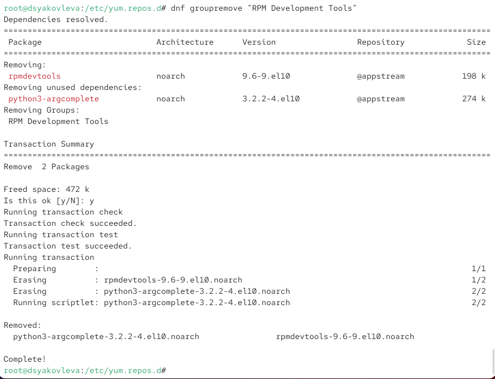

---
## Front matter
lang: ru-RU
title: Отчёт по лабораторной работе №4
subtitle: Работа с программными пакетами
author:
  - Яковлева Дарья Сергеевна
institute:
  - Российский университет дружбы народов, Москва, Россия
date: 13 сентября 2025

## i18n babel
babel-lang: russian
babel-otherlangs: english

## Formatting pdf
toc: false
slide_level: 2
aspectratio: 169
section-titles: true
theme: metropolis
header-includes:
 - \metroset{progressbar=frametitle,sectionpage=progressbar,numbering=fraction}
---

# Цель работы

## Цель

Получить навыки работы с репозиториями и менеджерами пакетов в Linux.

# Выполнение лабораторной работы

## Работа с репозиториями

{ #fig:001 width=70% }

## Поиск и установка пакетов

{ #fig:002 width=70% }

## Поиск и установка пакетов

{ #fig:003 width=70% }

## Установка и удаление пакетов

{ #fig:004 width=70% }

## Установка и удаление пакетов

{ #fig:005 width=70% }

## Работа с группами пакетов

{ #fig:006 width=70% }

## Работа с группами пакетов

{ #fig:007 width=70% }

## Использование rpm (lynx)

{ #fig:009 width=70% }

## Использование rpm (lynx)

{ #fig:010 width=70% }

## Изучение документации (lynx)

{ #fig:011 width=70% }

## Изучение документации (lynx)

{ #fig:012 width=70% }

## Запуск и удаление lynx

{ #fig:013 width=70% }

## Запуск и удаление lynx

{ #fig:014 width=70% }

## Использование rpm (dnsmasq)

{ #fig:015 width=70% }

## Использование rpm (dnsmasq)

{ #fig:016 width=70% }

## Документация и конфигурация dnsmasq

{ #fig:017 width=70% }

## Документация и конфигурация dnsmasq

{ #fig:018 width=70% }

## Документация и конфигурация dnsmasq

{ #fig:019 width=70% }

# Контрольные вопросы

## Основные команды

* `rpm -qf /usr/sbin/useradd` — поиск пакета по файлу  
* `dnf group list`, `dnf group info` — работа с группами  
* `rpm -Uvh package.rpm` — установка rpm из файла  
* `rpm -qp --scripts package.rpm` — просмотр скриптов  
* `rpm -qd package_name` — документация пакета  
* `rpm -qf /path/to/file` — поиск пакета по файлу  

# Итоги работы

## Вывод

В ходе работы были изучены команды `dnf` и `rpm`.  
Выполнены операции поиска, установки, удаления и анализа пакетов,  
а также работа с группами пакетов и документацией.
