---
## Front matter
title: "Отчёт по лабораторной работе №4"
subtitle: "Работа с программными пакетами"
author: "Яковлева Дарья Сергеевна"

## Generic otions
lang: ru-RU
toc-title: "Содержание"

## Bibliography
bibliography: bib/cite.bib
csl: pandoc/csl/gost-r-7-0-5-2008-numeric.csl

## Pdf output format
toc: true # Table of contents
toc-depth: 2
lof: true # List of figures
lot: true # List of tables
fontsize: 12pt
linestretch: 1.5
papersize: a
documentclass: scrreprt
## I18n polyglossia
polyglossia-lang:
  name: russian
  options:
	- spelling=modern
	- babelshorthands=true
polyglossia-otherlangs:
  name: english
## I18n babel
babel-lang: russian
babel-otherlangs: english
## Fonts
mainfont: IBM Plex Serif
romanfont: IBM Plex Serif
sansfont: IBM Plex Sans
monofont: IBM Plex Mono
mathfont: STIX Two Math
mainfontoptions: Ligatures=Common,Ligatures=TeX,Scale=0.94
romanfontoptions: Ligatures=Common,Ligatures=TeX,Scale=0.94
sansfontoptions: Ligatures=Common,Ligatures=TeX,Scale=MatchLowercase,Scale=0.94
monofontoptions: Scale=MatchLowercase,Scale=0.94,FakeStretch=0.9
mathfontoptions:
## Biblatex
biblatex: true
biblio-style: "gost-numeric"
biblatexoptions:
  - parentracker=true
  - backend=biber
  - hyperref=auto
  - language=auto
  - autolang=other*
  - citestyle=gost-numeric
## Pandoc-crossref LaTeX customization
figureTitle: "Рис."
tableTitle: "Таблица"
listingTitle: "Листинг"
lofTitle: "Список иллюстраций"
lotTitle: "Список таблиц"
lolTitle: "Листинги"
## Misc options
indent: true
header-includes:
  - \usepackage{indentfirst}
  - \usepackage{float} # keep figures where there are in the text
  - \floatplacement{figure}{H} # keep figures where there are in the text
---

# Цель работы

Получить навыки работы с репозиториями и менеджерами пакетов.

# Выполнение лабораторной работы

## Работа с репозиториями

Перехожу в режим суперпользователя и перехожу в каталог `/etc/yum.repos.d/`, где находятся файлы репозиториев (см. рис. [@fig:001]).  

Открываю файл `rocky.repo` и изучаю его содержимое. В нём указаны параметры подключения к зеркалам Rocky Linux, а также настройки проверки подписи пакетов (см. рис. [@fig:001]).  

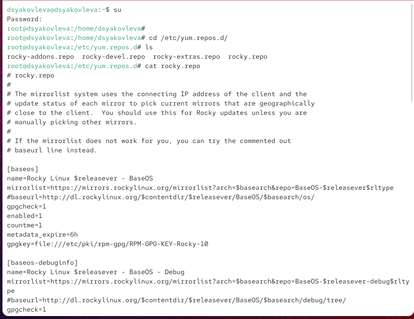{ #fig:001 width=70% }

Вывожу список доступных репозиториев с помощью `dnf repolist`. В системе активны три основных репозитория: *AppStream*, *BaseOS* и *Extras* (см. рис. [@fig:002]).  

Ищу пакеты, в названии или описании которых встречается слово *user*. Команда `dnf search user` показала, что доступны библиотеки и утилиты, связанные с управлением пользователями и их окружением (см. рис. [@fig:002]).  

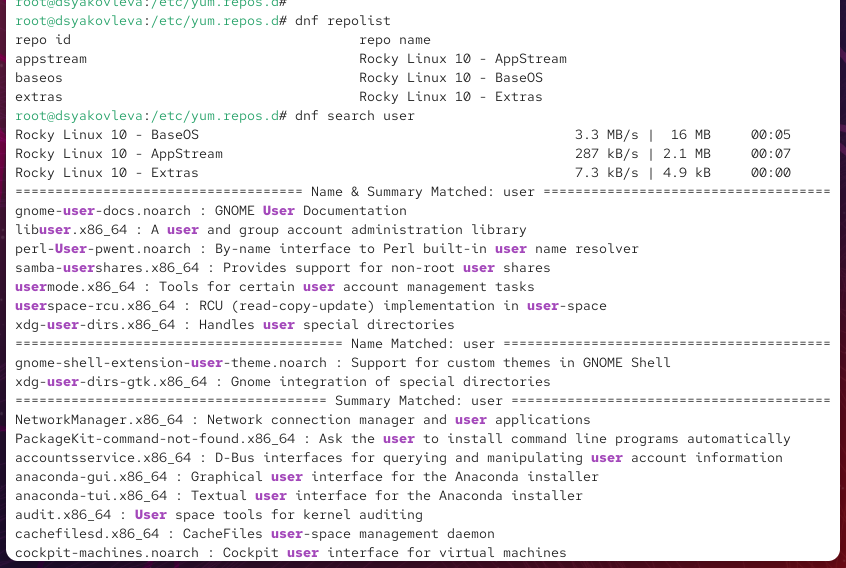{ #fig:002 width=70% }

Перед установкой `nmap` изучаю доступные пакеты через `dnf search nmap` и `dnf info nmap`. Получаю информацию о версии, репозитории и назначении пакета (см. рис. [@fig:003]).  

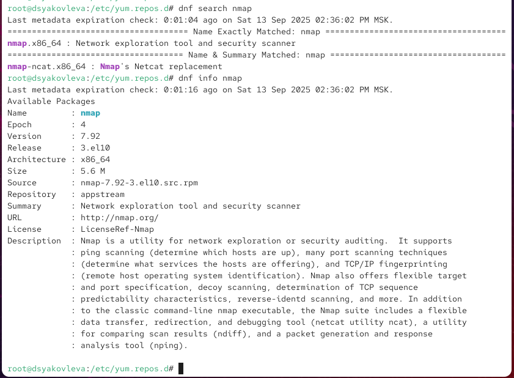{ #fig:003 width=70% }

Устанавливаю `nmap` двумя способами:  
- `dnf install nmap` — устанавливает основной пакет,  
- `dnf install nmap\*` — устанавливает пакет вместе с дополнительными утилитами (см. рис. [@fig:004]).  

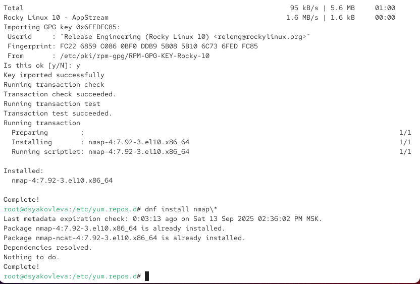{ #fig:004 width=70% }

Удаляю установленный пакет с помощью `dnf remove nmap` и `dnf remove nmap\*`. В результате из системы удаляется сам `nmap` и сопутствующие пакеты, такие как `nmap-ncat` (см. рис. [@fig:005]).  

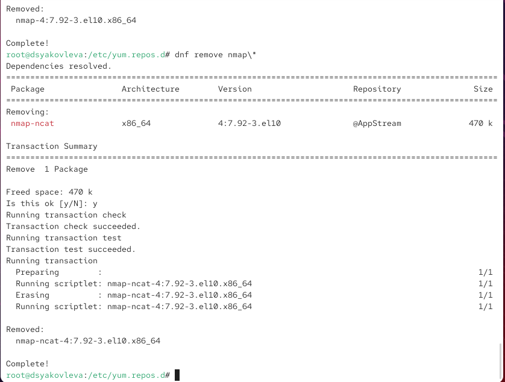{ #fig:005 width=70% }

Вывожу список доступных групп пакетов с помощью `dnf groups list`. Система показывает как установленные, так и доступные для установки группы. Также изучаю содержимое группы **RPM Development Tools** (см. рис. [@fig:006]).  

{ #fig:006 width=70% }

Удаляю группу пакетов **RPM Development Tools** с помощью `dnf groupremove`, а затем проверяю историю транзакций и восстанавливаю удалённые пакеты командой `dnf history undo` (см. рис. [@fig:007]).  

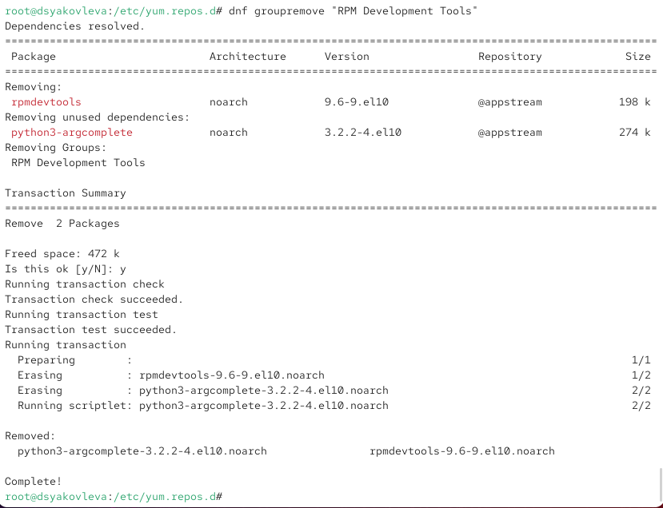{ #fig:007 width=70% }

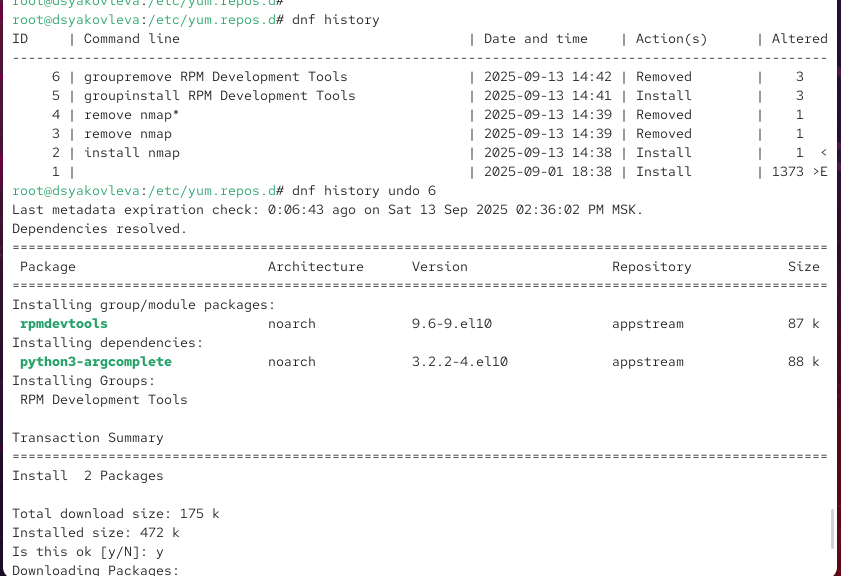{ #fig:008 width=70% }

## Использование rpm

Сначала с помощью команды `dnf list lynx` проверяю наличие пакета lynx в репозиториях. Затем выполняю его загрузку без установки (`dnf install lynx --downloadonly`). Пакет был успешно загружен в кэш (см. рис. [@fig:009]).  

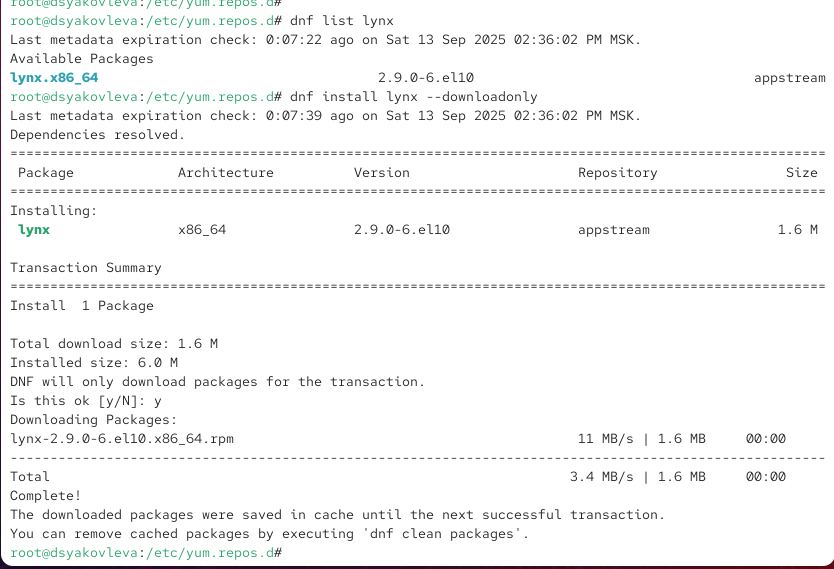{ #fig:009 width=70% }

Перехожу в каталог кэша и устанавливаю пакет при помощи `rpm -Uhv lynx-<версия>.rpm`. После установки проверяю расположение исполняемого файла (`which lynx`), принадлежность файла к пакету (`rpm -qf $(which lynx)`) и вывожу подробную информацию о пакете (`rpm -qi lynx`) (см. рис. [@fig:010]).  

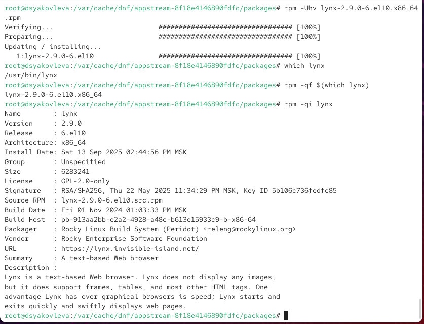{ #fig:010 width=70% }

Вывожу список всех файлов пакета с помощью `rpm -ql lynx`, а также отдельный список файлов документации командой `rpm -qd lynx`. В документации доступны руководства и описания изменений (см. рис. [@fig:011] и [@fig:012]).  

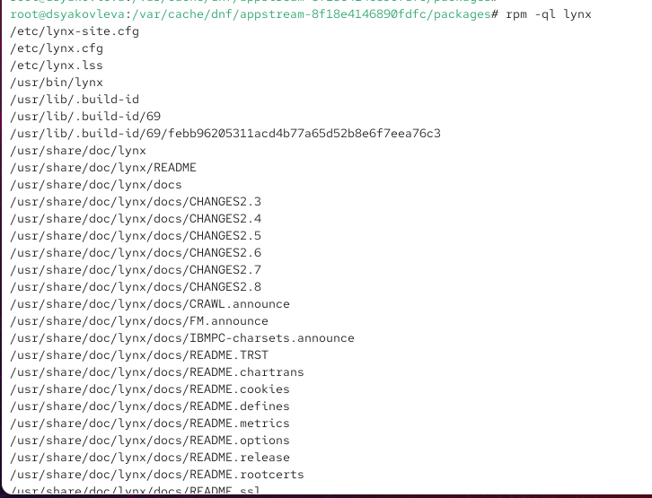{ #fig:011 width=70% }

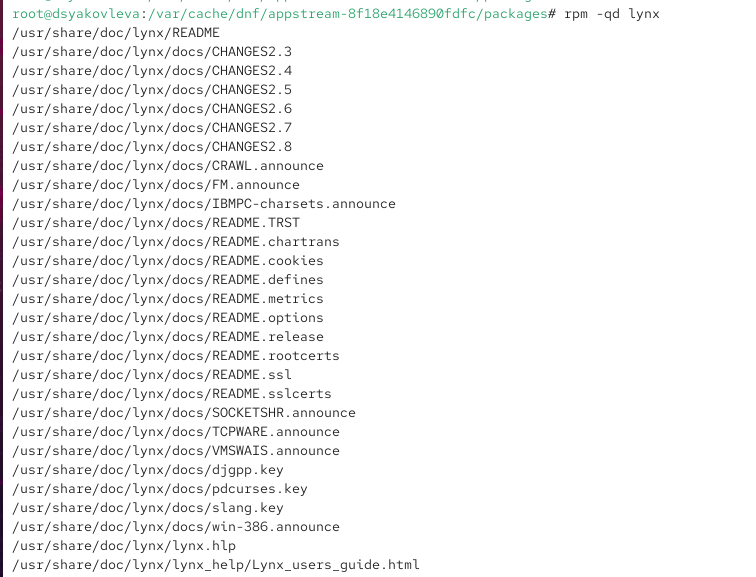{ #fig:012 width=70% }

Для просмотра документации запускаю `man lynx`, где представлено руководство по использованию браузера (см. рис. [@fig:013]).  

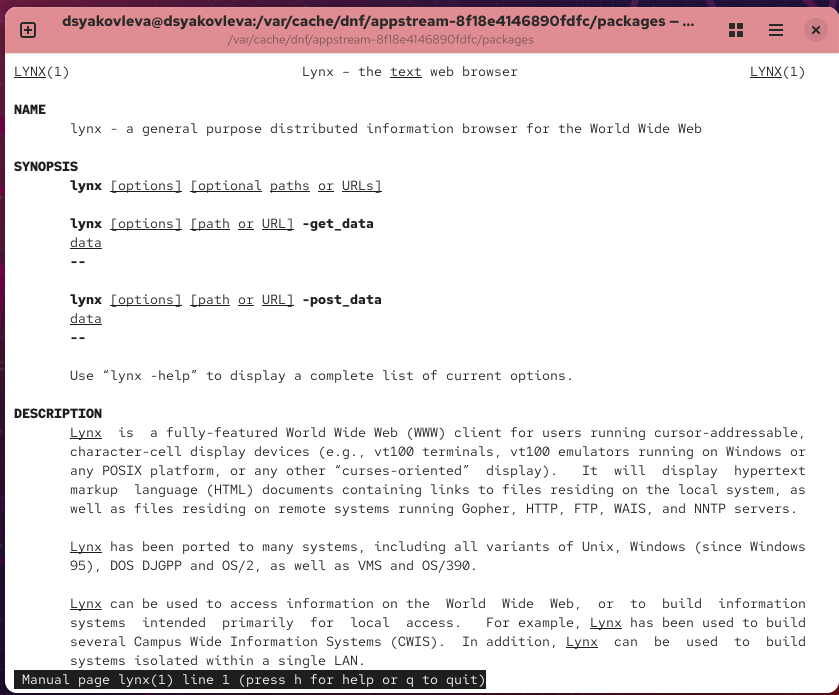{ #fig:013 width=70% }

Запускаю текстовый браузер `lynx`, который корректно открывает стартовую страницу Rocky Linux (см. рис. [@fig:014]).  

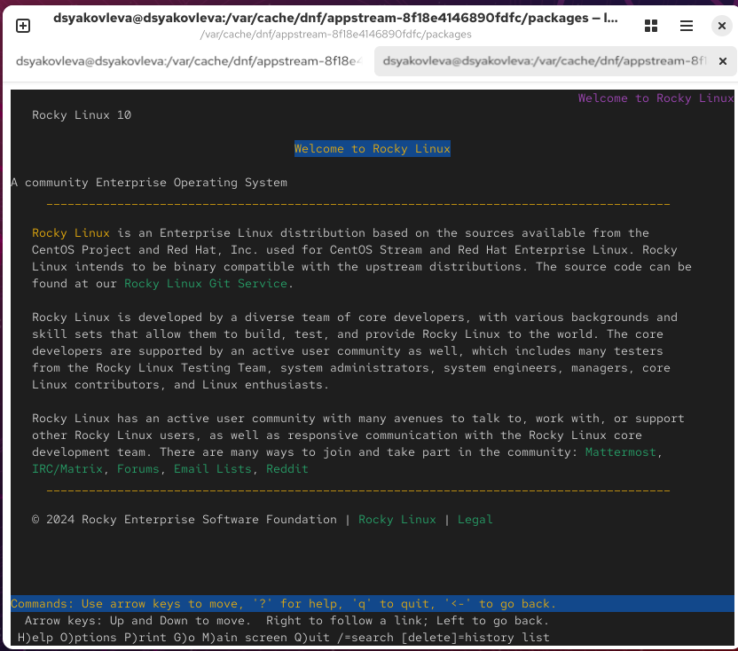{ #fig:014 width=70% }

Затем исследую конфигурационные файлы (`rpm -qc lynx`) и проверяю наличие установочных скриптов (`rpm -q --scripts lynx`). После этого удаляю пакет командой `rpm -e lynx` и убеждаюсь, что файл исчез из системы (см. рис. [@fig:015]).  

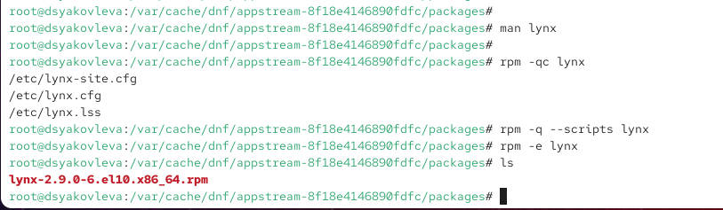{ #fig:015 width=70% }

Сначала проверяю наличие пакета dnsmasq в репозиториях командой `dnf list dnsmasq`. Затем выполняю установку с помощью `dnf install dnsmasq`. После установки определяю расположение исполняемого файла (`which dnsmasq`) и убеждаюсь, что он принадлежит пакету `dnsmasq` (`rpm -qf $(which dnsmasq)`) (см. рис. [@fig:016]).  

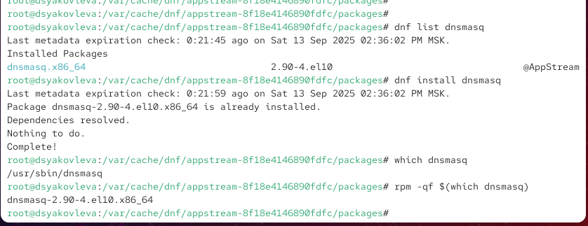{ #fig:016 width=70% }

Вывожу подробную информацию о пакете командой `rpm -qi dnsmasq`. Здесь указаны версия, архитектура, дата сборки, производитель и описание, из которого видно, что dnsmasq — это лёгкий DNS-, DHCP- и TFTP-сервер (см. рис. [@fig:017]).  

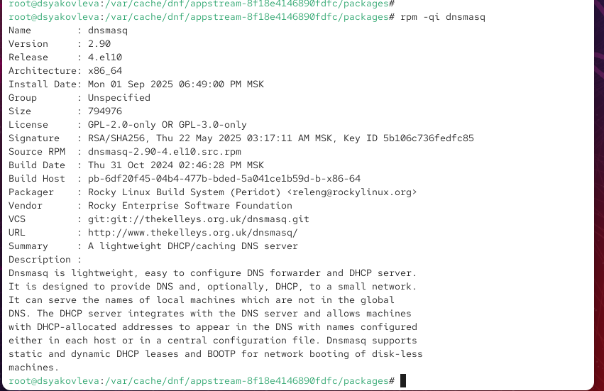{ #fig:017 width=70% }

Вывожу список всех файлов пакета (`rpm -ql dnsmasq`), включая исполняемые и конфигурационные файлы. Отдельно проверяю список документации (`rpm -qd dnsmasq`), где доступны справочные материалы, changelog и man-страницы (см. рис. [@fig:018]).  

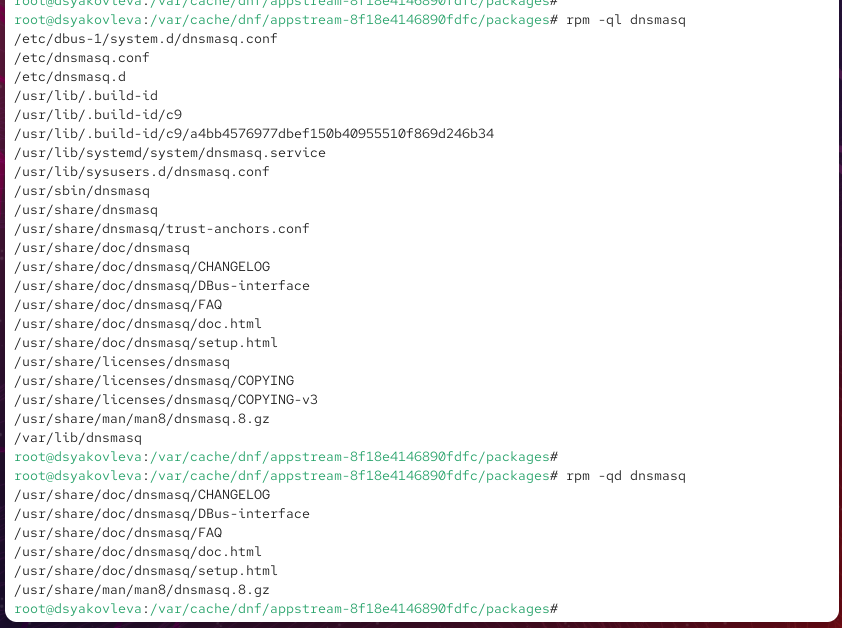{ #fig:018 width=70% }

Также просматриваю руководство пользователя через `man dnsmasq`, где приведено описание возможностей сервера и примеры использования (см. рис. [@fig:019]).  

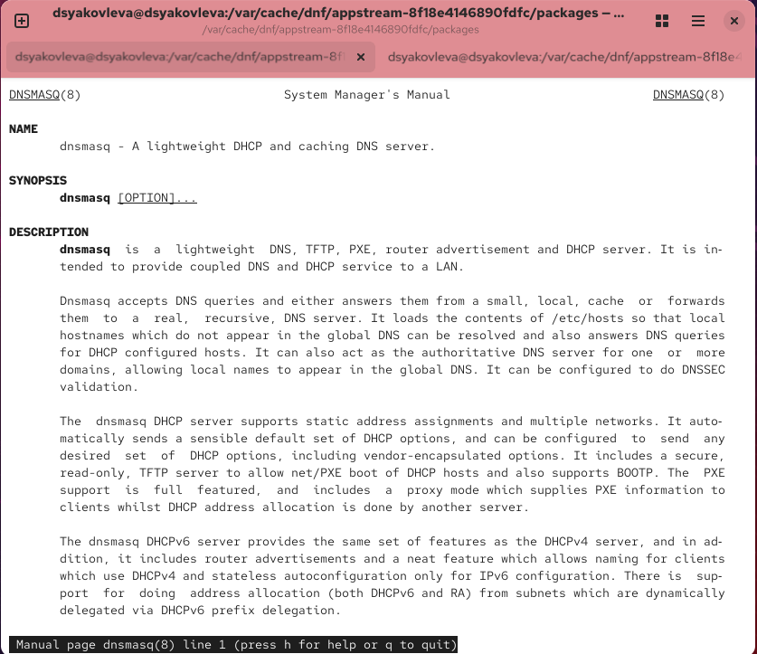{ #fig:019 width=70% }

Получаю список конфигурационных файлов с помощью `rpm -qc dnsmasq`. Затем изучаю установочные и удаляемые скрипты пакета (`rpm -q --scripts dnsmasq`). Из скриптов видно, что при установке создаются системный пользователь и группа `dnsmasq`, а также производится настройка сервисов systemd. При удалении выполняется их очистка (см. рис. [@fig:020]).  

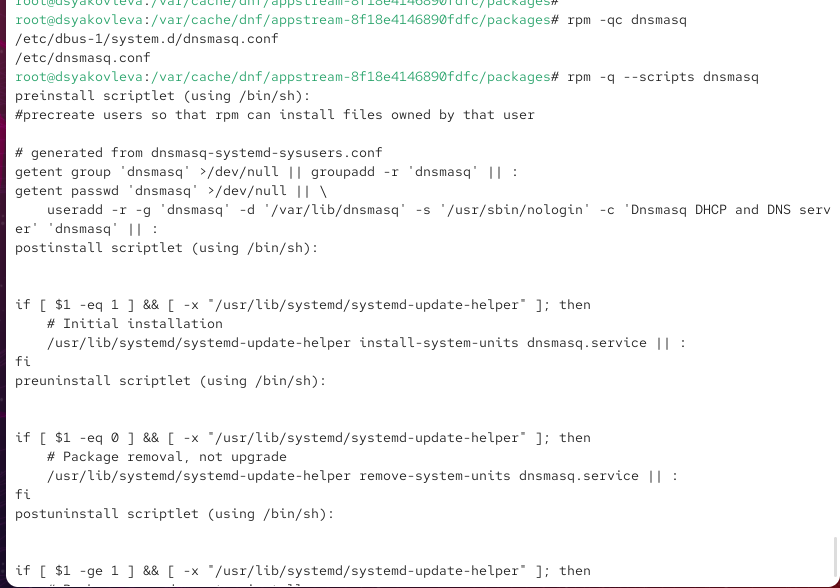{ #fig:020 width=70% }

После завершения работы удаляю пакет командой:  `rpm -e dnsmasq`

# Контрольные вопросы

1. **Какая команда позволяет вам искать пакет rpm, содержащий файл useradd?**  
   Используется команда `rpm -qf /usr/sbin/useradd` или `rpm -qf $(which useradd)`.

2. **Какие команды вам нужно использовать, чтобы показать имя группы dnf, которая содержит инструменты безопасности и показывает, что находится в этой группе?**  
   Сначала выполняется `dnf group list`, затем для выбранной группы — `dnf group info "Security Tools"`.

3. **Какая команда позволяет вам установить rpm, который вы загрузили из Интернета и который не находится в репозиториях?**  
   Для этого используется команда `rpm -Uvh package.rpm`.

4. **Вы хотите убедиться, что пакет rpm, который вы загрузили, не содержит никакого опасного кода сценария. Какая команда позволяет это сделать?**  
   Проверка выполняется с помощью команды `rpm -qp --scripts package.rpm`.

5. **Какая команда показывает всю документацию в rpm?**  
   Для этого используется команда `rpm -qd package_name`.

6. **Какая команда показывает, какому пакету rpm принадлежит файл?**  
   Это можно определить с помощью команды `rpm -qf /path/to/file`.

# Заключение

В ходе лабораторной работы были изучены возможности управления пакетами в Linux с использованием утилит `dnf` и `rpm`.  
Были выполнены операции установки, удаления и анализа пакетов, а также исследованы группы пакетов и их документация.  
Полученные навыки позволяют эффективно администрировать систему и контролировать состав установленного ПО.  
