---
## Front matter
lang: ru-RU
title: Отчёт по лабораторной работе №5
subtitle: Управление системными службами
author:
  - Яковлева Дарья Сергеевна
institute:
  - Российский университет дружбы народов, Москва, Россия
date: 19 сентября 2025

## i18n babel
babel-lang: russian
babel-otherlangs: english

## Formatting pdf
toc: false
slide_level: 2
aspectratio: 169
section-titles: true
theme: metropolis
header-includes:
 - \metroset{progressbar=frametitle,sectionpage=progressbar,numbering=fraction}
---

# Цель работы

## Цель

Получить навыки управления системными службами операционной системы посредством systemd.

# Выполнение лабораторной работы

## Управление сервисом vsftpd

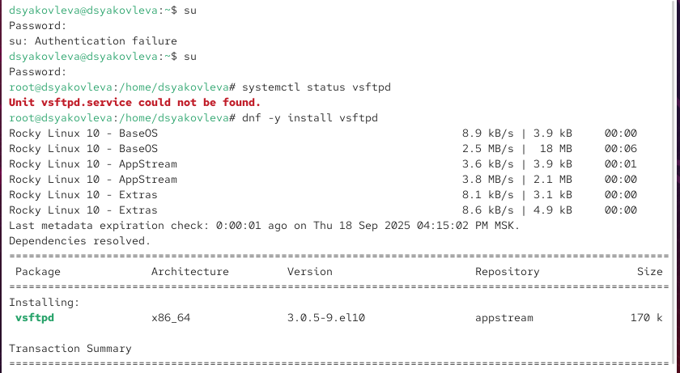{ #fig:001 width=70% }

## Управление сервисом vsftpd

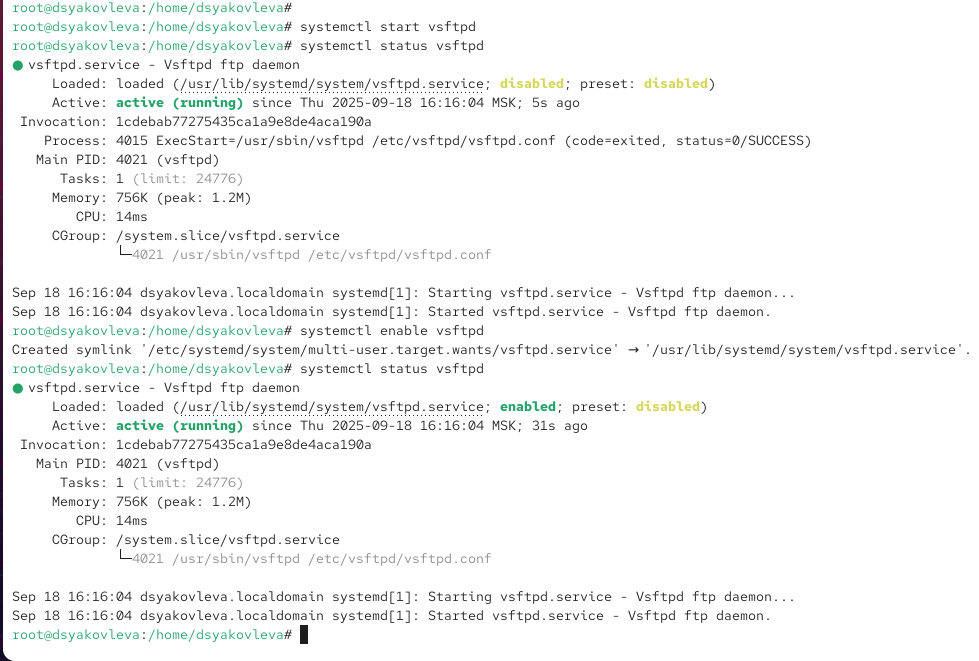{ #fig:002 width=70% }

## Управление сервисом vsftpd

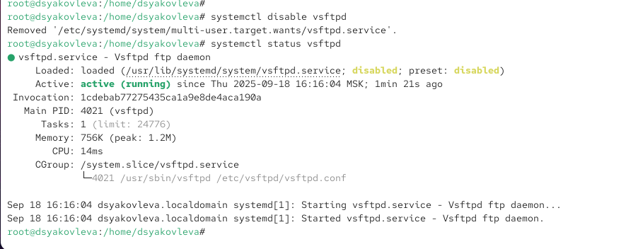{ #fig:003 width=70% }

## Управление сервисом vsftpd

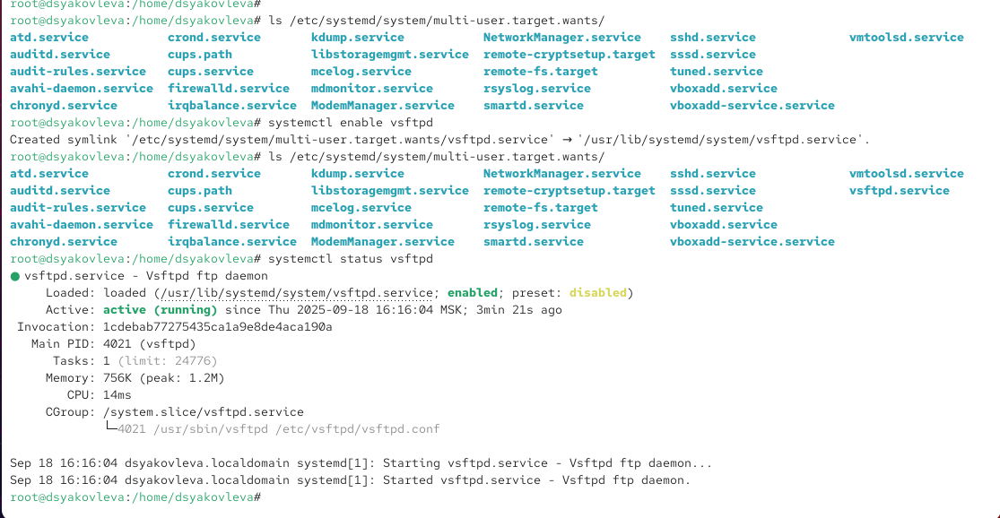{ #fig:004 width=70% }

## Управление сервисом vsftpd

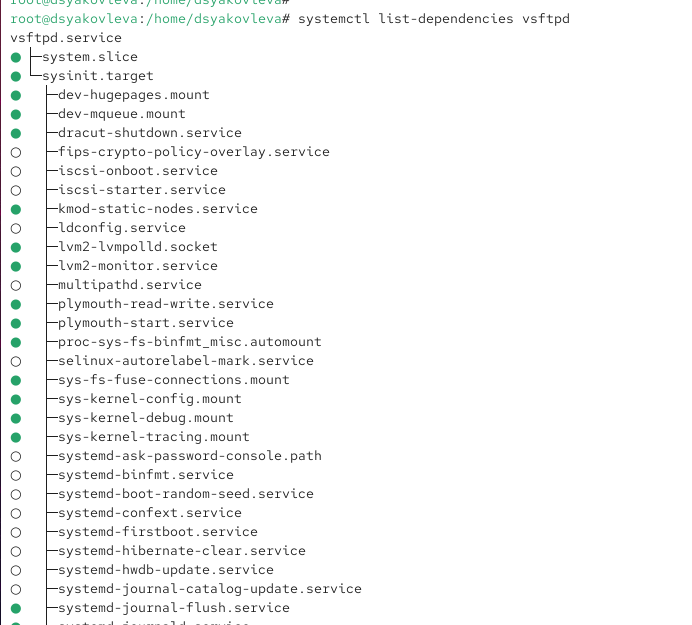{ #fig:005 width=70% }

## Управление сервисом vsftpd

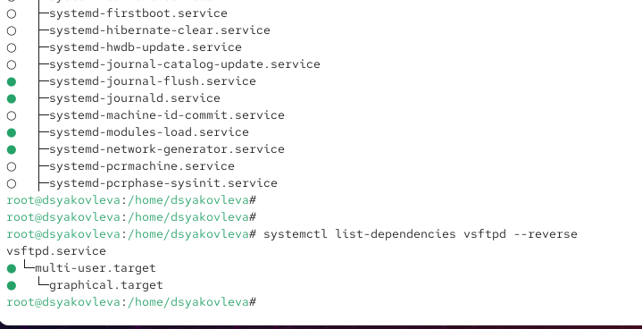{ #fig:006 width=70% }

## Конфликты юнитов

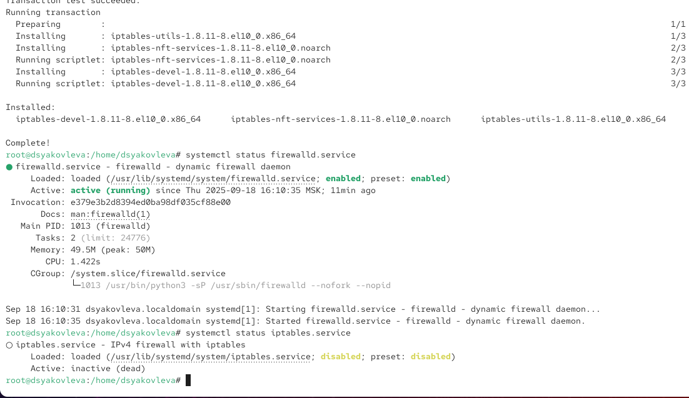{ #fig:007 width=70% }

## Конфликты юнитов

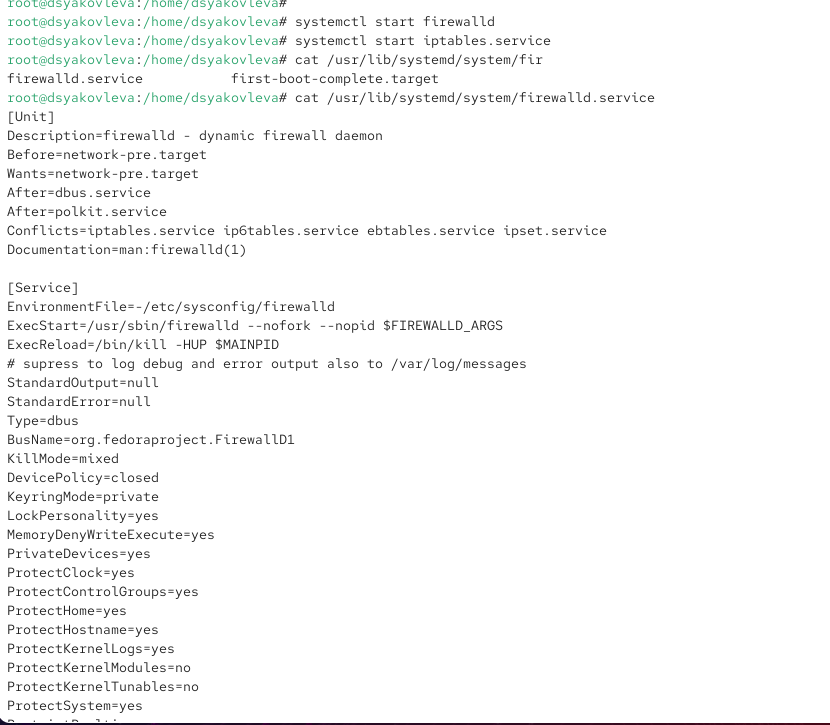{ #fig:008 width=70% }

## Конфликты юнитов

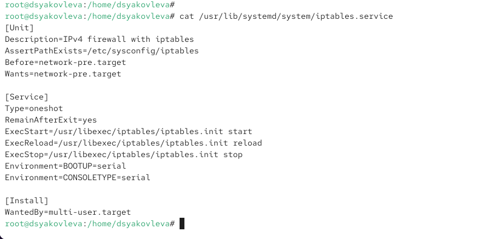{ #fig:009 width=70% }

## Конфликты юнитов

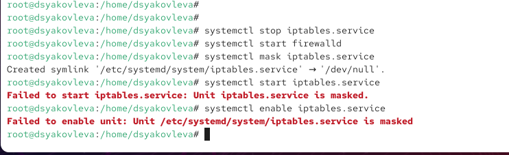{ #fig:010 width=70% }

## Изолируемые цели

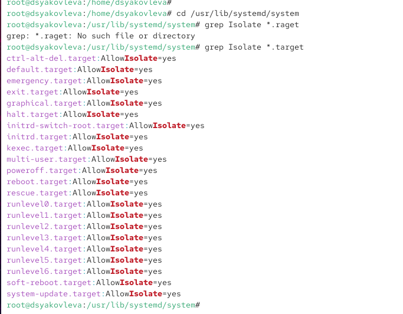{ #fig:011 width=70% }

## Изолируемые цели

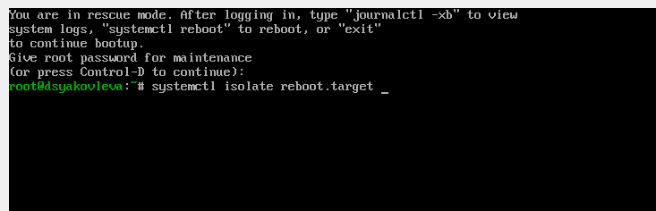{ #fig:012 width=70% }

## Цель по умолчанию

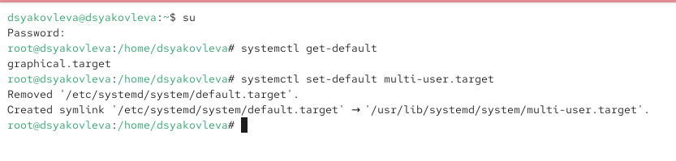{ #fig:013 width=70% }

## Цель по умолчанию

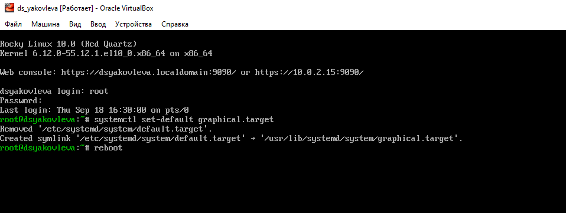{ #fig:014 width=70% }

# Итоги работы

## Управление сервисом vsftpd

* Проверка статуса: `systemctl status vsftpd`  
* Установка пакета: `dnf -y install vsftpd`  
* Запуск службы: `systemctl start vsftpd`  
* Добавление в автозагрузку: `systemctl enable vsftpd`  
* Удаление из автозагрузки: `systemctl disable vsftpd`  
* Просмотр зависимостей: `systemctl list-dependencies vsftpd`

## Изолируемые цели

* Список активных целей: `systemctl --type=target`  
* Список всех целей: `systemctl --type=target --all`  
* Поиск изолируемых: `grep Isolate *.target`  
* Переключение в режим восстановления: `systemctl isolate rescue.target`  
* Перезагрузка системы: `systemctl isolate reboot.target`

## Вывод

Были изучены принципы управления юнитами в systemd.  
Продемонстрированы установка и настройка сервисов, работа с автозагрузкой, разрешение конфликтов и использование изолируемых целей.
