---
## Front matter
title: "Отчёт по лабораторной работе №5"
subtitle: "Управление системными службами"
author: "Яковлева Дарья Сергеевна"

## Generic otions
lang: ru-RU
toc-title: "Содержание"

## Bibliography
bibliography: bib/cite.bib
csl: pandoc/csl/gost-r-7-0-5-2008-numeric.csl

## Pdf output format
toc: true # Table of contents
toc-depth: 2
lof: true # List of figures
lot: true # List of tables
fontsize: 12pt
linestretch: 1.5
papersize: a
documentclass: scrreprt
## I18n polyglossia
polyglossia-lang:
  name: russian
  options:
	- spelling=modern
	- babelshorthands=true
polyglossia-otherlangs:
  name: english
## I18n babel
babel-lang: russian
babel-otherlangs: english
## Fonts
mainfont: IBM Plex Serif
romanfont: IBM Plex Serif
sansfont: IBM Plex Sans
monofont: IBM Plex Mono
mathfont: STIX Two Math
mainfontoptions: Ligatures=Common,Ligatures=TeX,Scale=0.94
romanfontoptions: Ligatures=Common,Ligatures=TeX,Scale=0.94
sansfontoptions: Ligatures=Common,Ligatures=TeX,Scale=MatchLowercase,Scale=0.94
monofontoptions: Scale=MatchLowercase,Scale=0.94,FakeStretch=0.9
mathfontoptions:
## Biblatex
biblatex: true
biblio-style: "gost-numeric"
biblatexoptions:
  - parentracker=true
  - backend=biber
  - hyperref=auto
  - language=auto
  - autolang=other*
  - citestyle=gost-numeric
## Pandoc-crossref LaTeX customization
figureTitle: "Рис."
tableTitle: "Таблица"
listingTitle: "Листинг"
lofTitle: "Список иллюстраций"
lotTitle: "Список таблиц"
lolTitle: "Листинги"
## Misc options
indent: true
header-includes:
  - \usepackage{indentfirst}
  - \usepackage{float} # keep figures where there are in the text
  - \floatplacement{figure}{H} # keep figures where there are in the text
---

# Цель работы

Получить навыки управления системными службами операционной системы посредством systemd.

# Выполнение лабораторной работы

## Управление сервисом vsftpd

Получаю права администратора с помощью `su` (см. рис. [@fig:001]).  
Проверяю статус службы **Very Secure FTP Daemon (vsftpd)** с помощью `systemctl status vsftpd`.  
Вижу сообщение *Unit vsftpd.service could not be found*, что означает отсутствие установленного пакета (см. рис. [@fig:001]).

Устанавливаю сервис с помощью `dnf -y install vsftpd` (см. рис. [@fig:001]).

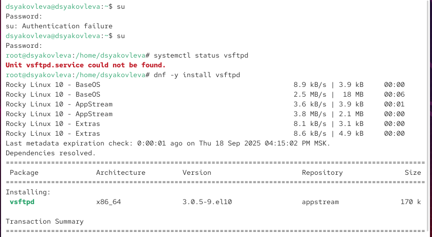{ #fig:001 width=70% }

Запускаю службу `vsftpd` командой `systemctl start vsftpd`, затем проверяю её состояние (см. рис. [@fig:002]).  
Статус показывает, что служба **active (running)**, но параметр автозагрузки остаётся *disabled*.

Добавляю сервис в автозапуск через `systemctl enable vsftpd` и снова проверяю статус.  
Теперь служба отображается как **enabled** (см. рис. [@fig:002]).

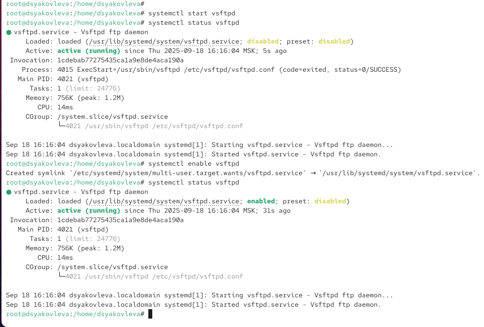{ #fig:002 width=70% }

Отключаю автозапуск с помощью `systemctl disable vsftpd`.  
После проверки состояния видно, что сервис остаётся **active (running)**, но параметр снова изменился на *disabled* (см. рис. [@fig:003]).

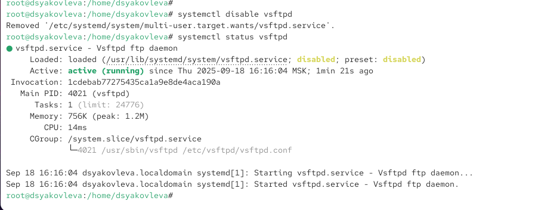{ #fig:003 width=70% }

Просматриваю список символических ссылок, отвечающих за автозапуск сервисов:  
`ls /etc/systemd/system/multi-user.target.wants` (см. рис. [@fig:004]).  

После включения `vsftpd` снова (`systemctl enable vsftpd`) видно, что появилась ссылка на `/usr/lib/systemd/system/vsftpd.service` в каталоге автозагрузки (см. рис. [@fig:004]).

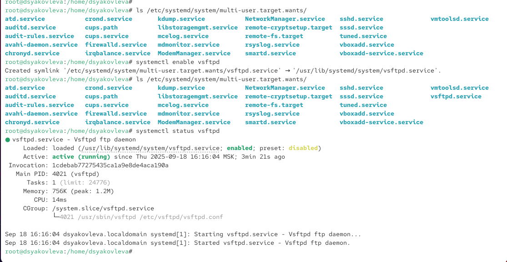{ #fig:004 width=70% }

Снова проверяю статус `vsftpd` (см. рис. [@fig:005]).  
Теперь видно, что служба находится в состоянии **enabled** и работает в активном режиме.

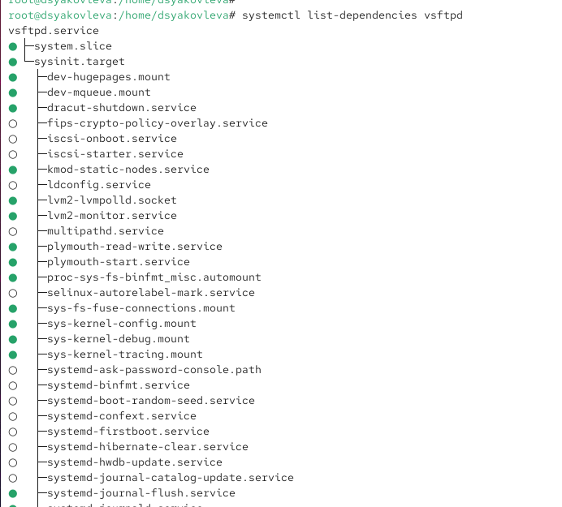{ #fig:005 width=70% }

Вывожу список зависимостей юнита:  
`systemctl list-dependencies vsftpd` (см. рис. [@fig:006]).  

Затем отображаю список юнитов, которые зависят от данного сервиса, используя ключ `--reverse` (см. рис. [@fig:006]).

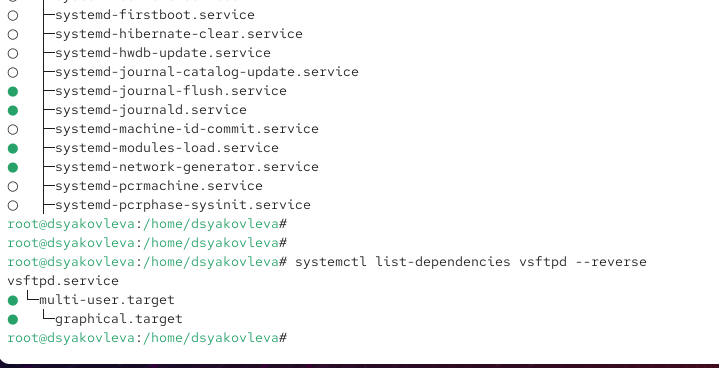{ #fig:006 width=70% }

## Конфликты юнитов (iptables и firewalld)

Сначала получаю полномочия администратора и устанавливаю пакет iptables с помощью команды  
`dnf -y install iptables*` (см. рис. [@fig:007]).

Проверяю статус сервисов `firewalld` и `iptables` (см. рис. [@fig:007]).  
Вижу, что `firewalld` активен (**active, running, enabled**), а `iptables` отключён (**inactive, disabled**).

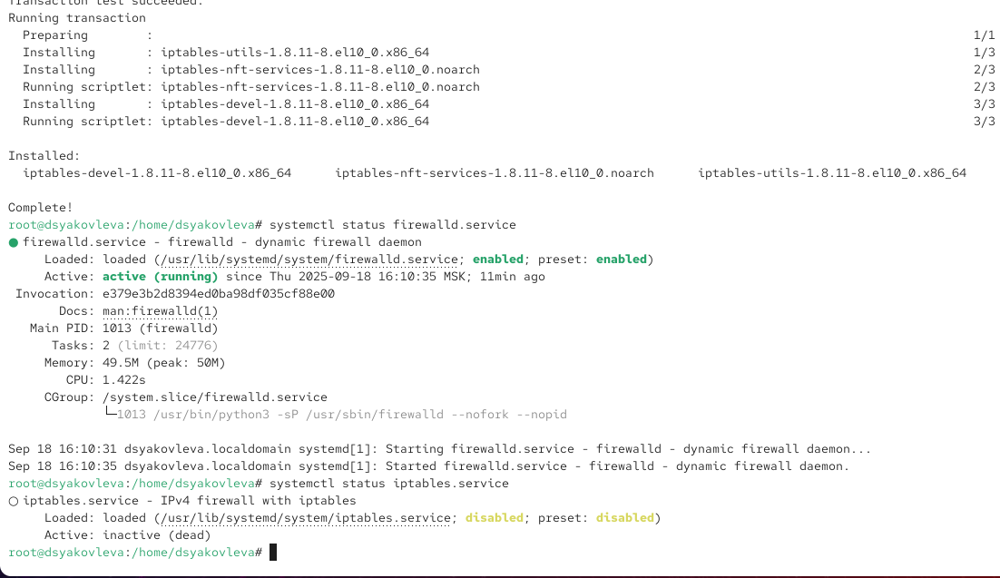{ #fig:007 width=70% }

Пробую запустить обе службы:  
`systemctl start firewalld` и `systemctl start iptables` (см. рис. [@fig:008]).  

При запуске одной службы вторая деактивируется, что подтверждает наличие конфликта.

Далее просматриваю содержимое юнит-файлов:  
- `/usr/lib/systemd/system/firewalld.service` — в секции **[Unit]** указан параметр `Conflicts=iptables.service`, который запрещает их одновременный запуск.  
- `/usr/lib/systemd/system/iptables.service` — в нём нет явного конфликта, но он включён по умолчанию в список сервисов, связанных с сетью.  

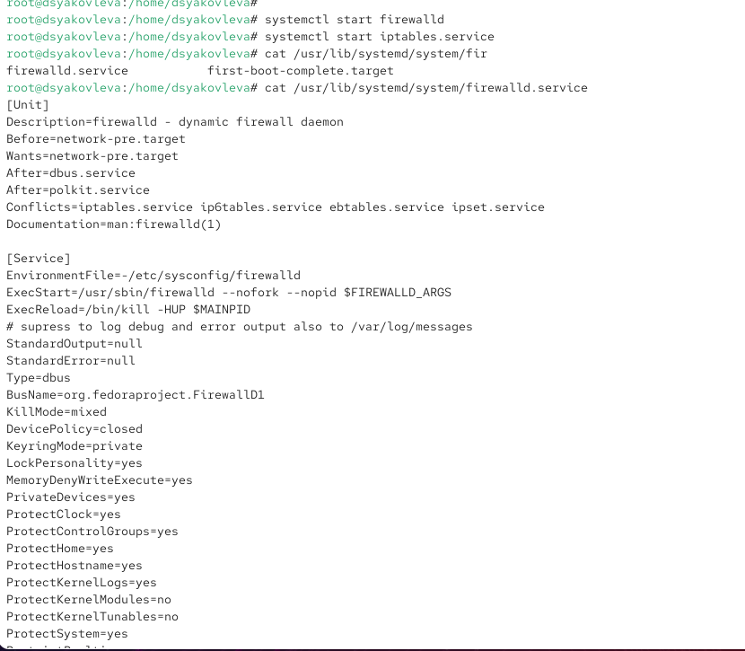{ #fig:008 width=70% }

Останавливаю службу `iptables` (на всякий случай, чтобы убедиться, что она выгружена) и запускаю `firewalld` (см. рис. [@fig:009]).  
После этого блокирую `iptables` командой `systemctl mask iptables`.  

При этом создаётся символическая ссылка `/etc/systemd/system/iptables.service → /dev/null`, что гарантирует невозможность случайного запуска (см. рис. [@fig:009]).

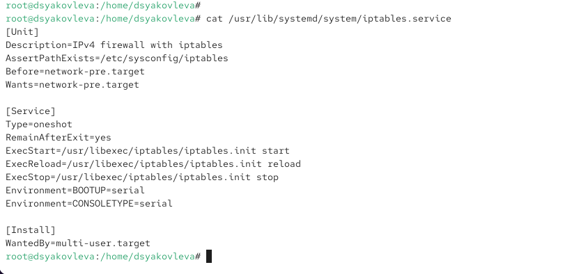{ #fig:009 width=70% }

Пробую снова запустить службу `iptables`:  
`systemctl start iptables`  

Получаю сообщение об ошибке *Unit iptables.service is masked*, что подтверждает блокировку запуска (см. рис. [@fig:010]).  

Аналогично, при попытке добавить сервис в автозагрузку через `systemctl enable iptables` отображается ошибка *Unit is masked*, и служба остаётся в неактивном состоянии.

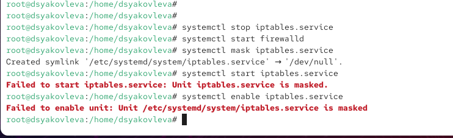{ #fig:010 width=70% }

## Изолируемые цели

Перехожу в каталог `/usr/lib/systemd/system` и выполняю поиск целей, которые поддерживают изоляцию.  
В результате вижу список unit-файлов с параметром `AllowIsolate=yes` (см. рис. [@fig:011]).  

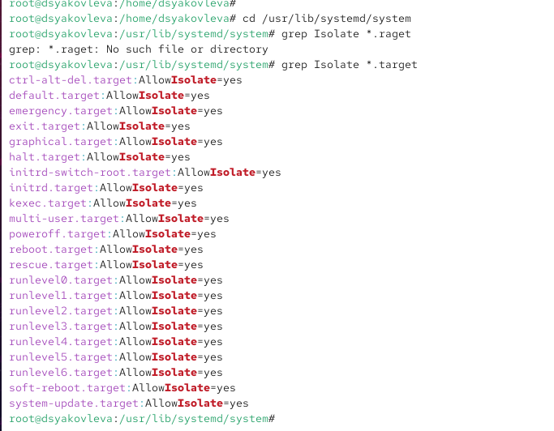{ #fig:011 width=70% }

Переключаю систему в режим восстановления (`rescue.target`).  
Для входа в систему требуется ввести пароль root (см. рис. [@fig:012]).  

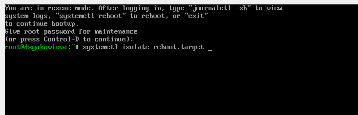{ #fig:012 width=70% }

Перезапускаю систему, изолировав цель `reboot.target`.  
Это приводит к перезагрузке операционной системы (см. рис. [@fig:012]).  

## Цель по умолчанию

Определяю, какая цель установлена по умолчанию, с помощью команды `systemctl get-default`.  
По умолчанию загружается `graphical.target` (см. рис. [@fig:013]).  

Изменяю цель по умолчанию на `multi-user.target` с помощью `systemctl set-default multi-user.target`.  
После перезагрузки система загружается в текстовом режиме (см. рис. [@fig:013]).  

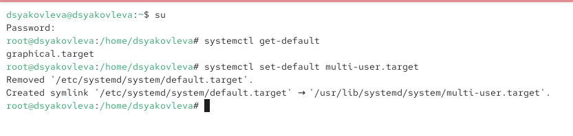{ #fig:013 width=70% }

Снова изменяю цель по умолчанию на `graphical.target` через `systemctl set-default graphical.target`.  
После перезагрузки система загружается в графическом режиме (см. рис. [@fig:014]).  

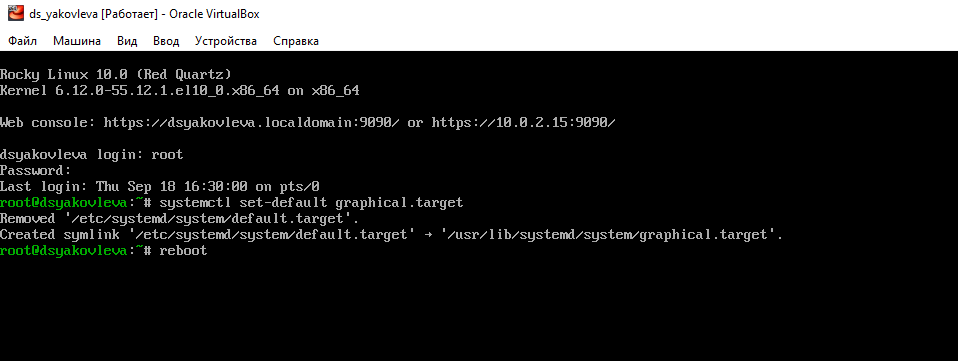{ #fig:014 width=70% }

# Контрольные вопросы

1. **Что такое юнит (unit)? Приведите примеры.**  
   Юнит — это объект управления в systemd, который описывает сервис, точку монтирования, устройство, цель и т. д.  
   Примеры: `sshd.service`, `multi-user.target`, `home.mount`.

2. **Какая команда позволяет вам убедиться, что цель больше не входит в список автоматического запуска при загрузке системы?**  
   Используется команда `systemctl disable <unit>`. Она удаляет символические ссылки из каталога автозагрузки.

3. **Какую команду вы должны использовать для отображения всех сервисных юнитов, которые в настоящее время загружены?**  
   Команда `systemctl list-units --type=service`.

4. **Как создать потребность (wants) в сервисе?**  
   Потребность создаётся через команду `systemctl enable <unit>`.  
   При этом создаётся символическая ссылка в каталоге `*.wants`.

5. **Как переключить текущее состояние на цель восстановления (rescue target)?**  
   Используется команда `systemctl isolate rescue.target`.

6. **Поясните причину получения сообщения о том, что цель не может быть изолирована.**  
   Сообщение появляется, если в unit-файле отсутствует параметр `AllowIsolate=yes`, то есть данная цель не поддерживает изоляцию.

7. **Вы хотите отключить службу systemd, но, прежде чем сделать это, вы хотите узнать, какие другие юниты зависят от этой службы. Какую команду вы бы использовали?**  
   Используется команда `systemctl list-dependencies <unit> --reverse`.

# Заключение

В ходе выполнения лабораторной работы были изучены принципы управления юнитами в systemd. На практике продемонстрированы установка и настройка сервисов, работа с автозагрузкой, разрешение конфликтов и использование изолируемых целей.
