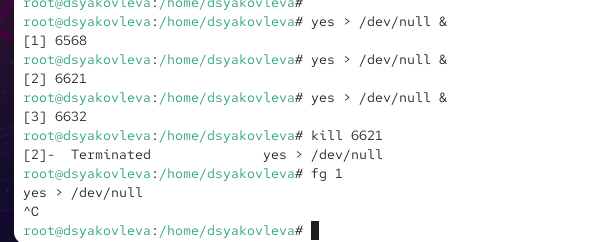

---
## Front matter
lang: ru-RU
title: Отчёт по лабораторной работе №6
subtitle: Управление процессами
author:
  - Яковлева Дарья Сергеевна
institute:
  - Российский университет дружбы народов, Москва, Россия
date: 24 сентября 2025

## i18n babel
babel-lang: russian
babel-otherlangs: english

## Formatting pdf
toc: false
slide_level: 2
aspectratio: 169
section-titles: true
theme: metropolis
header-includes:
 - \metroset{progressbar=frametitle,sectionpage=progressbar,numbering=fraction}
---

# Цель работы

## Цель

Получить навыки управления процессами операционной системы.

# Выполнение лабораторной работы

## Управление заданиями

{ #fig:001 width=70% }

## Управление заданиями

{ #fig:002 width=70% }

## Управление заданиями

{ #fig:003 width=70% }

## Управление процессами

{ #fig:004 width=70% }

## Управление процессами

{ #fig:005 width=70% }

## Управление процессами

{ #fig:006 width=70% }

## Задание 1

{ #fig:007 width=70% }

## Задание 2

{ #fig:008 width=70% }

## Задание 2

{ #fig:009 width=70% }

## Задание 2

{ #fig:010 width=70% }

## Задание 2

{ #fig:011 width=70% }

## Задание 2

{ #fig:012 width=70% }

## Задание 2

{ #fig:013 width=70% }

# Контрольные вопросы

## Основные команды

* `jobs` — просмотр текущих заданий
* **Ctrl+Z** — приостановка задания
* **Ctrl+C** — завершение задания
* `fg` / `bg` — перевод задания в передний или фоновый режим

## Работа с процессами

* `ps aux`, `ps fax` — список процессов и их иерархия
* `kill <PID>` — завершение процесса
* `killall <имя>` — завершение всех процессов с именем
* `top` — мониторинг процессов, завершение по клавише **k**
* `nice`, `renice` — управление приоритетами процессов

# Итоги работы

## Вывод

Были приобретены практические навыки управления заданиями и процессами в Linux:  
* запуск программ в фоновом и переднем режиме,  
* приостановка и возобновление выполнения,  
* завершение отдельных процессов и групп процессов,  
* работа с приоритетами с помощью `nice` и `renice`.  
