---
## Front matter
title: "Отчёт по лабораторной работе №6"
subtitle: "Управление процессами"
author: "Яковлева Дарья Сергеевна"

## Generic otions
lang: ru-RU
toc-title: "Содержание"

## Bibliography
bibliography: bib/cite.bib
csl: pandoc/csl/gost-r-7-0-5-2008-numeric.csl

## Pdf output format
toc: true # Table of contents
toc-depth: 2
lof: true # List of figures
lot: true # List of tables
fontsize: 12pt
linestretch: 1.5
papersize: a
documentclass: scrreprt
## I18n polyglossia
polyglossia-lang:
  name: russian
  options:
	- spelling=modern
	- babelshorthands=true
polyglossia-otherlangs:
  name: english
## I18n babel
babel-lang: russian
babel-otherlangs: english
## Fonts
mainfont: IBM Plex Serif
romanfont: IBM Plex Serif
sansfont: IBM Plex Sans
monofont: IBM Plex Mono
mathfont: STIX Two Math
mainfontoptions: Ligatures=Common,Ligatures=TeX,Scale=0.94
romanfontoptions: Ligatures=Common,Ligatures=TeX,Scale=0.94
sansfontoptions: Ligatures=Common,Ligatures=TeX,Scale=MatchLowercase,Scale=0.94
monofontoptions: Scale=MatchLowercase,Scale=0.94,FakeStretch=0.9
mathfontoptions:
## Biblatex
biblatex: true
biblio-style: "gost-numeric"
biblatexoptions:
  - parentracker=true
  - backend=biber
  - hyperref=auto
  - language=auto
  - autolang=other*
  - citestyle=gost-numeric
## Pandoc-crossref LaTeX customization
figureTitle: "Рис."
tableTitle: "Таблица"
listingTitle: "Листинг"
lofTitle: "Список иллюстраций"
lotTitle: "Список таблиц"
lolTitle: "Листинги"
## Misc options
indent: true
header-includes:
  - \usepackage{indentfirst}
  - \usepackage{float} # keep figures where there are in the text
  - \floatplacement{figure}{H} # keep figures where there are in the text
---

# Цель работы

Получить навыки управления процессами операционной системы.

# Выполнение лабораторной работы

## Управление заданиями

Получаю полномочия администратора с помощью `su` (см. рис. [@fig:001]).

Запускаю три задания:  
- `sleep 3600 &` — первое задание в фоне;  
- `dd if=/dev/zero of=/dev/null &` — второе задание в фоне;  
- `sleep 7200` — третье задание, запущенное без `&`.  

Поскольку третье задание блокирует терминал, прерываю его комбинацией **Ctrl+Z**, после чего проверяю список заданий с помощью `jobs` (см. рис. [@fig:001]).

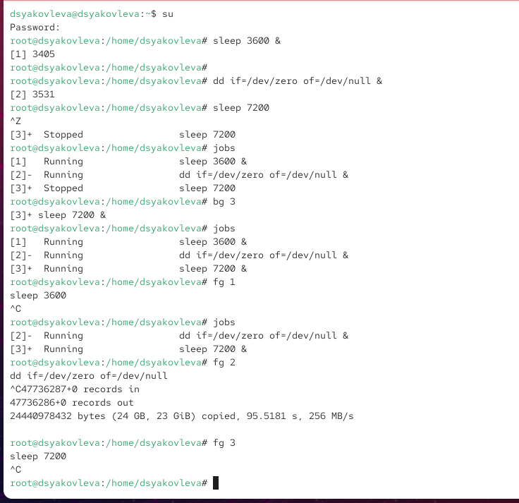{ #fig:001 width=70% }

Вижу, что первые два задания находятся в состоянии *Running*, а третье — *Stopped*.  
Перевожу задание 3 в фоновый режим командой `bg 3`, снова проверяю список заданий через `jobs`. Теперь все три задания работают в фоне.

Переношу задание 1 на передний план с помощью `fg 1`, затем останавливаю его комбинацией **Ctrl+C**. Аналогично завершаю задания 2 и 3 (см. рис. [@fig:001]).

Открываю новый терминал от имени пользователя и запускаю в нём процесс `dd if=/dev/zero of=/dev/null &`.  
Закрываю терминал командой `exit`.

В другом терминале под тем же пользователем запускаю утилиту `top`, где вижу, что процесс `dd` продолжает работать (см. рис. [@fig:002]).

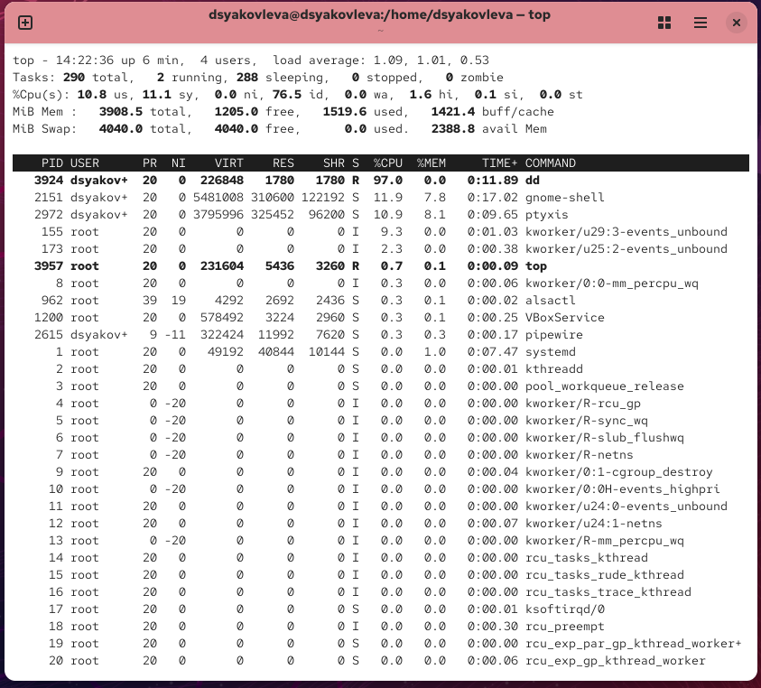{ #fig:002 width=70% }

Выход из `top` выполняю клавишей **q**. Затем снова запускаю `top` и использую клавишу **k** для завершения процесса `dd`. В списке процессов он больше не отображается (см. рис. [@fig:003]).

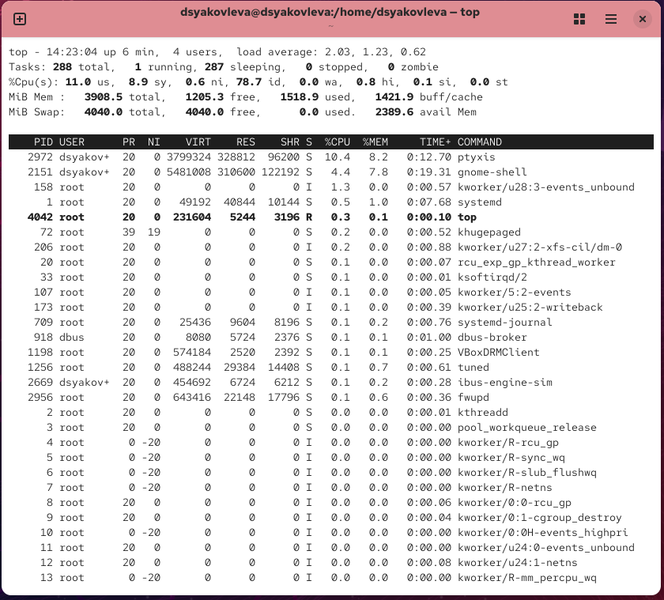{ #fig:003 width=70% }

## Управление процессами

Получаю полномочия администратора с помощью `su`.

Запускаю три процесса `dd`, которые пишут поток данных из `/dev/zero` в `/dev/null` (см. рис. [@fig:004]).

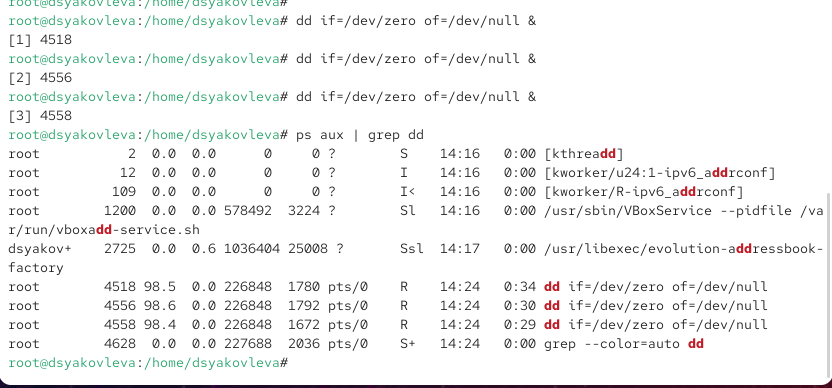{ #fig:004 width=70% }

С помощью команды `ps aux | grep dd` просматриваю список процессов. Вижу три активных процесса `dd` с различными PID (см. рис. [@fig:004]).

Меняю приоритет одного из процессов, используя команду `renice -n 5 <PID>`. В результате приоритет изменяется с 0 на 5 (см. рис. [@fig:005]).

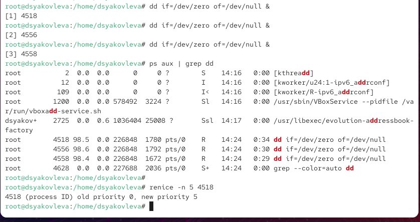{ #fig:005 width=70% }

Для отображения иерархии процессов использую команду `ps fax | grep -B5 dd`. Вижу дерево выполнения, где процессы `dd` являются дочерними для корневой оболочки `bash`, запущенной из-под `su` (см. рис. [@fig:006]).

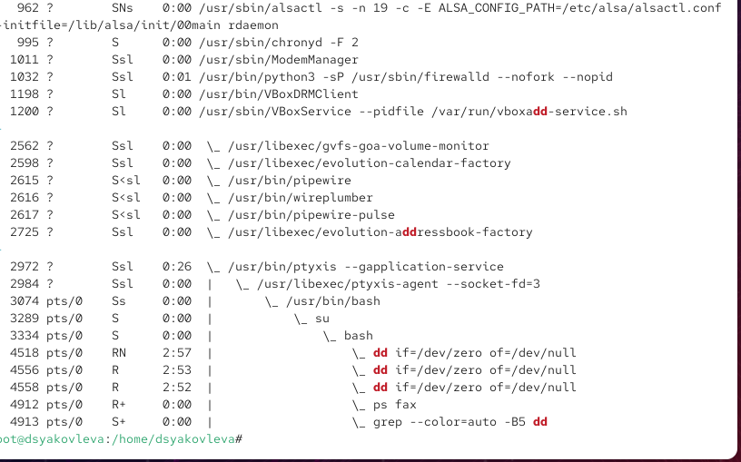{ #fig:006 width=70% }

Нахожу PID родительского процесса `bash`, из которого были запущены процессы `dd`, и завершаю его с помощью `kill -9 <PID>`. В результате оболочка закрывается, и все дочерние процессы `dd` останавливаются автоматически.

## Задание 1

Запускаю три процесса `dd`, которые пишут данные из `/dev/zero` в `/dev/null`, в фоновом режиме (см. рис. [@fig:007]).

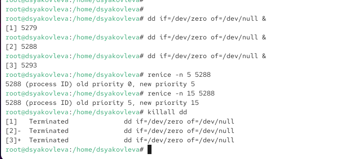{ #fig:007 width=70% }

Меняю приоритет одного из процессов на значение `-5` с помощью команды `renice -n -5 <PID>`. В результате приоритет изменяется с 0 на 5.  

Затем повторно изменяю приоритет этого же процесса, установив значение `-15`. Теперь приоритет изменяется с 5 на 15 (см. рис. [@fig:007]).

Для завершения всех процессов `dd` использую команду `killall dd`. Вижу сообщение о завершении трёх процессов (см. рис. [@fig:007]).

## Задание 2

Запускаю программу `yes` в фоновом режиме с подавлением потока вывода. Аналогично запускаю её несколько раз на переднем плане, приостанавливаю выполнение комбинацией **Ctrl+Z**, затем перевожу процессы в фон с помощью `bg` и завершаю их при необходимости (см. рис. [@fig:008]).

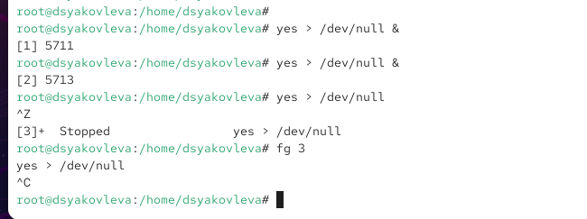{ #fig:008 width=70% }

С помощью команды `jobs` проверяю состояния заданий. Вижу, что процессы находятся в состоянии *Running*. Один из процессов перевожу на передний план командой `fg`, затем завершаю его (см. рис. [@fig:009]).

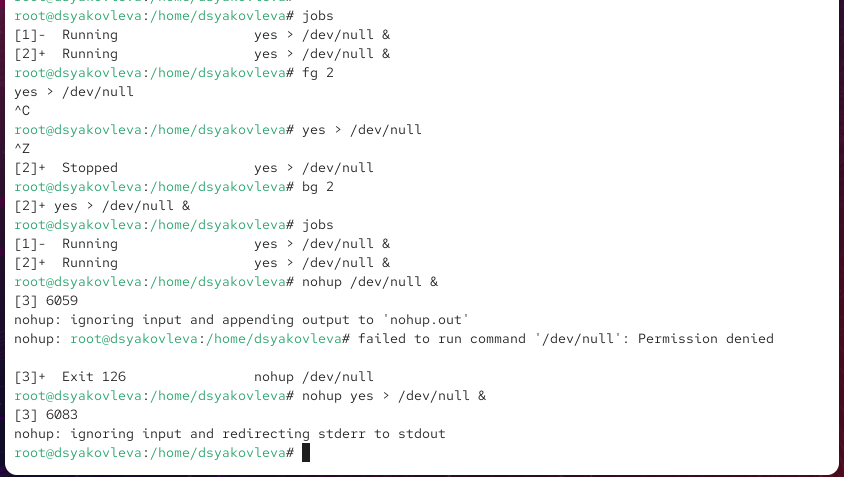{ #fig:009 width=70% }

Для запуска процесса, продолжающего работу после выхода из терминала, использую `nohup yes > /dev/null &`. Проверяю результат через `jobs`, где видно, что процесс перенаправил вывод в файл `nohup.out`. После закрытия терминала и повторного входа убеждаюсь, что процесс остался активным (см. рис. [@fig:009]).

Получаю информацию о процессах с помощью утилиты `top`. Наглядно видно, что процессы `yes` потребляют значительные ресурсы процессора (см. рис. [@fig:010]).

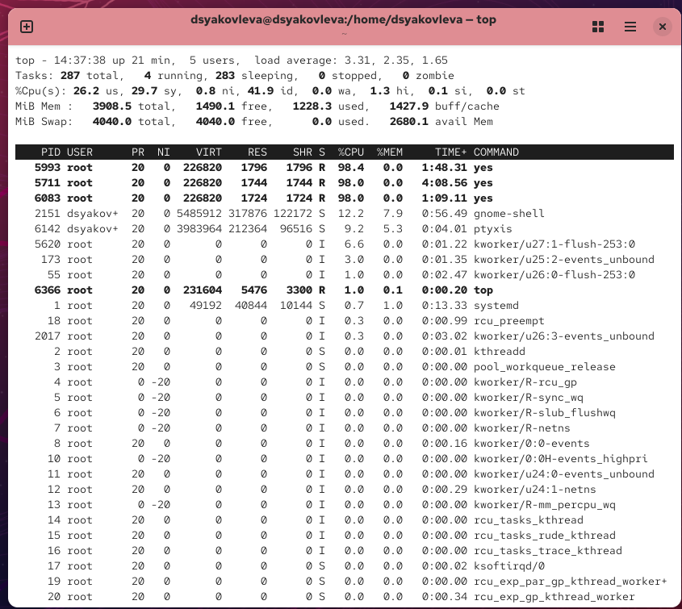{ #fig:010 width=70% }

Запускаю ещё три процесса `yes` в фоне. Завершаю один из них по PID, а второй — по идентификатору задания. Использую команду `kill` и наблюдаю завершение процессов (см. рис. [@fig:011]).

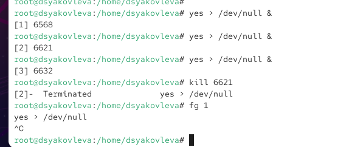{ #fig:011 width=70% }

Далее отправляю сигнал `SIGHUP` обычному процессу и процессу, запущенному с помощью `nohup`. При этом обычный процесс завершается, а процесс под `nohup` продолжает работу (см. рис. [@fig:012]).

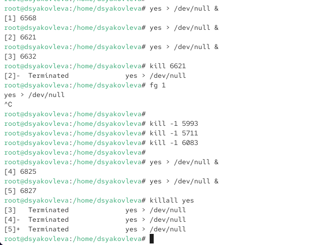{ #fig:012 width=70% }

Запускаю несколько процессов `yes` в фоне, а затем завершаю их одновременно командой `killall yes` (см. рис. [@fig:013]).

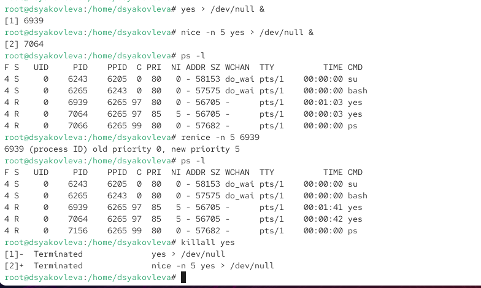{ #fig:013 width=70% }

Запускаю процесс `yes` с повышенным приоритетом при помощи `nice -n -5`. Сравниваю приоритеты процессов через `ps -l`: вижу различие в значениях. Затем с помощью `renice` выравниваю приоритеты, установив одинаковое значение для обоих процессов (см. рис. [@fig:013]).

# Контрольные вопросы

1. **Какая команда даёт обзор всех текущих заданий оболочки?**  
   Используется команда `jobs`.

2. **Как остановить текущее задание оболочки, чтобы продолжить его выполнение в фоновом режиме?**  
   Используется комбинация клавиш **Ctrl+Z**, затем команда `bg`.

3. **Какую комбинацию клавиш можно использовать для отмены текущего задания оболочки?**  
   Для завершения задания применяется комбинация **Ctrl+C**.

4. **Необходимо отменить одно из начатых заданий. Доступ к оболочке, в которой в данный момент работает пользователь, невозможен. Что можно сделать, чтобы отменить задание?**  
   Использовать команду `kill <PID>` из другой оболочки или завершить родительский процесс, от которого оно запущено.

5. **Какая команда используется для отображения отношений между родительскими и дочерними процессами?**  
   Команда `ps fax`.

6. **Какая команда позволит изменить приоритет процесса с идентификатором 1234 на более высокий?**  
   Команда `renice -n -5 -p 1234`.

7. **В системе в настоящее время запущено 20 процессов dd. Как проще всего остановить их все сразу?**  
   Использовать команду `killall dd`.

8. **Какая команда позволяет остановить команду с именем mycommand?**  
   Используется команда `killall mycommand`.

9. **Какая команда используется в top, чтобы убить процесс?**  
   Внутри `top` используется клавиша **k** и вводится PID процесса.

10. **Как запустить команду с достаточно высоким приоритетом, не рискуя, что не хватит ресурсов для других процессов?**  
    Используется команда `nice`, например: `nice -n 10 mycommand`.

# Заключение

В ходе лабораторной работы были приобретены практические навыки управления заданиями и процессами в Linux: запуск программ в фоновом и переднем режиме, приостановка и возобновление выполнения, завершение отдельных процессов и групп процессов. Освоены приёмы работы с приоритетами процессов с помощью утилит `nice` и `renice`, а также использование команд `jobs`, `ps`, `top`, `kill` и `killall`. Полученные знания позволяют эффективно контролировать работу процессов и управлять распределением ресурсов в системе.
