---
## Front matter
lang: ru-RU
title: Отчёт по лабораторной работе №7
subtitle: Управление журналами событий в системе
author:
  - Яковлева Дарья Сергеевна
institute:
  - Российский университет дружбы народов, Москва, Россия
date: 1 октября 2025

## i18n babel
babel-lang: russian
babel-otherlangs: english

## Formatting pdf
toc: false
slide_level: 2
aspectratio: 169
section-titles: true
theme: metropolis
header-includes:
 - \metroset{progressbar=frametitle,sectionpage=progressbar,numbering=fraction}
---

# Цель работы

## Цель

Получить навыки работы с журналами мониторинга различных событий в системе.

# Выполнение лабораторной работы

## Мониторинг системных событий

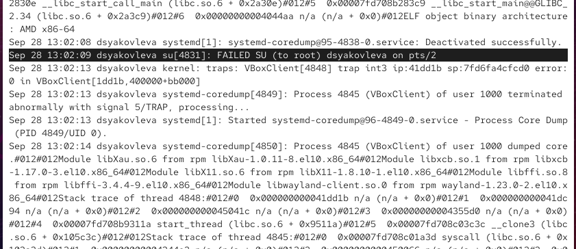{ #fig:001 width=70% }

## Мониторинг системных событий

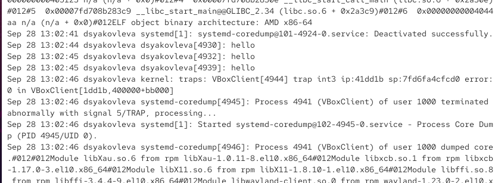{ #fig:002 width=70% }

## Мониторинг системных событий

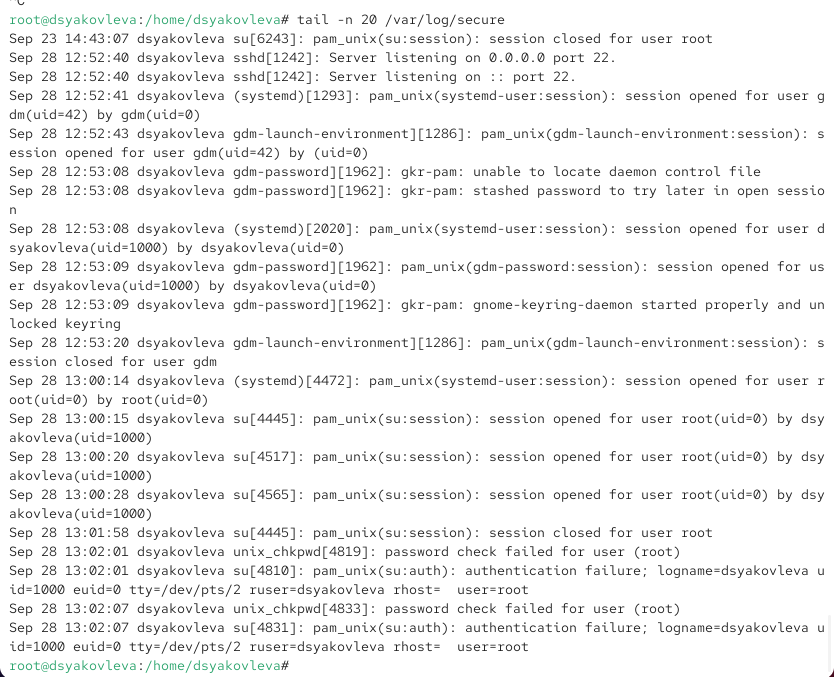{ #fig:003 width=70% }

## Изменение правил rsyslog.conf

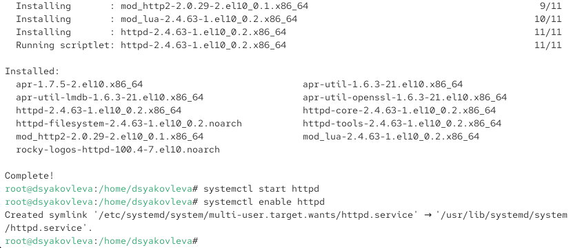{ #fig:004 width=70% }

## Изменение правил rsyslog.conf

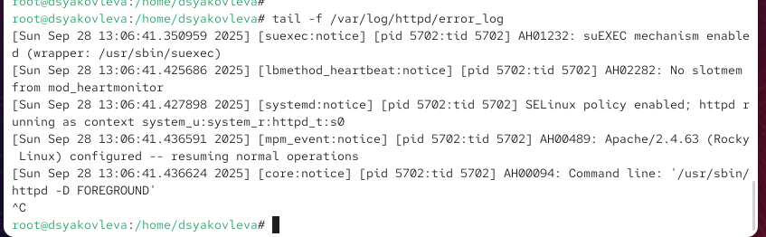{ #fig:005 width=70% }

## Изменение правил rsyslog.conf

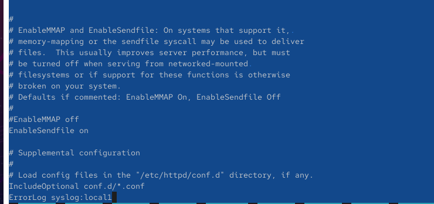{ #fig:006 width=70% }

## Изменение правил rsyslog.conf

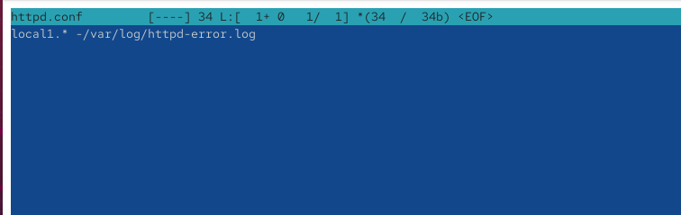{ #fig:007 width=70% }

## Изменение правил rsyslog.conf

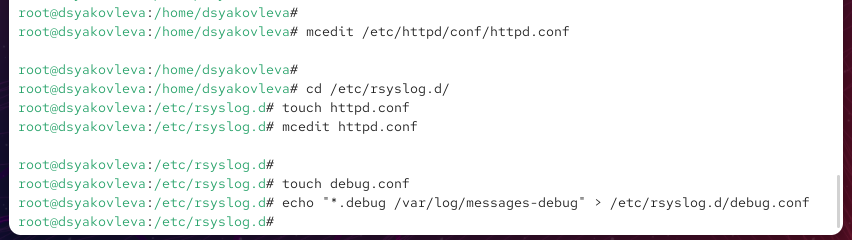{ #fig:008 width=70% }

## Изменение правил rsyslog.conf

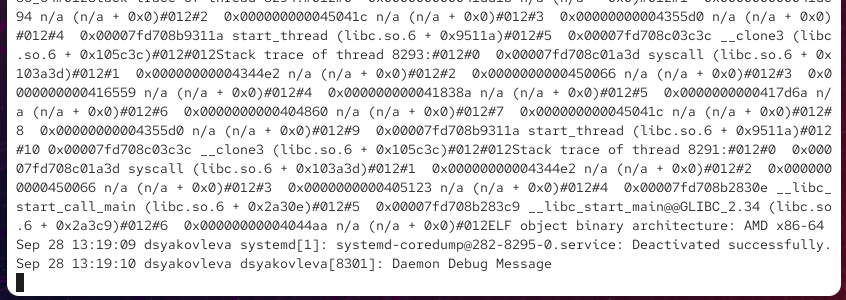{ #fig:009 width=70% }

## Использование journalctl

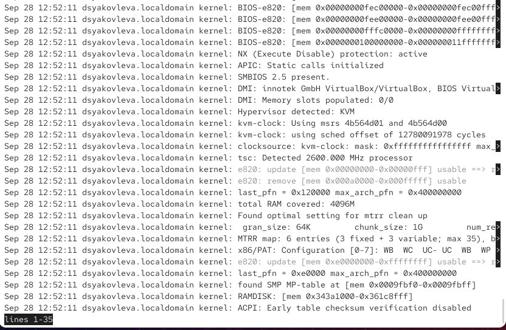{ #fig:010 width=70% }

## Использование journalctl

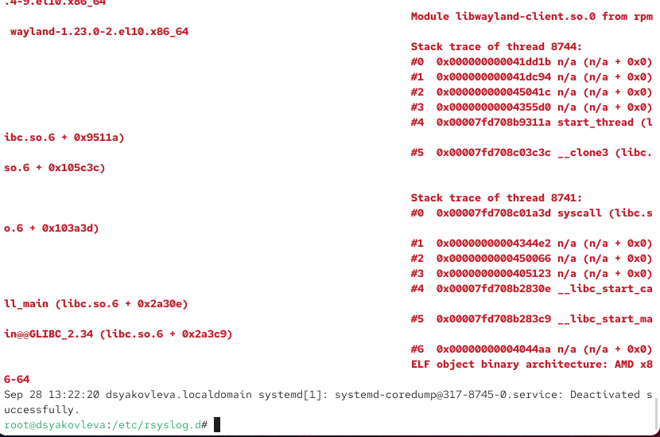{ #fig:011 width=70% }

## Использование journalctl

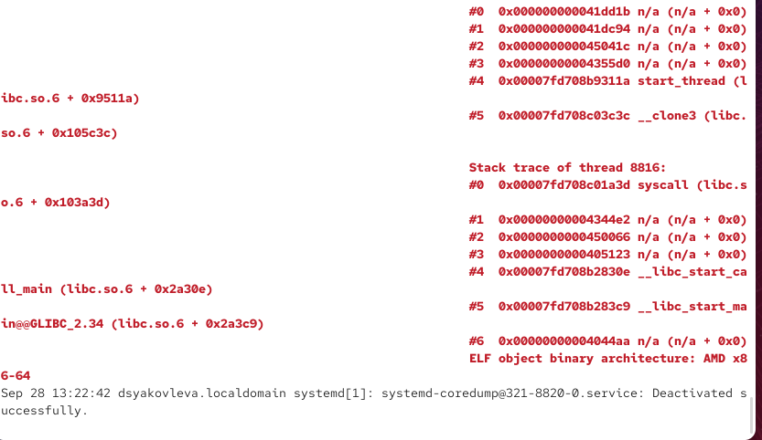{ #fig:012 width=70% }

## Использование journalctl

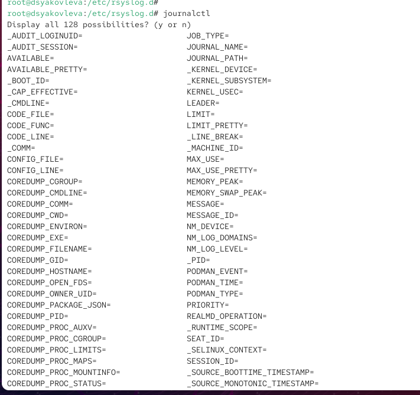{ #fig:013 width=70% }

## Использование journalctl

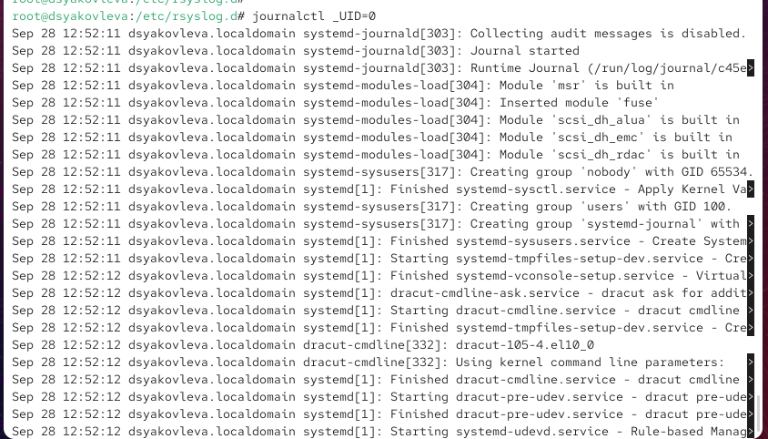{ #fig:014 width=70% }

## Использование journalctl

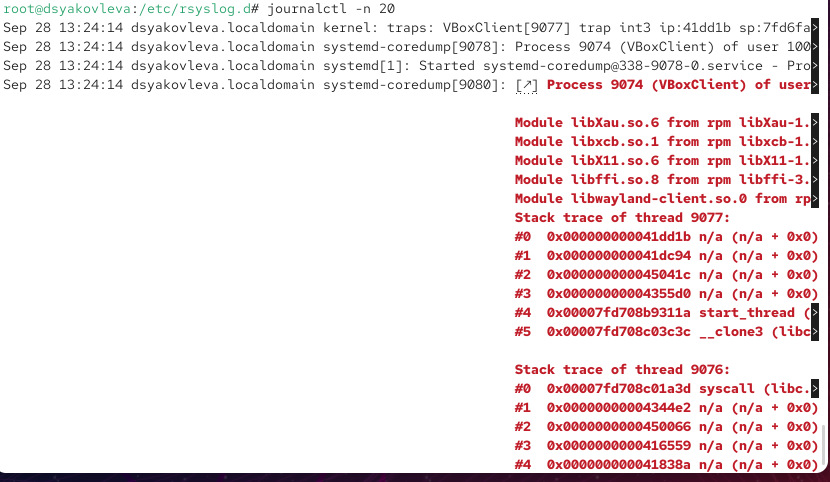{ #fig:015 width=70% }

## Использование journalctl

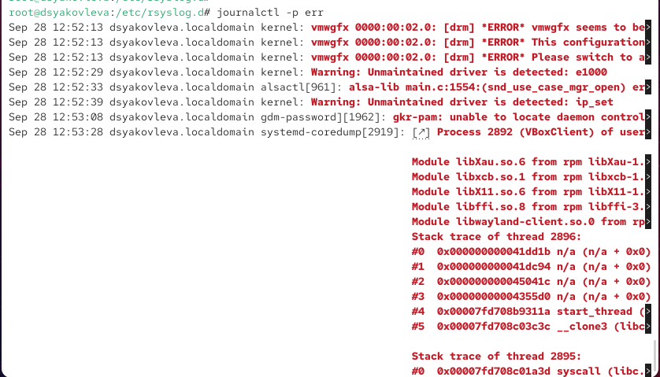{ #fig:016 width=70% }

## Использование journalctl

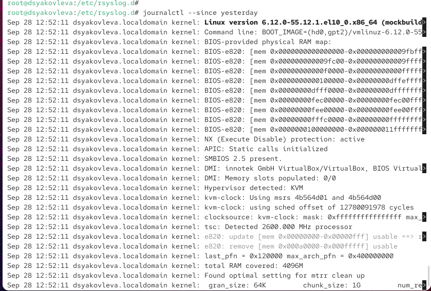{ #fig:017 width=70% }

## Использование journalctl

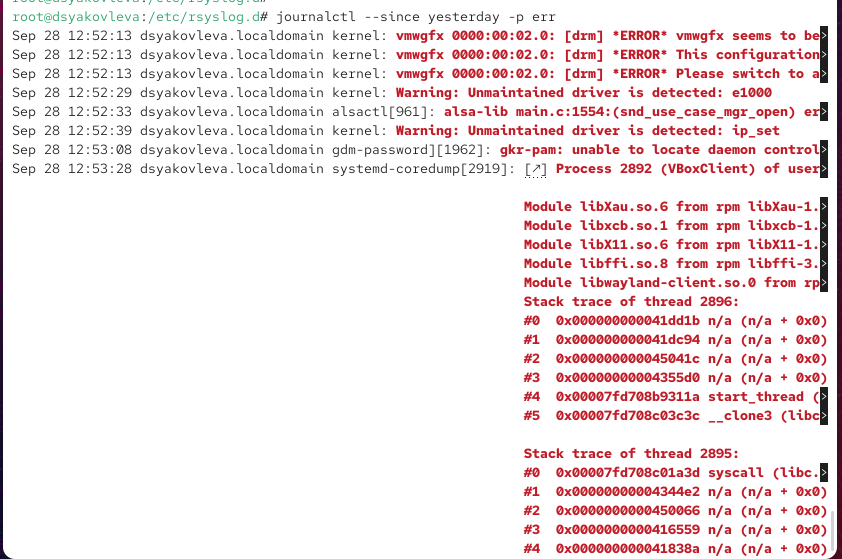{ #fig:018 width=70% }

## Использование journalctl

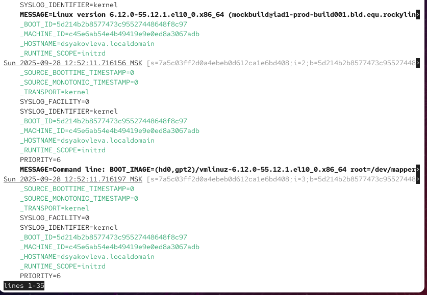{ #fig:019 width=70% }

## Использование journalctl

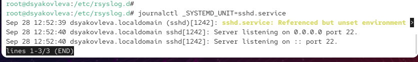{ #fig:020 width=70% }

## Постоянный журнал journald

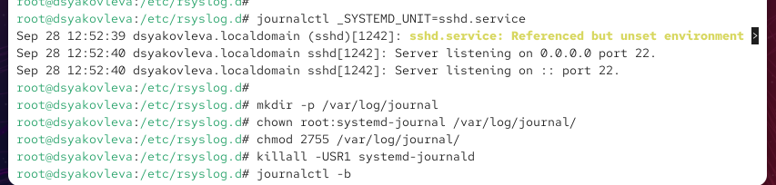{ #fig:021 width=70% }

## Постоянный журнал journald

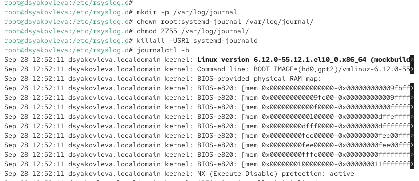{ #fig:022 width=70% }

# Контрольные вопросы

## Конфигурация rsyslog

* Основной файл — `/etc/rsyslog.conf`  
* Файлы правил — `/etc/rsyslog.d/`
* Журнал аутентификации - `/var/log/secure`

## Ротация журналов

* По умолчанию — раз в неделю  
* Хранение — 4 недели (`logrotate`)

## journalctl

* Режим реального времени: `journalctl -f`  
* Сообщения PID 1 с 9:00 до 15:00:  
  `journalctl _PID=1 --since "09:00" --until "15:00"`  
* После перезагрузки: `journalctl -b`

# Итоги работы

## Вывод

Были приобретены навыки мониторинга системных журналов и настройки регистрации событий в Linux:  
работа с `tail`, настройка `rsyslog`, использование `logger`, исследование логов при помощи `journalctl` и настройка постоянного хранения с помощью `journald`.
