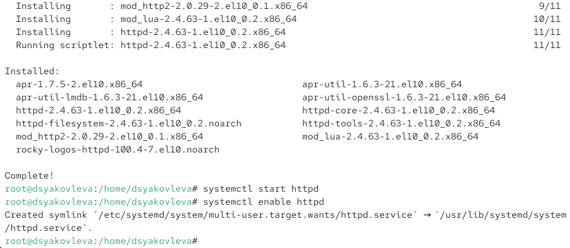

---
## Front matter
title: "Отчёт по лабораторной работе №7"
subtitle: "Управление журналами событий в системе"
author: "Яковлева Дарья Сергеевна"

## Generic otions
lang: ru-RU
toc-title: "Содержание"

## Bibliography
bibliography: bib/cite.bib
csl: pandoc/csl/gost-r-7-0-5-2008-numeric.csl

## Pdf output format
toc: true # Table of contents
toc-depth: 2
lof: true # List of figures
lot: true # List of tables
fontsize: 12pt
linestretch: 1.5
papersize: a
documentclass: scrreprt
## I18n polyglossia
polyglossia-lang:
  name: russian
  options:
	- spelling=modern
	- babelshorthands=true
polyglossia-otherlangs:
  name: english
## I18n babel
babel-lang: russian
babel-otherlangs: english
## Fonts
mainfont: IBM Plex Serif
romanfont: IBM Plex Serif
sansfont: IBM Plex Sans
monofont: IBM Plex Mono
mathfont: STIX Two Math
mainfontoptions: Ligatures=Common,Ligatures=TeX,Scale=0.94
romanfontoptions: Ligatures=Common,Ligatures=TeX,Scale=0.94
sansfontoptions: Ligatures=Common,Ligatures=TeX,Scale=MatchLowercase,Scale=0.94
monofontoptions: Scale=MatchLowercase,Scale=0.94,FakeStretch=0.9
mathfontoptions:
## Biblatex
biblatex: true
biblio-style: "gost-numeric"
biblatexoptions:
  - parentracker=true
  - backend=biber
  - hyperref=auto
  - language=auto
  - autolang=other*
  - citestyle=gost-numeric
## Pandoc-crossref LaTeX customization
figureTitle: "Рис."
tableTitle: "Таблица"
listingTitle: "Листинг"
lofTitle: "Список иллюстраций"
lotTitle: "Список таблиц"
lolTitle: "Листинги"
## Misc options
indent: true
header-includes:
  - \usepackage{indentfirst}
  - \usepackage{float} # keep figures where there are in the text
  - \floatplacement{figure}{H} # keep figures where there are in the text
---

# Цель работы

Получить навыки работы с журналами мониторинга различных событий в системе.

# Выполнение лабораторной работы

## Мониторинг журнала системных событий в реальном времени

Запускаю три вкладки терминала и получаю полномочия администратора с помощью `su -`.

Во второй вкладке запускаю мониторинг системных событий командой `tail -f /var/log/messages`.

В третьей вкладке возвращаюсь к учётной записи пользователя (Ctrl + D) и пробую получить права администратора, но ввожу неправильный пароль. В окне мониторинга фиксируется сообщение об ошибке (см. рис. [@fig:001]).

{ #fig:001 width=70% }

Затем в третьей вкладке из оболочки пользователя выполняю команду `logger hello`.

Во второй вкладке вижу появившееся сообщение в журнале (см. рис. [@fig:002]).

{ #fig:002 width=70% }

После этого останавливаю мониторинг (Ctrl + C) и запускаю просмотр последних 20 строк журнала безопасности командой `tail -n 20 /var/log/secure`.

На экране отображаются сообщения, зафиксированные при ошибках аутентификации и вводе неверного пароля для `su` (см. рис. [@fig:003]).

{ #fig:003 width=70% }

## Изменение правил rsyslog.conf

Устанавливаю веб-сервер Apache. После завершения установки запускаю и добавляю службу в автозагрузку с помощью команд `systemctl start httpd` и `systemctl enable httpd` (см. рис. [@fig:004]).

{ #fig:004 width=70% }

Во второй вкладке просматриваю журнал сообщений об ошибках веб-службы при помощи `tail -f /var/log/httpd/error_log` (см. рис. [@fig:005]).

{ #fig:005 width=70% }

В конфигурационном файле `/etc/httpd/conf/httpd.conf` добавляю строку `ErrorLog syslog:local1` (см. рис. [@fig:006]).

{ #fig:006 width=70% }

Затем в каталоге `/etc/rsyslog.d` создаю файл `httpd.conf` и прописываю правило `local1.* -/var/log/httpd-error.log` (см. рис. [@fig:007]).

{ #fig:007 width=70% }

После перезапуска служб `rsyslog` и `httpd` все ошибки веб-сервера начинают записываться в файл `/var/log/httpd-error.log`.

Далее создаю отдельный файл `debug.conf` в каталоге `/etc/rsyslog.d` и добавляю правило `*.debug /var/log/messages-debug`, которое перенаправляет все отладочные сообщения в отдельный лог-файл (см. рис. [@fig:008]).

{ #fig:008 width=70% }

Во второй вкладке запускаю мониторинг отладочной информации с помощью `tail -f /var/log/messages-debug`. В третьей вкладке ввожу команду `logger -p daemon.debug "Daemon Debug Message"`. В окне мониторинга отображается сообщение (см. рис. [@fig:009]).

{ #fig:009 width=70% }

## Использование journalctl

Во второй вкладке терминала просматриваю содержимое журнала событий с момента последнего запуска системы с помощью команды `journalctl`. Отображаются сообщения ядра и служб (см. рис. [@fig:010]).

{ #fig:010 width=70% }

Запускаю просмотр журнала без использования пейджера с помощью опции `--no-pager`. Сообщения выводятся в обычном потоке терминала (см. рис. [@fig:011]).

{ #fig:011 width=70% }

Использую режим просмотра журнала в реальном времени с параметром `-f`. Система отображает новые записи сразу после их появления (см. рис. [@fig:012]).

{ #fig:012 width=70% }

Для изучения доступных параметров фильтрации ввожу команду `journalctl` и дважды нажимаю Tab. Отображается список возможных ключей фильтрации (см. рис. [@fig:013]).

{ #fig:013 width=70% }

Просматриваю события, относящиеся к пользователю с UID 0, при помощи команды `journalctl _UID=0` (см. рис. [@fig:014]).

{ #fig:014 width=70% }

Для вывода последних 20 строк журнала использую параметр `-n 20`. Вижу записи, относящиеся к ошибкам приложений (см. рис. [@fig:015]).

{ #fig:015 width=70% }

Отображаю только сообщения об ошибках с помощью параметра `-p err`. В выводе фиксируются ошибки драйверов и служб (см. рис. [@fig:016]).

{ #fig:016 width=70% }

Для анализа журнала за определённый период использую параметр `--since yesterday`. На экране появляются все записи, начиная со вчерашнего дня (см. рис. [@fig:017]).

{ #fig:017 width=70% }

Затем применяю комбинацию параметров `--since yesterday -p err`, чтобы показать только ошибки со вчерашнего дня (см. рис. [@fig:018]).

{ #fig:018 width=70% }

Для получения детальной информации использую параметр `-o verbose`. Сообщения журнала выводятся с дополнительными полями, включая идентификатор хоста и параметры ядра (см. рис. [@fig:019]).

{ #fig:019 width=70% }

Для просмотра дополнительной информации о модуле `sshd` использую команду `journalctl _SYSTEMD_UNIT=sshd.service`. Отображаются записи о запуске сервера и его прослушивании порта 22 (см. рис. [@fig:020]).

{ #fig:020 width=70% }

## Постоянный журнал journald

По умолчанию `journald` хранит сообщения во временном каталоге `/run/log/journal`, и они теряются после перезагрузки системы. Чтобы сделать журнал постоянным, создаю каталог `/var/log/journal` и задаю ему необходимые права доступа (см. рис. [@fig:021]).

{ #fig:021 width=70% }

После этого посылаю сигнал `USR1` процессу `systemd-journald`, чтобы он принял изменения без перезагрузки (см. рис. [@fig:022]).

{ #fig:022 width=70% }

Теперь журнал становится постоянным, и для просмотра сообщений с момента последней перезагрузки использую команду `journalctl -b`. В выводе отображаются сообщения ядра и системных служб после старта системы.

# Контрольные вопросы

1. **Какой файл используется для настройки rsyslogd?**  
   Основной файл конфигурации — `/etc/rsyslog.conf`. Дополнительные правила можно хранить в каталоге `/etc/rsyslog.d/`.

2. **В каком файле журнала rsyslogd содержатся сообщения, связанные с аутентификацией?**  
   Сообщения об аутентификации фиксируются в файле `/var/log/secure`.

3. **Если вы ничего не настроите, то сколько времени потребуется для ротации файлов журналов?**  
   По умолчанию ротация файлов журналов происходит раз в неделю, а старые файлы хранятся в течение 4 недель. За это отвечает служба `logrotate`.

4. **Какую строку следует добавить в конфигурацию для записи всех сообщений с приоритетом info в файл `/var/log/messages.info`?**  
   Нужно добавить строку:  `*.info /var/log/messages.info`
   
5. **Какая команда позволяет вам видеть сообщения журнала в режиме реального времени?**  
Используется команда `journalctl -f`.

6. **Какая команда позволяет вам видеть все сообщения журнала, которые были написаны для PID 1 между 9:00 и 15:00?**  
`journalctl _PID=1 --since "09:00" --until "15:00"`

7. **Какая команда позволяет вам видеть сообщения journald после последней перезагрузки системы?**  
Для этого используется команда `journalctl -b`.

8. **Какая процедура позволяет сделать журнал journald постоянным?**  
- Создать каталог `/var/log/journal`.  
- Задать ему владельца и группу: `chown root:systemd-journal /var/log/journal`.  
- Установить права: `chmod 2755 /var/log/journal`.  
- Отправить сигнал `USR1` процессу `systemd-journald` или перезагрузить систему.  
После этого журнал будет храниться постоянно.

# Заключение

В ходе лабораторной работы были приобретены навыки мониторинга системных журналов и настройки регистрации событий в Linux: использование `tail` для просмотра логов в реальном времени, настройка правил `rsyslog`, работа с `logger`, исследование журналов при помощи `journalctl`, а также организация постоянного хранения журналов с помощью `journald`.
