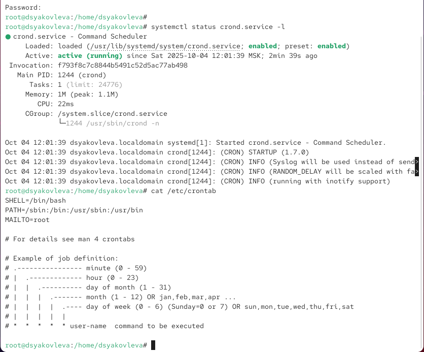
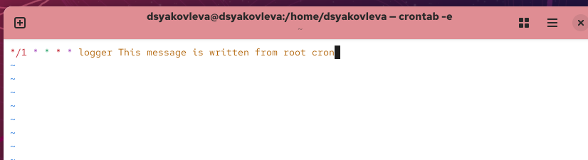
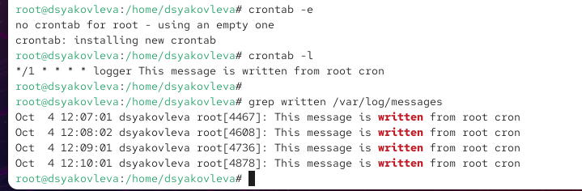
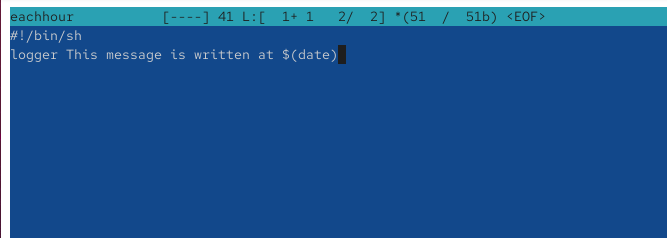
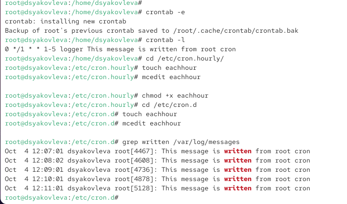
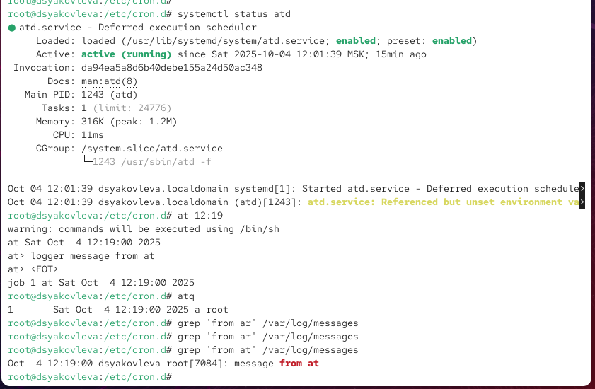

---
## Front matter
lang: ru-RU
title: Отчёт по лабораторной работе №8
subtitle: Планировщики событий
author:
  - Яковлева Дарья Сергеевна
institute:
  - Российский университет дружбы народов, Москва, Россия
date: 9 октября 2025

## i18n babel
babel-lang: russian
babel-otherlangs: english

## Formatting pdf
toc: false
slide_level: 2
aspectratio: 169
section-titles: true
theme: metropolis
header-includes:
 - \metroset{progressbar=frametitle,sectionpage=progressbar,numbering=fraction}
---

# Цель работы

## Цель

Получить навыки работы с планировщиками событий `cron` и `at` в операционной системе Linux.

# Выполнение лабораторной работы

## Планирование задач с помощью cron

{ #fig:001 width=70% }

## Файл /etc/crontab

{ #fig:002 width=70% }

## Настройка расписания cron

{ #fig:003 width=70% }

## Проверка работы cron

{ #fig:004 width=70% }

## Сценарий eachhour

{ #fig:005 width=70% }

## Планировщик /etc/cron.d

{ #fig:006 width=70% }

## Проверка службы atd

{ #fig:007 width=70% }

# Контрольные вопросы

## Примеры расписаний cron

* Раз в 2 недели — `0 0 */14 * *`
* 1-го и 15-го числа — `0 2 1,15 * *`
* Каждые 2 минуты — `*/2 * * * *`
* 19 сентября ежегодно — `0 0 19 9 *`
* Каждый четверг сентября — `0 0 * 9 4`

## Администрирование пользователей cron

* Назначить задание пользователю — `crontab -u alice -e`
* Запретить пользователю задания — добавить имя в `/etc/cron.deny`
* Обеспечить выполнение при простое — использовать `anacron`
* Проверить очередь at — `atq`

# Итоги работы

## Вывод

В ходе лабораторной работы были изучены принципы планирования задач в Linux  
с помощью утилит `cron` и `at`.  
Получены практические навыки создания, редактирования и проверки расписаний,  
а также работы с системными каталогами `/etc/cron.*` и файлами конфигурации.
