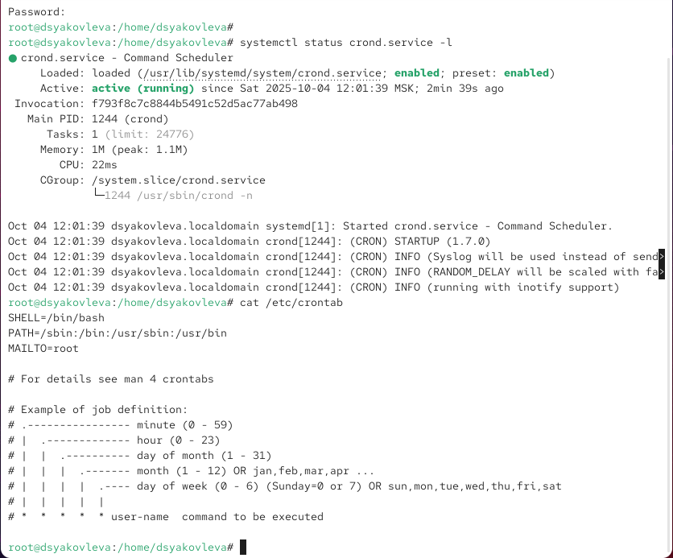
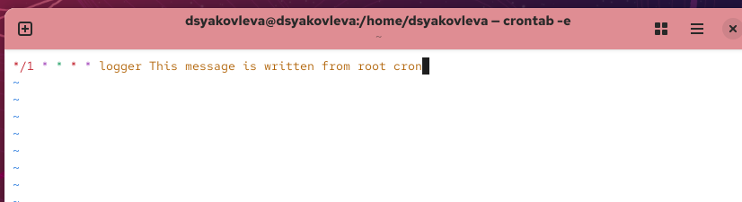
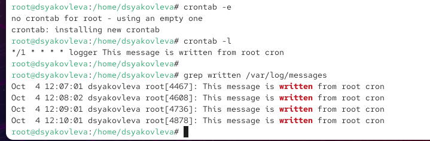
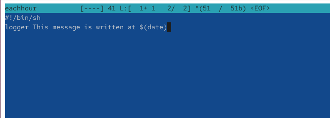
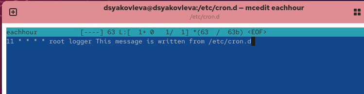
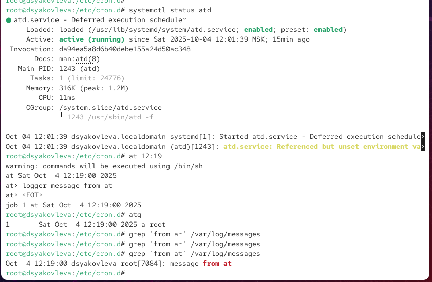

---
## Front matter
title: "Отчёт по лабораторной работе №8"
subtitle: "Планировщики событий"
author: "Яковлева Дарья Сергеевна"

## Generic otions
lang: ru-RU
toc-title: "Содержание"

## Bibliography
bibliography: bib/cite.bib
csl: pandoc/csl/gost-r-7-0-5-2008-numeric.csl

## Pdf output format
toc: true # Table of contents
toc-depth: 2
lof: true # List of figures
lot: true # List of tables
fontsize: 12pt
linestretch: 1.5
papersize: a
documentclass: scrreprt
## I18n polyglossia
polyglossia-lang:
  name: russian
  options:
	- spelling=modern
	- babelshorthands=true
polyglossia-otherlangs:
  name: english
## I18n babel
babel-lang: russian
babel-otherlangs: english
## Fonts
mainfont: IBM Plex Serif
romanfont: IBM Plex Serif
sansfont: IBM Plex Sans
monofont: IBM Plex Mono
mathfont: STIX Two Math
mainfontoptions: Ligatures=Common,Ligatures=TeX,Scale=0.94
romanfontoptions: Ligatures=Common,Ligatures=TeX,Scale=0.94
sansfontoptions: Ligatures=Common,Ligatures=TeX,Scale=MatchLowercase,Scale=0.94
monofontoptions: Scale=MatchLowercase,Scale=0.94,FakeStretch=0.9
mathfontoptions:
## Biblatex
biblatex: true
biblio-style: "gost-numeric"
biblatexoptions:
  - parentracker=true
  - backend=biber
  - hyperref=auto
  - language=auto
  - autolang=other*
  - citestyle=gost-numeric
## Pandoc-crossref LaTeX customization
figureTitle: "Рис."
tableTitle: "Таблица"
listingTitle: "Листинг"
lofTitle: "Список иллюстраций"
lotTitle: "Список таблиц"
lolTitle: "Листинги"
## Misc options
indent: true
header-includes:
  - \usepackage{indentfirst}
  - \usepackage{float} # keep figures where there are in the text
  - \floatplacement{figure}{H} # keep figures where there are in the text
---

# Цель работы

Получение навыков работы с планировщиками событий cron и at.

# Выполнение лабораторной работы

## Планирование задач с помощью cron

Запускаю терминал и получаю права администратора командой `su -`.

Проверяю состояние службы планировщика заданий `crond` с помощью команды `systemctl status crond.service -l`.  
Служба активна и запущена (см. рис. [@fig:001]).

Открываю файл конфигурации `/etc/crontab` и просматриваю его содержимое (см. рис. [@fig:002]).  
Файл содержит переменные окружения и пример синтаксиса задания cron.

{ #fig:001 width=70% }

Открываю файл расписания для пользователя root с помощью команды `crontab -e` и добавляю задание, которое записывает сообщение в системный журнал каждую минуту.  
Эта запись означает, что команда выполняется каждую минуту.  
Поля расписания интерпретируются следующим образом:  
- `*/1` — каждая минута,  
- `*` — каждый час,  
- `*` — каждый день месяца,  
- `*` — каждый месяц,  
- `*` — каждый день недели.  

Выполняемая команда `logger` записывает сообщение в системный журнал (см. рис. [@fig:002]).

{ #fig:002 width=70% }

После сохранения проверяю текущее расписание (`crontab -l`) и убеждаюсь, что задание добавлено.  
Через несколько минут просматриваю журнал `/var/log/messages` и вижу записи, создаваемые cron (см. рис. [@fig:003]).

{ #fig:003 width=70% }

Изменяю расписание задания, чтобы сообщение записывалось в начале каждого часа по будням.  
Теперь команда выполняется в 00 минут каждого часа с понедельника по пятницу.

Создаю сценарий `eachhour` в каталоге `/etc/cron.hourly` (см. рис. [@fig:004]).  
В сценарии реализована запись сообщения в системный журнал с указанием текущей даты и времени.  
После этого делаю сценарий исполняемым.

{ #fig:004 width=70% }

Затем создаю файл `/etc/cron.d/eachhour` с расписанием, по которому команда `logger` будет выполняться каждый час в 11 минут от имени пользователя root.  
Это позволяет запускать задание централизованно через системный каталог `cron.d` (см. рис. [@fig:005]).

{ #fig:005 width=70% }

Проверяю журнал `/var/log/messages`, чтобы убедиться, что задания выполняются согласно расписанию.  
Сообщения подтверждают успешное выполнение команд cron (см. рис. [@fig:006]).

{ #fig:006 width=70% }

## Планирование заданий с помощью at

Запускаю терминал и получаю права администратора командой `su -`.

Проверяю состояние службы отложенного выполнения заданий `atd` с помощью команды `systemctl status atd`.  
Служба активна и работает (см. рис. [@fig:007]).

{ #fig:007 width=70% }

Для планирования выполнения команды в определённое время использую утилиту `at`.  
Задаю выполнение команды `logger message from at` в заданный момент времени (в примере — в 12:19).  
После ввода команды `at 12:19` открывается интерактивная оболочка, в которой указываю команду `logger message from at`, затем завершаю ввод комбинацией клавиш **Ctrl + D**.  
Появляется подтверждение создания задания с его номером (см. рис. [@fig:007]).

Проверяю список запланированных заданий с помощью команды `atq` — задание отображается в очереди.  
После наступления указанного времени проверяю системный журнал `/var/log/messages` при помощи команды `grep 'from at' /var/log/messages`.  
Вижу запись о выполнении команды, что подтверждает успешное выполнение задания, запланированного через `at` (см. рис. [@fig:007]).

# Контрольные вопросы

1. **Как настроить задание cron, чтобы оно выполнялось раз в 2 недели?**  
   В cron отсутствует прямой параметр "раз в 2 недели", но можно использовать комбинацию дней недели и месяца, например:  
   `0 0 */14 * * команда`  
   — запуск каждые 14 дней в полночь.  
   Альтернативно можно добавить проверку даты в скрипте и запускать его раз в 2 недели при помощи `cron.weekly`.

2. **Как настроить задание cron, чтобы оно выполнялось 1-го и 15-го числа каждого месяца в 2 часа ночи?**  
   `0 2 1,15 * * команда`  
   — запуск в 2:00 ночи, 1-го и 15-го числа каждого месяца.

3. **Как настроить задание cron, чтобы оно выполнялось каждые 2 минуты каждый день?**  
   `*/2 * * * * команда`  
   — выполнение каждые 2 минуты, ежедневно.

4. **Как настроить задание cron, чтобы оно выполнялось 19 сентября ежегодно?**  
   `0 0 19 9 * команда`  
   — запуск 19 сентября каждого года в полночь.

5. **Как настроить задание cron, чтобы оно выполнялось каждый четверг сентября ежегодно?**  
   `0 0 * 9 4 команда`  
   — выполнение в полночь каждого четверга (день недели 4) в сентябре (месяц 9).

6. **Какая команда позволяет вам назначить задание cron для пользователя alice? Приведите подтверждающий пример.**  
   Команда: `crontab -u alice -e`  
   Пример:  
   `sudo crontab -u alice -e` — откроет расписание пользователя *alice* для редактирования.

7. **Как указать, что пользователю bob никогда не разрешено назначать задания через cron? Приведите подтверждающий пример.**  
   Добавить имя пользователя в файл `/etc/cron.deny`:  `echo "bob" >> /etc/cron.deny`

После этого пользователь *bob* не сможет использовать `crontab`.

8. **Вам нужно убедиться, что задание выполняется каждый день, даже если сервер во время выполнения временно недоступен. Как это сделать?**  
Использовать `anacron`, который гарантирует выполнение пропущенных заданий после включения системы.  
Конфигурационные файлы: `/etc/anacrontab`.

9. **Какая команда позволяет узнать, запланированы ли какие-либо задания на выполнение планировщиком atd?**  
Команда: `atq`  
— показывает очередь заданий `at`, ожидающих выполнения.
  
   
# Заключение

В ходе лабораторной работы были изучены принципы планирования заданий в Linux с использованием планировщиков `cron` и `at`.  
Были освоены способы создания, редактирования и проверки расписаний для периодических и однократных задач,  
а также работа с системными каталогами `/etc/cron.*` и файлами `/etc/crontab` и `/etc/cron.d`.  
Получены практические навыки настройки интервалов выполнения, ограничения доступа пользователей и проверки выполнения заданий через системные журналы.

