---
## Front matter
lang: ru-RU
title: Отчёт по лабораторной работе №9
subtitle: Управление SELinux
author:
  - Яковлева Дарья Сергеевна
institute:
  - Российский университет дружбы народов, Москва, Россия
date: 29 октября 2025

## i18n babel
babel-lang: russian
babel-otherlangs: english

## Formatting pdf
toc: false
slide_level: 2
aspectratio: 169
section-titles: true
theme: metropolis
header-includes:
 - \metroset{progressbar=frametitle,sectionpage=progressbar,numbering=fraction}
---

# Цель работы

## Цель

Получить практические навыки работы с контекстами безопасности и политиками SELinux в Linux.

# Выполнение лабораторной работы

## Проверка состояния SELinux

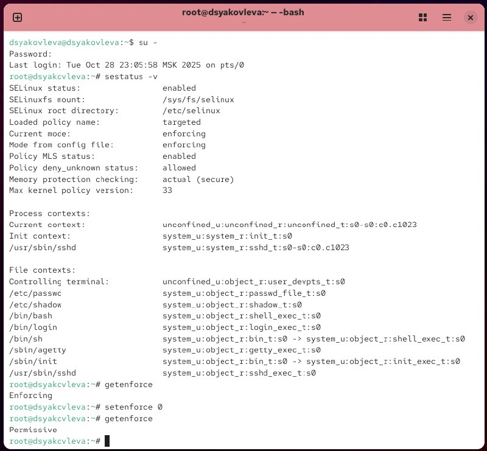{ #fig:001 width=70% }

## Изменение режима работы

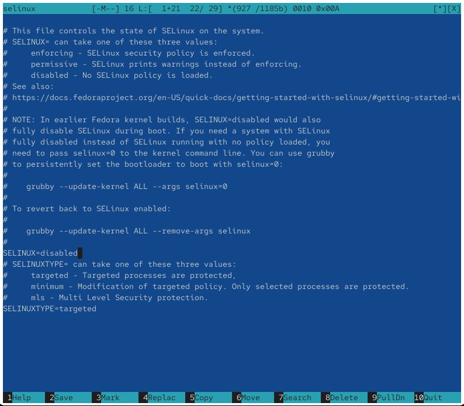{ #fig:002 width=70% }

## Проверка отключения SELinux

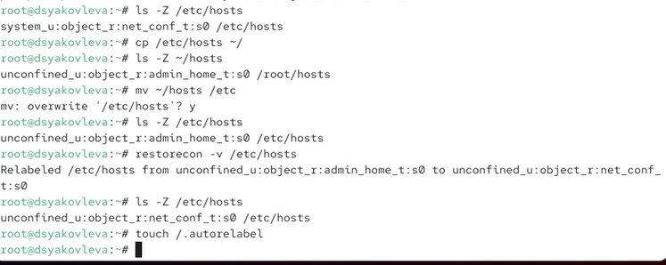{ #fig:003 width=70% }

## Восстановление режима Enforcing

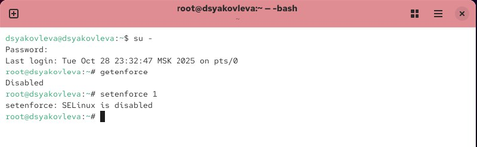{ #fig:004 width=70% }

## Использование restorecon

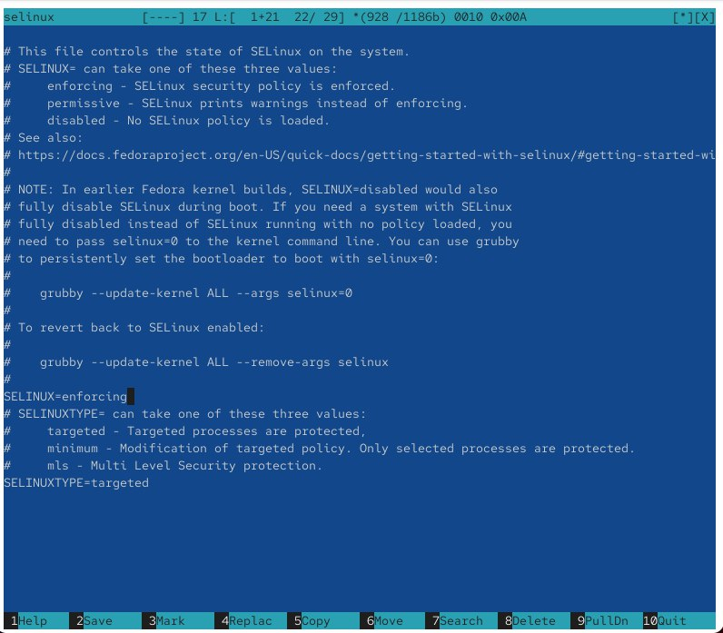{ #fig:005 width=70% }

## Настройка нестандартного пути DocumentRoot

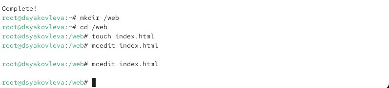{ #fig:006 width=70% }

## Редактирование index.html

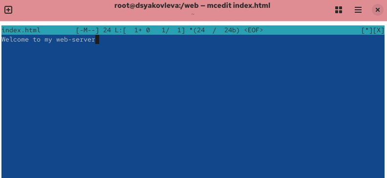{ #fig:007 width=70% }

## Проверка работы веб-сервера

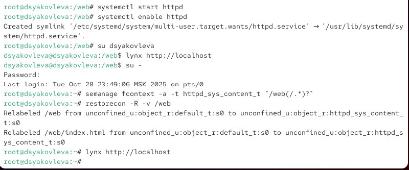{ #fig:008 width=70% }

## Изменение контекста каталога /web

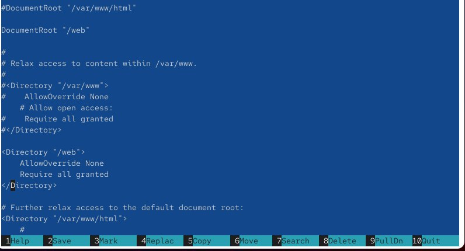{ #fig:009 width=70% }

## Успешный доступ к веб-странице

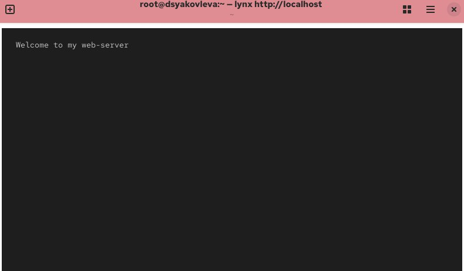{ #fig:010 width=70% }

## Работа с переключателями SELinux

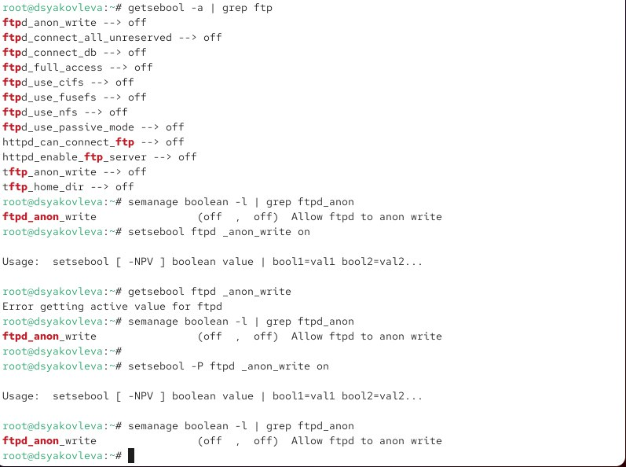{ #fig:011 width=70% }

# Контрольные вопросы

## Основные команды SELinux

* `getenforce` — проверка текущего режима  
* `setenforce 0` / `1` — изменение режима  
* `sestatus -v` — просмотр состояния SELinux  
* `restorecon` — восстановление контекста безопасности  
* `semanage fcontext` — настройка контекста файлов  
* `getsebool` / `setsebool` — управление переключателями

# Итоги работы

## Вывод

В ходе лабораторной работы были изучены принципы работы SELinux, способы изменения режимов безопасности, восстановления контекстов и настройки политик для сервисов.  
Получены практические навыки администрирования SELinux и повышения безопасности системы.
