---
## Front matter
title: "Отчёт по лабораторной работе №9"
subtitle: "Управление SELinux"
author: "Яковлева Дарья Сергеевна"

## Generic otions
lang: ru-RU
toc-title: "Содержание"

## Bibliography
bibliography: bib/cite.bib
csl: pandoc/csl/gost-r-7-0-5-2008-numeric.csl

## Pdf output format
toc: true # Table of contents
toc-depth: 2
lof: true # List of figures
lot: true # List of tables
fontsize: 12pt
linestretch: 1.5
papersize: a
documentclass: scrreprt
## I18n polyglossia
polyglossia-lang:
  name: russian
  options:
	- spelling=modern
	- babelshorthands=true
polyglossia-otherlangs:
  name: english
## I18n babel
babel-lang: russian
babel-otherlangs: english
## Fonts
mainfont: IBM Plex Serif
romanfont: IBM Plex Serif
sansfont: IBM Plex Sans
monofont: IBM Plex Mono
mathfont: STIX Two Math
mainfontoptions: Ligatures=Common,Ligatures=TeX,Scale=0.94
romanfontoptions: Ligatures=Common,Ligatures=TeX,Scale=0.94
sansfontoptions: Ligatures=Common,Ligatures=TeX,Scale=MatchLowercase,Scale=0.94
monofontoptions: Scale=MatchLowercase,Scale=0.94,FakeStretch=0.9
mathfontoptions:
## Biblatex
biblatex: true
biblio-style: "gost-numeric"
biblatexoptions:
  - parentracker=true
  - backend=biber
  - hyperref=auto
  - language=auto
  - autolang=other*
  - citestyle=gost-numeric
## Pandoc-crossref LaTeX customization
figureTitle: "Рис."
tableTitle: "Таблица"
listingTitle: "Листинг"
lofTitle: "Список иллюстраций"
lotTitle: "Список таблиц"
lolTitle: "Листинги"
## Misc options
indent: true
header-includes:
  - \usepackage{indentfirst}
  - \usepackage{float} # keep figures where there are in the text
  - \floatplacement{figure}{H} # keep figures where there are in the text
---

# Цель работы

Получить навыки работы с контекстом безопасности и политиками SELinux.

# Выполнение лабораторной работы

## Управление режимами SELinux

Получаю административные права с помощью команды `su -` (см. рис. \[@fig:001]).

Проверяю текущие параметры SELinux с помощью команды `sestatus -v`.  
Из вывода видно, что SELinux включён (*enabled*), используется политика *targeted*, текущий режим — *enforcing*, то есть политика безопасности принудительно применяется.  
Отображаются также параметры:
- **SELinuxfs mount** — точка монтирования системных файлов SELinux;  
- **SELinux root directory** — путь к конфигурационным файлам SELinux;  
- **Loaded policy name** — активная политика безопасности;  
- **Current mode / Mode from config file** — текущий и заданный в конфигурации режим работы;  
- **Policy MLS status** — включённый многоуровневый контроль безопасности;  
- **Policy deny_unknown status** — реакция системы на неизвестные объекты (разрешено);  
- **Memory protection checking** — защита памяти в активном состоянии;  
- **Max kernel policy version** — версия политики ядра.  
Также показаны контексты процессов (`unconfined_u:unconfined_r:unconfined_t:s0-s0:c0.c1023`) и файлов (`system_u:object_r:passwd_file_t:s0` и др.) (см. рис. \[@fig:001]).

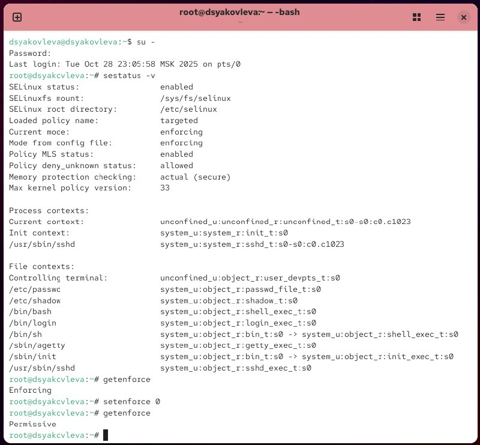{ #fig:001 width=70% }

Проверяю текущий режим работы SELinux с помощью `getenforce` — получаю значение *Enforcing*.  
Переключаю SELinux в разрешающий режим (*Permissive*) командой `setenforce 0` и повторно выполняю `getenforce` — теперь режим изменён (см. рис. \[@fig:001]).

Открываю файл `/etc/sysconfig/selinux` через текстовый редактор и изменяю строку  
`SELINUX=disabled`, чтобы полностью отключить SELinux (см. рис. \[@fig:002]).

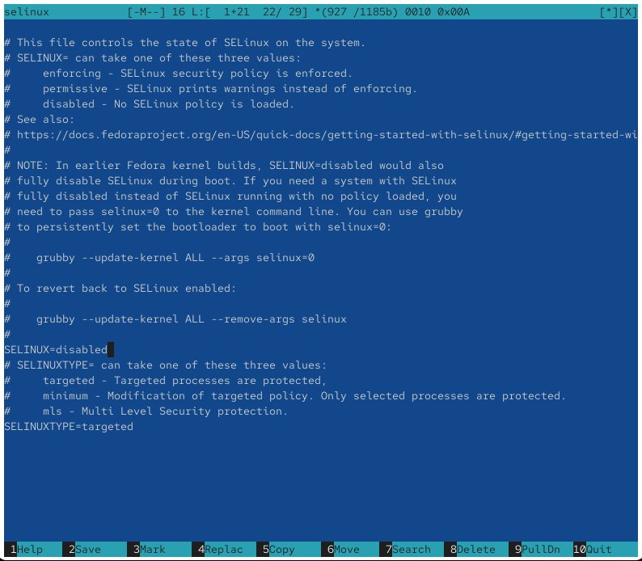{ #fig:002 width=70% }

После перезагрузки системы снова проверяю состояние SELinux с помощью `getenforce`.  
Система сообщает, что SELinux отключён (*Disabled*).  
Попытка выполнить `setenforce 1` не приводит к изменению состояния, так как при отключённом SELinux переключение режима невозможно (см. рис. \[@fig:003]).

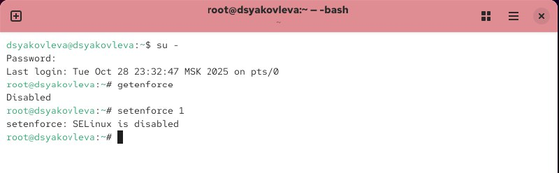{ #fig:003 width=70% }

Повторно открываю файл `/etc/sysconfig/selinux` и изменяю параметр обратно на  
`SELINUX=enforcing`, чтобы вернуть принудительный режим (см. рис. \[@fig:004]).  
После этого система требует восстановления контекстов безопасности и перезагрузки.

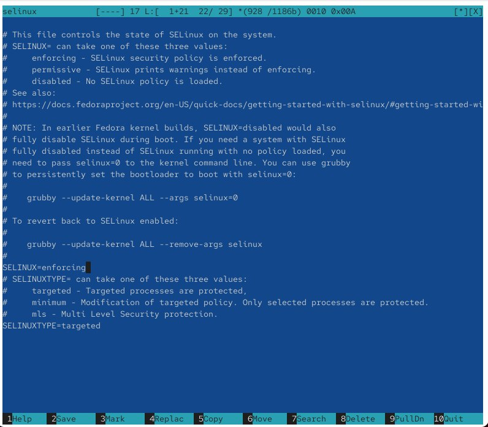{ #fig:004 width=70% }

После перезагрузки система сообщает о восстановлении меток SELinux. 

## Использование restorecon для восстановления контекста безопасности
 
Проверяю контекст безопасности файла `/etc/hosts` с помощью `ls -Z`.  
Вижу, что у файла установлен тип `net_conf_t`.  
Копирую файл `/etc/hosts` в домашний каталог и снова проверяю метку — теперь она имеет тип `admin_home_t`, поскольку копирование создаёт новый файл с контекстом домашнего каталога (см. рис. \[@fig:005]).

Перемещаю файл обратно в `/etc` и проверяю контекст — тип остаётся `admin_home_t`.  
Выполняю команду `restorecon -v /etc/hosts`, чтобы восстановить правильный контекст.  
Тип контекста меняется обратно на `net_conf_t`, что подтверждает корректное восстановление.  
Для массового исправления контекстов безопасности создаю файл `.autorelabel` и перезагружаю систему (см. рис. \[@fig:005]).

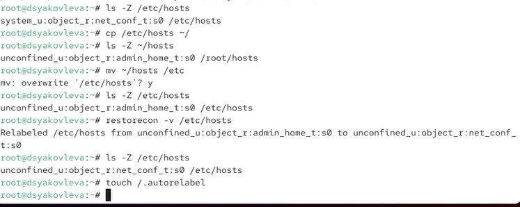{ #fig:005 width=70% }

## Настройка контекста безопасности для нестандартного расположения файлов веб-сервера

Получаю административные права и создаю новый каталог `/web` для размещения веб-контента (см. рис. \[@fig:006]).  
Перехожу в каталог и создаю пустой файл `index.html`, который затем открываю в редакторе `mcedit` для редактирования.

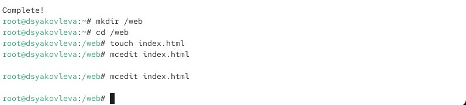{ #fig:006 width=70% }

В файл `index.html` добавляю строку **Welcome to my web-server** — содержимое, которое будет отображаться при обращении к локальному веб-серверу (см. рис. \[@fig:007]).

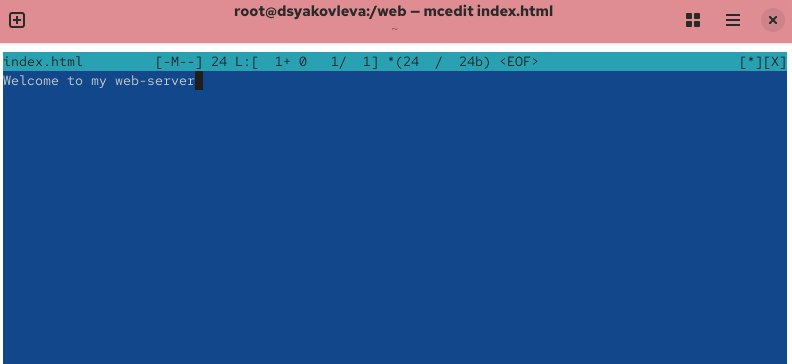{ #fig:007 width=70% }

Редактирую конфигурационный файл `/etc/httpd/conf/httpd.conf`: (см. рис. \[@fig:009]).

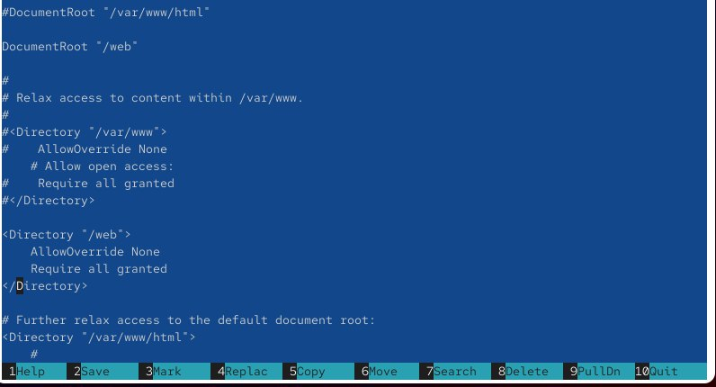{ #fig:009 width=70% }

Запускаю и активирую службу Apache с помощью команд `systemctl start httpd` и `systemctl enable httpd`.  
При попытке открыть `http://localhost` через текстовый браузер `lynx` поначалу отображается стандартная страница Red Hat, так как у каталога `/web` отсутствует корректный контекст безопасности (см. рис. \[@fig:008]).

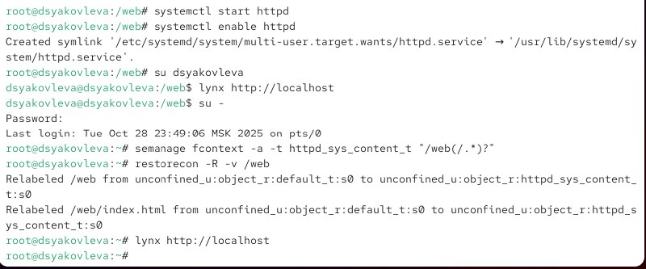{ #fig:008 width=70% }

Для устранения проблемы назначаю каталогу `/web` контекст `httpd_sys_content_t` с помощью команды  
`semanage fcontext -a -t httpd_sys_content_t "/web(/.*)?"`,  
затем восстанавливаю контексты:  
`restorecon -R -v /web`.  
После этого повторно открываю `http://localhost` в `lynx` и вижу корректное отображение содержимого файла `index.html` с сообщением **Welcome to my web-server** (см. рис. \[@fig:010]).

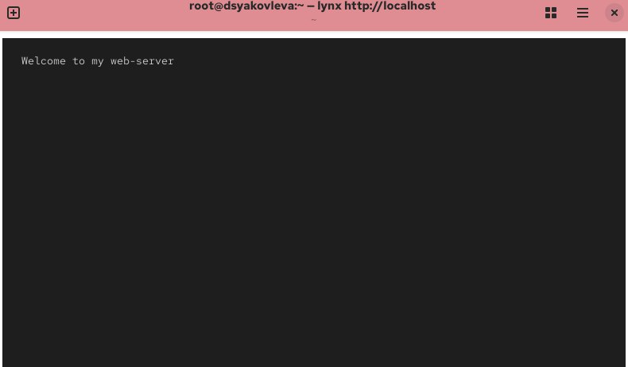{ #fig:010 width=70% }

## Работа с переключателями SELinux

Получаю список переключателей SELinux, связанных с FTP-службой, с помощью `getsebool -a | grep ftp`.  
Из вывода видно, что параметр `ftpd_anon_write` имеет значение *off*, то есть анонимная запись через FTP запрещена.  
Просматриваю подробное описание переключателя через `semanage boolean -l | grep ftpd_anon` — он отвечает за разрешение анонимной записи на FTP-сервере (см. рис. \[@fig:011]).

Изменяю временное значение переключателя командой  
`setsebool ftpd_anon_write on`,  
а затем делаю изменение постоянным с помощью  
`setsebool -P ftpd_anon_write on`.  
После проверки видно, что настройка всё ещё имеет значение *(off, off)*, что означает, что разрешение анонимной записи остаётся отключённым (см. рис. \[@fig:011]).

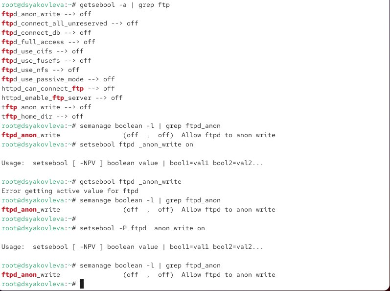{ #fig:011 width=70% }

# Контрольные вопросы

1. **Вы хотите временно поставить SELinux в разрешающем режиме. Какую команду вы используете?**  
   Используется команда `setenforce 0`.

2. **Вам нужен список всех доступных переключателей SELinux. Какую команду вы используете?**  
   Используется команда `getsebool -a`.

3. **Каково имя пакета, который требуется установить для получения легко читаемых сообщений журнала SELinux в журнале аудита?**  
   Необходимо установить пакет `setroubleshoot`.

4. **Какие команды вам нужно выполнить, чтобы применить тип контекста httpd_sys_content_t к каталогу /web?**  
   Используются команды:  
   `semanage fcontext -a -t httpd_sys_content_t "/web(/.*)?"`  
   и  
   `restorecon -R -v /web`.

5. **Какой файл вам нужно изменить, если вы хотите полностью отключить SELinux?**  
   Нужно изменить файл `/etc/sysconfig/selinux`.

6. **Где SELinux регистрирует все свои сообщения?**  
   Сообщения SELinux записываются в журнал `/var/log/audit/audit.log`.

7. **Вы не знаете, какие типы контекстов доступны для службы ftp. Какая команда позволяет получить более конкретную информацию?**  
   Используется команда `semanage fcontext -l | grep ftp`.

8. **Ваш сервис работает не так, как ожидалось, и вы хотите узнать, связано ли это с SELinux или чем-то ещё. Какой самый простой способ узнать?**  
   Самый простой способ — временно перевести SELinux в разрешающий режим командой `setenforce 0` и проверить работу сервиса.

# Заключение

В ходе лабораторной работы были изучены механизмы управления политиками безопасности SELinux.  
Также изучена работа с переключателями SELinux, обеспечивающими гибкую настройку политик безопасности для различных служб.  
В результате работы сформировано понимание принципов функционирования SELinux и его роли в обеспечении безопасности системы.
