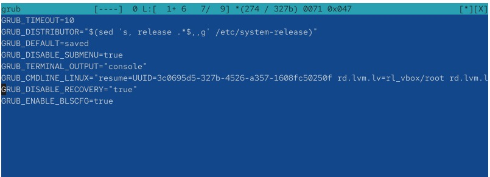
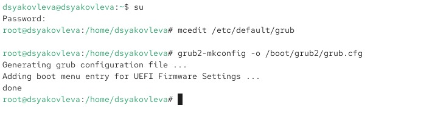
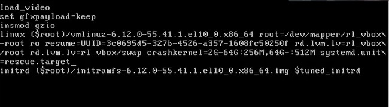
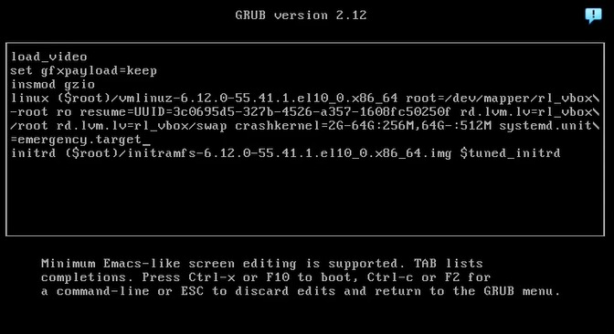
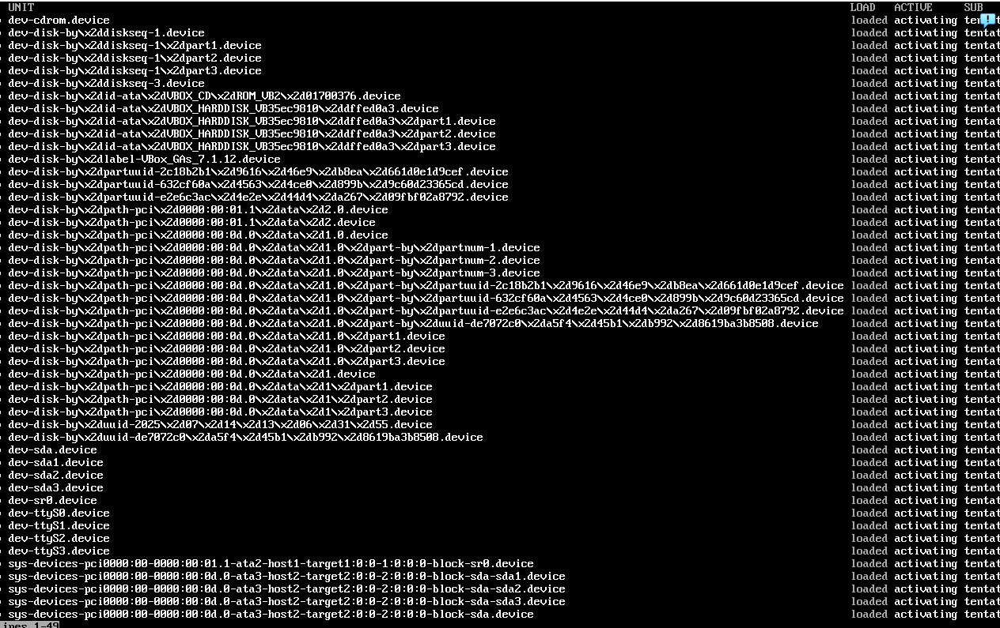

---
## Front matter
lang: ru-RU
title: Отчёт по лабораторной работе №11
subtitle: Управление загрузкой системы
author:
  - Яковлева Дарья Сергеевна
institute:
  - Российский университет дружбы народов, Москва, Россия
date: 13 ноября 2025

## i18n babel
babel-lang: russian
babel-otherlangs: english

## Formatting pdf
toc: false
slide_level: 2
aspectratio: 169
section-titles: true
theme: metropolis
header-includes:
 - \metroset{progressbar=frametitle,sectionpage=progressbar,numbering=fraction}
---

# Цель работы

## Цель
Получить навыки настройки загрузчика GRUB2, изменения параметров загрузки ядра и устранения неполадок системы через различные режимы загрузки.

# Выполнение лабораторной работы

## Настройка параметров загрузчика
{ width=70% }

## Обновление конфигурации GRUB2
{ width=70% }

## Проверка меню загрузчика
{ width=70% }

## Загрузка в режим rescue.target
{ width=70% }

## Просмотр системных модулей и среды
{ width=70% }

## Загрузка в режим emergency.target
{ width=70% }

## Минимальный набор модулей
{ width=70% }

## Попытка сброса через rd.break (неудачно)
{ width=70% }

## Рабочий способ: init=/bin/bash
{ width=70% }

## Успешная смена пароля
{ width=70% }

## Успешная загрузка после сброса
{ width=70% }

# Контрольные вопросы

## Основные файлы GRUB2
* `/etc/default/grub`
* `/boot/grub2/grub.cfg`

## Команда для применения изменений
* `grub2-mkconfig -o /boot/grub2/grub.cfg`

# Итоги работы

## Вывод
В ходе работы были изучены методы настройки GRUB2, способы загрузки в режимы rescue и emergency, а также выполнен успешный сброс пароля root с использованием параметра `init=/bin/bash`. Получены навыки диагностики проблем загрузки и временной модификации параметров запуска ядра.
