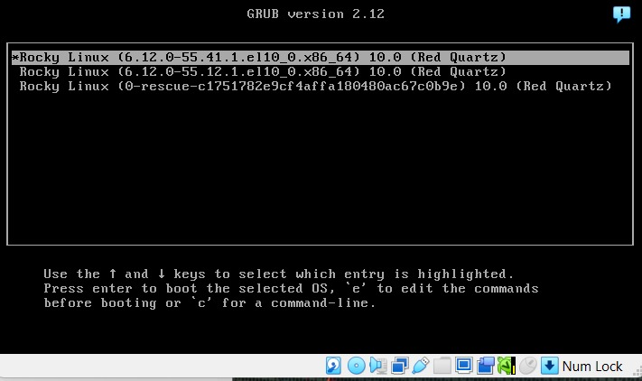
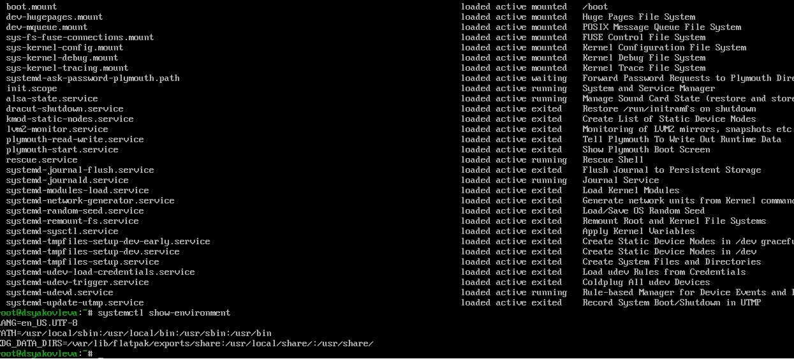
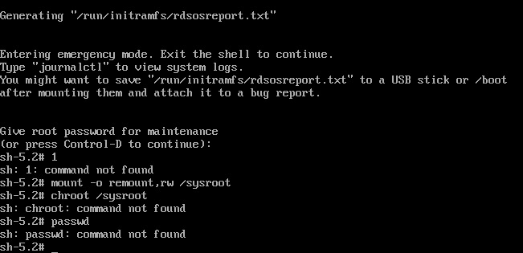
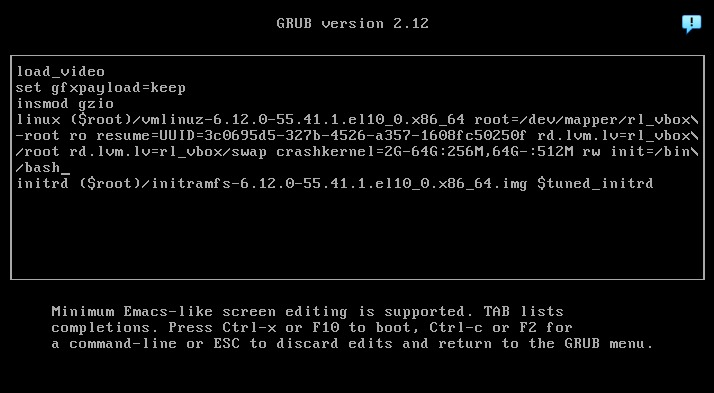

---
## Front matter
title: "Отчёт по лабораторной работе №11"
subtitle: "Управление загрузкой системы"
author: "Яковлева Дарья Сергеевна"

## Generic otions
lang: ru-RU
toc-title: "Содержание"

## Bibliography
bibliography: bib/cite.bib
csl: pandoc/csl/gost-r-7-0-5-2008-numeric.csl

## Pdf output format
toc: true # Table of contents
toc-depth: 2
lof: true # List of figures
lot: true # List of tables
fontsize: 12pt
linestretch: 1.5
papersize: a
documentclass: scrreprt
## I18n polyglossia
polyglossia-lang:
  name: russian
  options:
	- spelling=modern
	- babelshorthands=true
polyglossia-otherlangs:
  name: english
## I18n babel
babel-lang: russian
babel-otherlangs: english
## Fonts
mainfont: IBM Plex Serif
romanfont: IBM Plex Serif
sansfont: IBM Plex Sans
monofont: IBM Plex Mono
mathfont: STIX Two Math
mainfontoptions: Ligatures=Common,Ligatures=TeX,Scale=0.94
romanfontoptions: Ligatures=Common,Ligatures=TeX,Scale=0.94
sansfontoptions: Ligatures=Common,Ligatures=TeX,Scale=MatchLowercase,Scale=0.94
monofontoptions: Scale=MatchLowercase,Scale=0.94,FakeStretch=0.9
mathfontoptions:
## Biblatex
biblatex: true
biblio-style: "gost-numeric"
biblatexoptions:
  - parentracker=true
  - backend=biber
  - hyperref=auto
  - language=auto
  - autolang=other*
  - citestyle=gost-numeric
## Pandoc-crossref LaTeX customization
figureTitle: "Рис."
tableTitle: "Таблица"
listingTitle: "Листинг"
lofTitle: "Список иллюстраций"
lotTitle: "Список таблиц"
lolTitle: "Листинги"
## Misc options
indent: true
header-includes:
  - \usepackage{indentfirst}
  - \usepackage{float} # keep figures where there are in the text
  - \floatplacement{figure}{H} # keep figures where there are in the text
---

# Цель работы

Получить навыки работы с загрузчиком системы GRUB2.

# Выполнение лабораторной работы

## Настройка параметров загрузчика

Получаю полномочия администратора с помощью `su`.

Открываю файл `/etc/default/grub` для редактирования и устанавливаю отображение меню на 10 секунд, задавая параметр `GRUB_TIMEOUT=10` (см. рис. [@fig:001]).

{ #fig:001 width=70% }

Сохраняю изменения и обновляю конфигурацию GRUB2. Ход выполнения команды генерации файла показан на рис. [@fig:002].

{ #fig:002 width=70% }

Перезагружаю систему. После перезагрузки появляется меню загрузчика GRUB (см. рис. [@fig:003]).

{ #fig:003 width=70% }

## Устранение неполадок

### Переход в режим rescue.target

Перезагружаю систему и в меню GRUB открываю редактирование параметров ядра (клавиша `e`). В конце строки запуска ядра добавляю параметр `systemd.unit=rescue.target` и удаляю `rhgb` и `quiet`, если они присутствуют (см. рис. [@fig:004]).

{ #fig:004 width=70% }

Нажимаю `Ctrl + x` для загрузки. После ввода пароля root просматриваю список загруженных модулей с помощью `systemctl list-units`. Результат показан на рис. [@fig:005].

Просматриваю переменные среды с помощью `systemctl show-environment` (см. рис. [@fig:005]).

{ #fig:005 width=70% }

Перезагружаю систему.

### Переход в режим emergency.target

После повторной перезагрузки снова открываю параметры загрузки через клавишу `e`. В конец строки ядра добавляю `systemd.unit=emergency.target` и удаляю `rhgb` и `quiet` (см. рис. [@fig:006]).

{ #fig:006 width=70% }

Загружаюсь сочетанием `Ctrl + x`. После входа под root просматриваю минимальный набор загруженных модулей через `systemctl list-units`. Он показан на рис. [@fig:007].

{ #fig:007 width=70% }

Перезагружаю систему.

### Сброс пароля root

### Попытка сброса через `rd.break` (неуспешная)

В меню GRUB перехожу к редактированию строки загрузки ядра, добавляю параметр `rd.break` и удаляю `rhgb` и `quiet`.

После загрузки система останавливается в минимальной среде initramfs. Попытки выполнить необходимые команды приводят к ошибкам, поскольку утилиты отсутствуют в данном окружении (см. рис. [@fig:008]).

{ #fig:008 width=70% }

Способ, описанный в учебном пособии, в этой системе **не сработал**.

### Альтернативный рабочий способ сброса пароля root

Переходим к другому варианту — запуск системы с заменой процесса инициализации на оболочку Bash.

Снова открываю параметры запуска ядра и в конец строки добавляю `init=/bin/bash` (см. рис. [@fig:009]).

{ #fig:009 width=70% }

После загрузки попадаю в оболочку Bash с правами суперпользователя. Устанавливаю новый пароль для пользователя root. Изменение прошло успешно, что видно на рис. [@fig:010].

{ #fig:010 width=70% }

Создаю файл `.autorelabel`, чтобы при следующей загрузке система автоматически восстановила корректные контексты SELinux.

Запускаю штатный процесс инициализации и перезагружаю систему. После перезагрузки успешно вхожу в систему под пользователем root с новым паролем (см. рис. [@fig:011]).

{ #fig:011 width=70% }

# Контрольные вопросы

1. **Какой файл конфигурации следует изменить для применения общих изменений в GRUB2?**  
   Необходимо отредактировать файл `/etc/default/grub`.

2. **Как называется конфигурационный файл GRUB2, в котором вы применяете изменения для GRUB2?**  
   Конфигурационный файл GRUB2 находится по пути `/boot/grub2/grub.cfg`.

3. **После внесения изменений в конфигурацию GRUB2, какую команду вы должны выполнить, чтобы изменения сохранились и воспринялись при загрузке системы?**  
   Для применения изменений выполняется команда `grub2-mkconfig -o /boot/grub2/grub.cfg`.

# Заключение

В ходе лабораторной работы были освоены методы настройки и модификации загрузчика GRUB2: изменение параметров конфигурации, обновление файла grub.cfg, редактирование параметров загрузки ядра и выполнение сброса пароля root в однопользовательском режиме.
