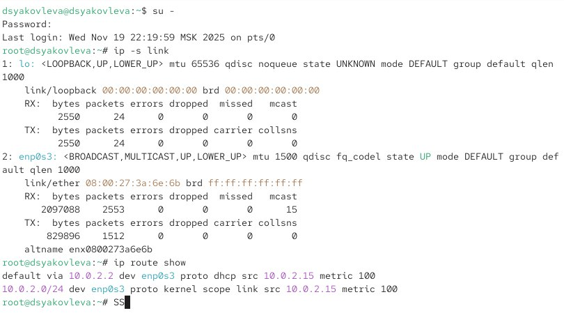
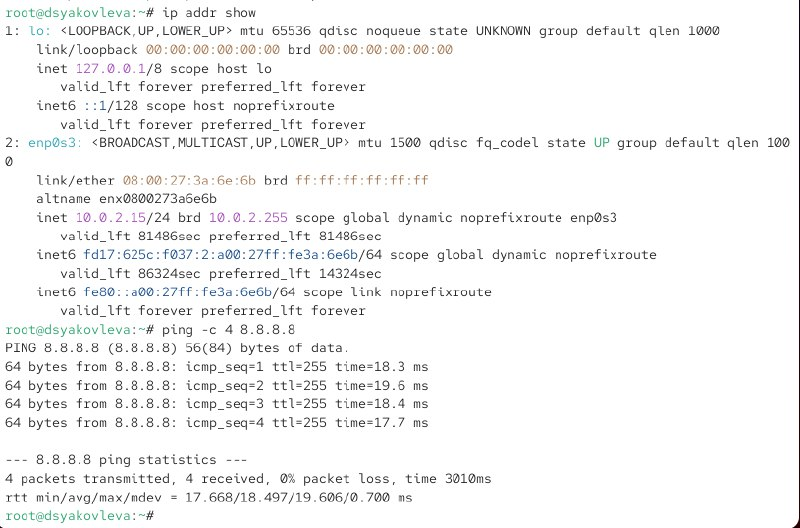
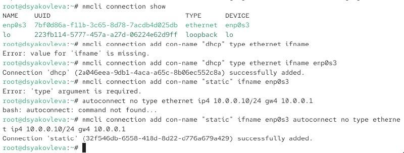
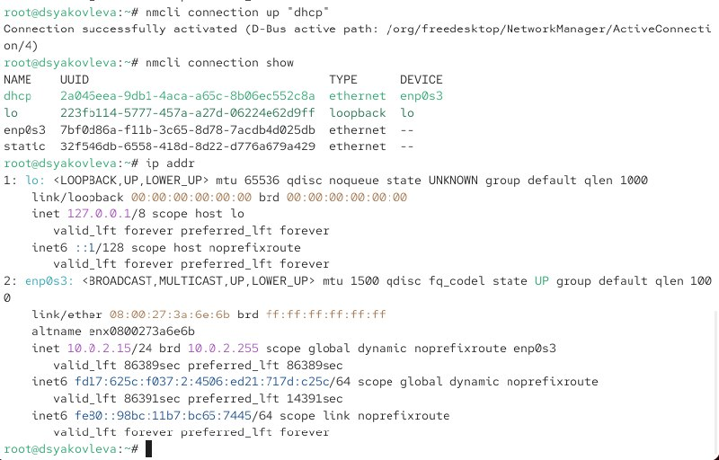
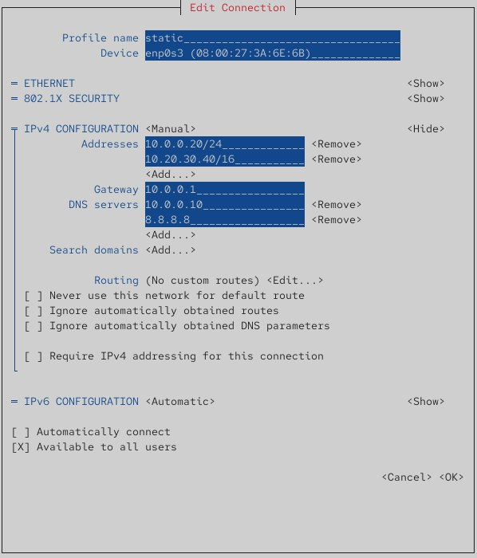
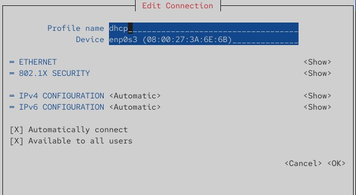
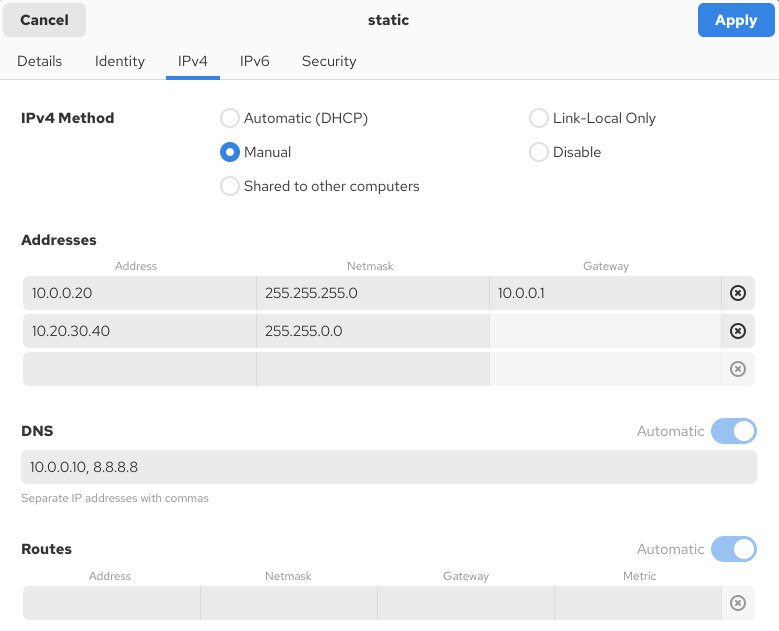
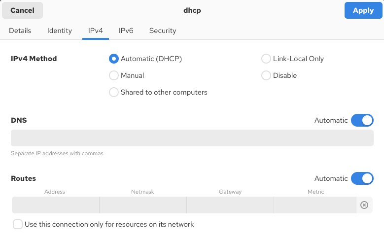
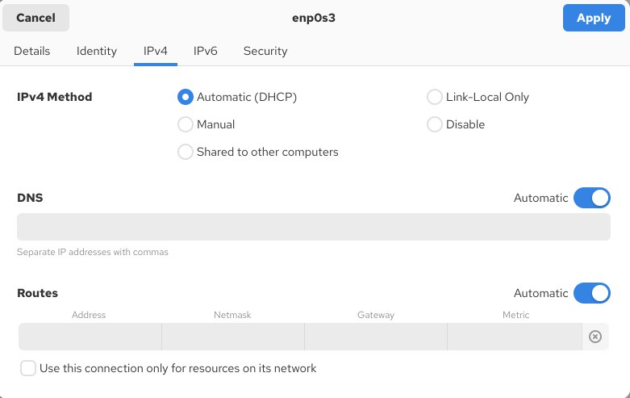

---
## Front matter
lang: ru-RU
title: Отчёт по лабораторной работе №12
subtitle: Настройки сети в Linux
author:
  - Яковлева Дарья Сергеевна
institute:
  - Российский университет дружбы народов, Москва, Россия
date: 20 ноября 2025

## Formatting pdf
toc: false
slide_level: 2
aspectratio: 169
section-titles: true
theme: metropolis

header-includes:
 - \metroset{progressbar=frametitle,sectionpage=progressbar,numbering=fraction}
---

# Цель работы

## Цель

Получить навыки настройки сетевых параметров и управления сетевыми соединениями в Linux.

# Выполнение лабораторной работы

## Получение полномочий администратора

{ width=70% }

## Просмотр состояния интерфейсов

{ width=70% }

## Таблица маршрутов

{ width=70% }

## IP-адреса интерфейсов

{ width=70% }

## Список соединений

{ width=70% }

## Создание профиля dhcp

{ width=70% }

## Создание профиля static

{ width=70% }

## Модификация static

{ width=70% }

## Дополнительные DNS и IP-адреса

{ width=70% }

## Профиль static

{ width=70% }

## Профиль dhcp

{ width=70% }

## Профиль enp0s3

{ width=70% }

## static в GUI

{ width=70% }

## dhcp в GUI

{ width=70% }

## enp0s3 в GUI

{ width=70% }

# Контрольные вопросы

## Основные ответы

* Статус устройств: `nmcli device status`
* Служба сети: `NetworkManager`
* Имя устройства: `/etc/hostname`
* Изменение имени: `hostnamectl set-hostname`

## Основные ответы

* Локальное разрешение имён: `/etc/hosts`
* Маршруты: `ip route show`
* Статус NetworkManager: `systemctl status NetworkManager`
* Изменение IP:  
  `nmcli connection modify <имя> ipv4.addresses <адрес>`

# Итоги работы

## Вывод

Получены навыки:

* просмотра статуса интерфейсов и маршрутов  
* добавления IP-адресов  
* работы с профилями nmcli и nmtui  
* изменения параметров сети  

Практически освоены методы управления сетевыми настройками Linux.
