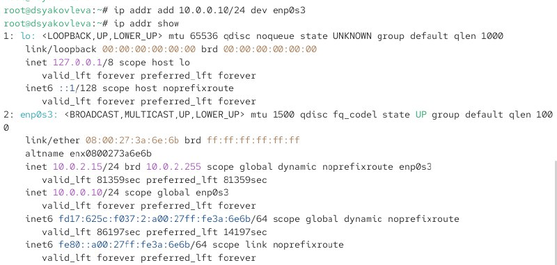
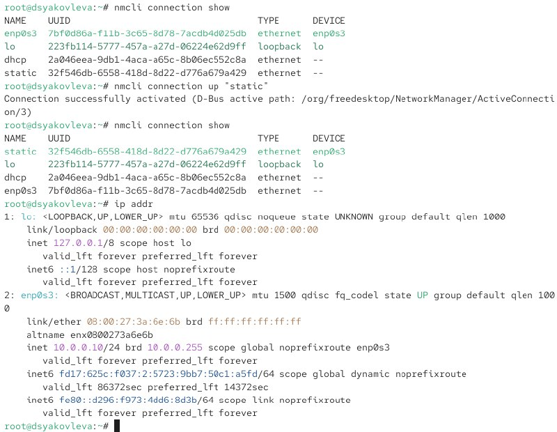
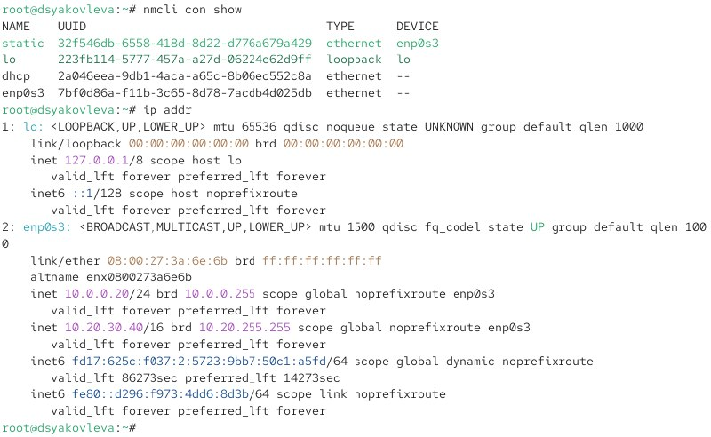
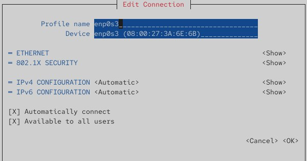

---
## Front matter
title: "Отчёт по лабораторной работе №12"
subtitle: "Настройки сети в Linux"
author: "Яковлева Дарья Сергеевна"

## Generic otions
lang: ru-RU
toc-title: "Содержание"

## Bibliography
bibliography: bib/cite.bib
csl: pandoc/csl/gost-r-7-0-5-2008-numeric.csl

## Pdf output format
toc: true # Table of contents
toc-depth: 2
lof: true # List of figures
lot: true # List of tables
fontsize: 12pt
linestretch: 1.5
papersize: a
documentclass: scrreprt
## I18n polyglossia
polyglossia-lang:
  name: russian
  options:
	- spelling=modern
	- babelshorthands=true
polyglossia-otherlangs:
  name: english
## I18n babel
babel-lang: russian
babel-otherlangs: english
## Fonts
mainfont: IBM Plex Serif
romanfont: IBM Plex Serif
sansfont: IBM Plex Sans
monofont: IBM Plex Mono
mathfont: STIX Two Math
mainfontoptions: Ligatures=Common,Ligatures=TeX,Scale=0.94
romanfontoptions: Ligatures=Common,Ligatures=TeX,Scale=0.94
sansfontoptions: Ligatures=Common,Ligatures=TeX,Scale=MatchLowercase,Scale=0.94
monofontoptions: Scale=MatchLowercase,Scale=0.94,FakeStretch=0.9
mathfontoptions:
## Biblatex
biblatex: true
biblio-style: "gost-numeric"
biblatexoptions:
  - parentracker=true
  - backend=biber
  - hyperref=auto
  - language=auto
  - autolang=other*
  - citestyle=gost-numeric
## Pandoc-crossref LaTeX customization
figureTitle: "Рис."
tableTitle: "Таблица"
listingTitle: "Листинг"
lofTitle: "Список иллюстраций"
lotTitle: "Список таблиц"
lolTitle: "Листинги"
## Misc options
indent: true
header-includes:
  - \usepackage{indentfirst}
  - \usepackage{float} # keep figures where there are in the text
  - \floatplacement{figure}{H} # keep figures where there are in the text
---

# Цель работы

Получить навыки настройки сетевых параметров системы.

# Выполнение лабораторной работы

## Проверка конфигурации сети

Перехожу в режим администратора с помощью команды su - (см. рис. [@fig:001]).

{ #fig:001 width=70% }

Для получения сведений об интерфейсах и статистики пакетов использована команда ip -s link (см. рис. [@fig:002]).

{ #fig:002 width=70% }

**Пояснение (интерфейс enp0s3):**

Интерфейс enp0s3 активен, находится в состоянии UP.  
Показана статистика работы канала:

- Получено пакетов (RX): 2097088  
- Отправлено пакетов (TX): 829896  
- Ошибки, дропы и коллизии отсутствуют — сеть функционирует корректно.

Информация о маршрутах отображена с помощью ip route show (см. рис. [@fig:003]).

{ #fig:003 width=70% }

**Пояснение:**

- Основной маршрут направляет трафик через шлюз 10.0.2.2.  
- Подсеть 10.0.2.0/24 относится к интерфейсу enp0s3.  
- IPv4-адрес устройства: 10.0.2.15.

Вывод ip addr show показан на рис. [@fig:004].

{ #fig:004 width=70% }

**Пояснение (интерфейс enp0s3):**

- IPv4-адрес: 10.0.2.15/24  
- MAC-адрес: 08:00:27:3a:6e:6b  
- Интерфейс находится в состоянии UP  
- Адаптер устройства: enp0s3.

Проверка связи выполнялась отправкой ICMP-пакетов на адрес 8.8.8.8.  
Ответы успешно получены — подключение к интернету исправно.

К интерфейсу enp0s3 был добавлен новый адрес 10.0.0.10/24.  
После проверки через ip addr show он отображается среди назначенных.

Сравнение ip и ifconfig показывает:  
ifconfig выводит краткую информацию, тогда как ip предоставляет полный набор параметров, включая флаги и несколько типов адресов.

С помощью ss -tul получен список слушающих TCP- и UDP-портов, среди которых видны службы SSH, mDNS и системные демоны.

## Управление сетевыми подключениями с помощью nmcli

Получаю полномочия администратора и вывожу список текущих соединений (см. рис. [@fig:005]).

{ #fig:005 width=70% }

Создаю новое Ethernet-соединение с именем dhcp для интерфейса enp0s3.  
После добавления проверяю список соединений — новое соединение отображается корректно (см. рис. [@fig:006]).

{ #fig:006 width=70% }

Добавляю второе соединение static для того же интерфейса enp0s3.  
Ему назначаю статический IPv4-адрес 10.0.0.10/24 и шлюз 10.0.0.1.  
После выполнения команда сообщает об успешном создании соединения (см. рис. [@fig:007]).

{ #fig:007 width=70% }

После добавления обоих соединений снова просматриваю список всех доступных профилей — dhcp и static присутствуют и готовы к использованию.

Активирую соединение static с помощью nmcli connection up "static".  
Проверяю результат с помощью nmcli connection show и ip addr: интерфейс enp0s3 получает статический адрес 10.0.0.10, что подтверждает корректность переключения.

Затем переключаюсь обратно на соединение dhcp при помощи nmcli connection up "dhcp".  
Снова проверяю настройки — интерфейс получает динамический адрес от DHCP-сервера, что подтверждает успешное включение профиля dhcp.

## Изменение параметров соединения с помощью nmcli

Отключаю автоподключение статического профиля и начинаю изменение его параметров.  
После выполнения команд проверяю список соединений и параметры интерфейса (см. рис. [@fig:008]).

{ #fig:008 width=70% }

Добавляю DNS-сервер 10.0.0.10 к соединению static, затем добавляю второй DNS-сервер 8.8.8.8 через оператор `+`, чтобы не заменить первый адрес.  
Изменяю основной IPv4-адрес на 10.0.0.20/24 и добавляю дополнительный 10.20.30.40/16.  
После завершения активирую соединение static (см. рис. [@fig:009]).

{ #fig:009 width=70% }

После применения параметров проверяю их корректность через nmtui.  
В профиле static видны назначенные вручную IPv4-адреса, шлюз и DNS-серверы (см. рис. [@fig:010]).

{ #fig:010 width=70% }

Смотрю параметры профиля dhcp через nmtui — все настройки получаются автоматически (см. рис. [@fig:011]).

{ #fig:011 width=70% }

Проверяю настройки профиля enp0s3, который также использует автоматическое получение параметров (см. рис. [@fig:012]).

{ #fig:012 width=70% }

Открываю параметры сети в графическом интерфейсе.  
Для профиля static отображаются вручную назначенные маршруты, DNS-сервера и список адресов (см. рис. [@fig:013]).

{ #fig:013 width=70% }

Аналогично просматриваю настройки профиля dhcp — метод получения адресов автоматический (см. рис. [@fig:014]).

{ #fig:014 width=70% }

В интерфейсе enp0s3 также используются автоматические параметры (см. рис. [@fig:015]).

{ #fig:015 width=70% }

После завершения работы переключаюсь на исходное сетевое соединение, соответствующее интерфейсу enp0s3.  
Проверяю результат через nmcli connection show и ip addr.

# Контрольные вопросы

1. **Какая команда отображает только статус соединения, но не IP-адрес?**  
   Команда `nmcli device status` показывает текущее состояние сетевых устройств без вывода IP-адресов.

2. **Какая служба управляет сетью в ОС типа RHEL?**  
   Управление сетью выполняет служба `NetworkManager`.

3. **Какой файл содержит имя узла (устройства) в ОС типа RHEL?**  
   Имя хоста хранится в файле `/etc/hostname`.

4. **Какая команда позволяет вам задать имя узла (устройства)?**  
   Имя устройства изменяется командой `hostnamectl set-hostname <имя_узла>`.

5. **Какой конфигурационный файл можно изменить для включения разрешения имён для конкретного IP-адреса?**  
   Для этого используется файл `/etc/hosts`.

6. **Какая команда показывает текущую конфигурацию маршрутизации?**  
   Актуальные маршруты выводятся командой `ip route show`.

7. **Как проверить текущий статус службы NetworkManager?**  
   Проверка состояния службы выполняется командой `systemctl status NetworkManager`.

8. **Какая команда позволяет вам изменить текущий IP-адрес и шлюз по умолчанию для вашего сетевого соединения?**  
   Изменение выполняется с помощью команды  
   `nmcli connection modify <имя_соединения> ipv4.addresses <адрес> ipv4.gateway <шлюз>`.

# Заключение

В ходе лабораторной работы были приобретены навыки настройки и управления сетевыми подключениями в Linux: просмотр параметров интерфейсов, маршрутов и портов, добавление IP-адресов, а также управление соединениями с помощью утилит `nmcli` и `nmtui`.
